# OpenClaw 系统运行机制与协作图

> 通过序列图和流程图深入解析系统运行机制
> 版本：2026.3.9
> 最后更新：2026-03-10

---

## 目录

1. [系统启动流程](#1-系统启动流程)
2. [消息接收与处理](#2-消息接收与处理)
3. [Agent 响应生成](#3-agent-响应生成)
4. [消息发送流程](#4-消息发送流程)
5. [设备配对流程](#5-设备配对流程)
6. [工具执行流程](#6-工具执行流程)
7. [会话管理流程](#7-会话管理流程)
8. [插件加载流程](#8-插件加载流程)

---

## 1. 系统启动流程

### 1.1 Gateway 启动序列图

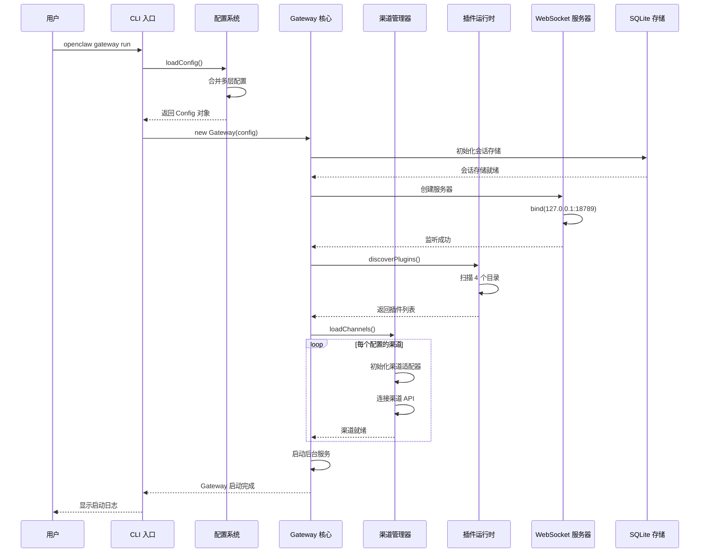

### 1.2 启动流程详细说明

```typescript
// 1. 配置加载 (src/config/io.ts)
async function loadConfig(): Promise<Config> {
  const sources = [
    { path: 'defaults', data: DEFAULT_CONFIG, priority: 0 },
    { path: '~/.openclaw/config.json', priority: 1 },
    { path: './.openclaw/config.json', priority: 2 },
    { path: 'env', data: parseEnvConfig(process.env), priority: 3 },
  ];

  // 合并配置 (高优先级覆盖低优先级)
  const merged = mergeConfigs(sources);

  // 验证配置 Schema
  await validateConfigObjectWithPlugins(merged);

  return merged as Config;
}

// 2. Gateway 初始化 (src/gateway/gateway.ts)
class Gateway {
  async start(): Promise<void> {
    // 2.1 初始化会话存储
    this.sessions = await createSessionStore(this.config);

    // 2.2 启动 WebSocket 服务器
    await this.startWebSocketServer({
      bind: this.config.gateway.bind,
      port: this.config.gateway.port,
    });

    // 2.3 发现并加载插件
    const { plugins, errors } = await discoverPlugins(this.config);
    for (const plugin of plugins) {
      await loadPlugin(plugin, this.createPluginAPI());
    }

    // 2.4 初始化渠道
    for (const [channelId, channelConfig] of Object.entries(this.config.channels)) {
      await this.channels.load(channelId, channelConfig);
    }

    // 2.5 启动后台服务
    await this.startHealthMonitor();
    await this.startCronScheduler();
  }
}
```

### 1.3 渠道初始化流程图

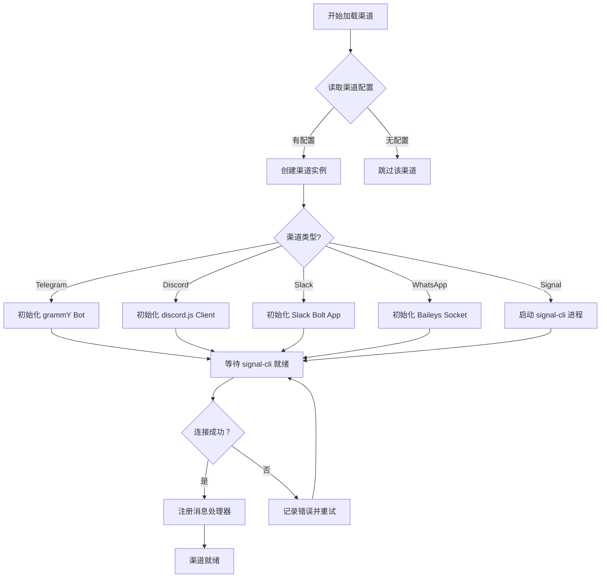

---

## 2. 消息接收与处理

### 2.1 消息接收序列图 (以 Telegram 为例)

```mermaid
sequenceDiagram
    participant TG as Telegram API
    participant Monitor as 渠道 Monitor
    participant Router as 消息路由器
    participant Session as 会话管理器
    participant Agent as Agent 运行时
    participant Channel as 渠道发送器

    TG->>Monitor: 推送新消息 (Update)
    Monitor->>Monitor: 解析消息体

    Note over Monitor: bot-message-context.ts<br/>提取会话上下文

    Monitor->>Monitor: 标准化消息格式
    Monitor->>Router: routeMessage(normalizedMsg)

    Router->>Router: 提取关键信息
    Note over Router: - channelType: telegram<br/>- accountId: bot-id<br/>- peerId: user-id<br/>- threadId: message-id

    Router->>Session: deriveSessionKey(channel, account, peer)
    Session-->>Router: session-key-abc123

    Router->>Session: loadSession(sessionKey)
    Session->>Session: 从 SQLite 加载
    Session-->>Router: 返回 SessionEntry

    Router->>Agent: enqueueMessage({
  session,
  message: text,
  sender
})

    Note over Agent: 消息进入队列<br/>等待 Agent 处理

    Router-->>Monitor: 路由完成
    Monitor-->>TG: ack
```

### 2.2 消息标准化流程

```typescript
// src/telegram/bot-message-context.ts

interface NormalizedMessage {
  id: string;           // Telegram message_id
  channelId: string;    // 'telegram'
  accountId: string;    // Bot ID
  peerId: string;       // User/Chat ID
  threadId?: string;    // 回复线程 ID
  sender: {
    id: string;
    name: string;
    isBot: boolean;
  };
  content: {
    type: 'text' | 'photo' | 'voice' | 'video';
    text?: string;
    mediaUrl?: string;
  };
  timestamp: number;
  isIncoming: boolean;
}

function normalizeTelegramMessage(update: Update): NormalizedMessage {
  const message = update.message || update.edited_message;

  return {
    id: String(message.message_id),
    channelId: 'telegram',
    accountId: String(message.bot.id),
    peerId: String(message.chat.id),
    threadId: message.is_topic_message
      ? String(message.message_thread_id)
      : undefined,
    sender: {
      id: String(message.from.id),
      name: message.from.first_name,
      isBot: message.from.is_bot || false,
    },
    content: {
      type: message.photo ? 'photo' :
            message.voice ? 'voice' : 'text',
      text: message.text || message.caption,
      mediaUrl: message.photo
        ? message.photo[message.photo.length - 1].file_id
        : undefined,
    },
    timestamp: message.date * 1000,
    isIncoming: true,
  };
}
```

### 2.3 消息路由决策树

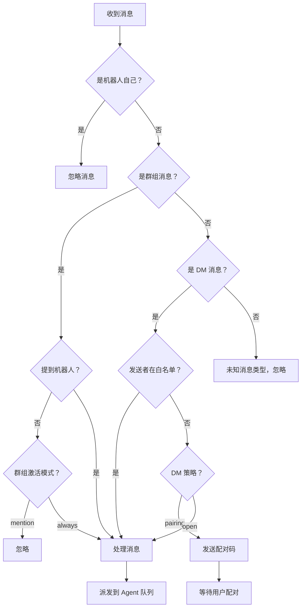

---

## 3. Agent 响应生成

### 3.1 Agent 循环序列图

```mermaid
sequenceDiagram
    participant Queue as 消息队列
    participant Loop as Agent Loop
    participant Session as 会话存储
    participant Hooks as 钩子系统
    participant Context as 上下文引擎
    participant Model as 模型提供者
    participant Tools as 工具执行器
    participant Stream as 流式处理器

    Queue->>Loop: 出队消息
    Loop->>Session: 加载会话

    Note over Hooks: before_model_resolve 钩子
    Loop->>Hooks: runBeforeModelResolve(ctx)
    Hooks-->>Loop: modelOverride?

    Loop->>Loop: 解析模型配置

    Note over Context: 构建提示
    Loop->>Context: assemble({ session, message })
    Context->>Session: 读取历史消息
    Context->>Context: 应用 token 预算
    Context-->>Loop: 返回 Prompt

    Note over Hooks: before_prompt_build 钩子
    Loop->>Hooks: runBeforePromptBuild(ctx)
    Hooks-->>Loop: prepend/append 内容

    Loop->>Model: completeStream(prompt)

    par 流式处理
      Stream->>Stream: 接收文本块
      Stream-->>Client: 推送文本到渠道
    and 工具调用
      Model->>Tools: 工具调用请求
      Tools->>Tools: 执行工具
      Tools-->>Model: 返回结果
    end

    Model-->>Loop: 完成响应

    Loop->>Context: ingest({ message, response })
    Context->>Session: 更新历史记录

    Loop->>Session: 保存会话

    Note over Loop: 检查是否需要压缩
    Loop->>Loop: shouldCompact()?
    Loop->>Context: compact()
```

### 3.2 提示构建流程

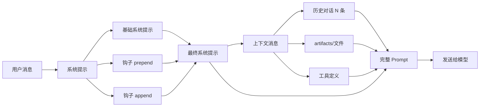

### 3.3 流式响应处理

```typescript
// src/agents/agent-loop.ts

async function processStream(
  stream: AsyncIterable<StreamChunk>,
  handlers: {
    onChunk: (text: string) => void;
    onToolCall: (toolCall: ToolCall) => Promise<ToolResult>;
  }
): Promise<AgentResult> {
  const result: AgentResult = {
    text: '',
    toolCalls: [],
  };

  for await (const chunk of stream) {
    if (chunk.type === 'content') {
      // 文本内容
      result.text += chunk.text;
      handlers.onChunk(chunk.text);
    }

    if (chunk.type === 'tool_call') {
      // 工具调用
      const toolCall = chunk.toolCall;
      result.toolCalls.push(toolCall);

      // 执行工具
      const toolResult = await handlers.onToolCall(toolCall);

      // 将结果返回给模型
      yield { type: 'tool_result', result: toolResult };
    }

    if (chunk.type === 'done') {
      // 完成
      result.summary = chunk.summary;
      break;
    }
  }

  return result;
}
```

---

## 4. 消息发送流程

### 4.1 消息发送序列图

```mermaid
sequenceDiagram
    participant Client as 客户端 (CLI/Web/App)
    participant Gateway as Gateway
    participant Router as 路由管理器
    participant Channel as 渠道适配器
    participant External as 外部渠道 API

    Client->>Gateway: req:send {
  channel: 'telegram',
  to: '+1234567890',
  text: 'Hello'
}

    Gateway->>Gateway: 验证请求参数

    Gateway->>Router: resolveChannel('telegram')
    Router-->>Gateway: TelegramChannel

    Gateway->>Channel: sendText({
  to: '+1234567890',
  text: 'Hello',
  accountId: 'default'
})

    Channel->>Channel: 标准化消息格式

    alt 文本消息
        Channel->>External: Telegram Bot API
        External-->>Channel: { message_id: 123 }
    else 媒体消息
        Channel->>Channel: 上传媒体文件
        Channel->>External: sendPhoto/Video/Audio
        External-->>Channel: { file_id: '...' }
    end

    Channel-->>Gateway: { ok: true, messageId: '123' }

    Gateway->>Gateway: 更新会话 lastTo/lastChannel

    Gateway-->>Client: res:send { ok: true }
```

### 4.2 渠道发送适配器

```typescript
// src/telegram/bot/delivery.ts

interface SendTextParams {
  to: string;           // 接收者 ID
  text: string;         // 消息文本
  accountId: string;    // 发送账号
  threadId?: string;    // 回复线程
  replyTo?: string;     // 回复消息 ID
}

interface SendResult {
  ok: boolean;
  messageId: string;
  channel: string;
  timestamp: number;
}

class TelegramDelivery {
  async sendText(params: SendTextParams): Promise<SendResult> {
    const bot = this.getBot(params.accountId);

    // 处理长消息分片
    const chunks = this.chunkMessage(params.text);

    let lastMessageId: string | undefined;

    for (const chunk of chunks) {
      const result = await bot.api.sendMessage(params.to, chunk, {
        reply_to_message_id: params.replyTo,
        message_thread_id: params.threadId,
      });

      lastMessageId = String(result.message_id);

      // 第一条消息后清除 replyTo，后续消息不嵌套回复
      params.replyTo = undefined;
    }

    return {
      ok: true,
      messageId: lastMessageId!,
      channel: 'telegram',
      timestamp: Date.now(),
    };
  }

  private chunkMessage(text: string): string[] {
    const MAX_LENGTH = 4096;  // Telegram 限制

    if (text.length <= MAX_LENGTH) {
      return [text];
    }

    const chunks: string[] = [];
    let remaining = text;

    while (remaining.length > 0) {
      if (remaining.length <= MAX_LENGTH) {
        chunks.push(remaining);
        break;
      }

      // 在最后一个空格处截断
      let cutIndex = MAX_LENGTH;
      const lastSpace = remaining.lastIndexOf(' ', MAX_LENGTH);
      if (lastSpace > 0) {
        cutIndex = lastSpace;
      }

      chunks.push(remaining.slice(0, cutIndex));
      remaining = remaining.slice(cutIndex + 1);
    }

    return chunks;
  }
}
```

### 4.3 媒体消息发送流程

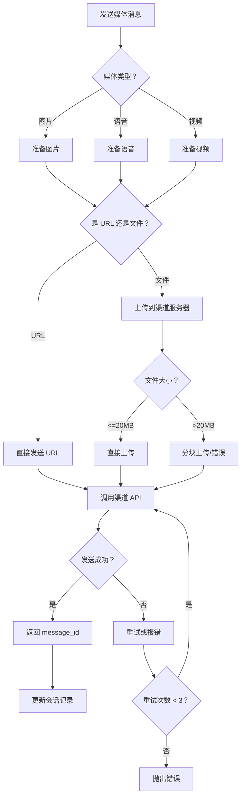

---

## 5. 设备配对流程

### 5.1 完整配对序列图

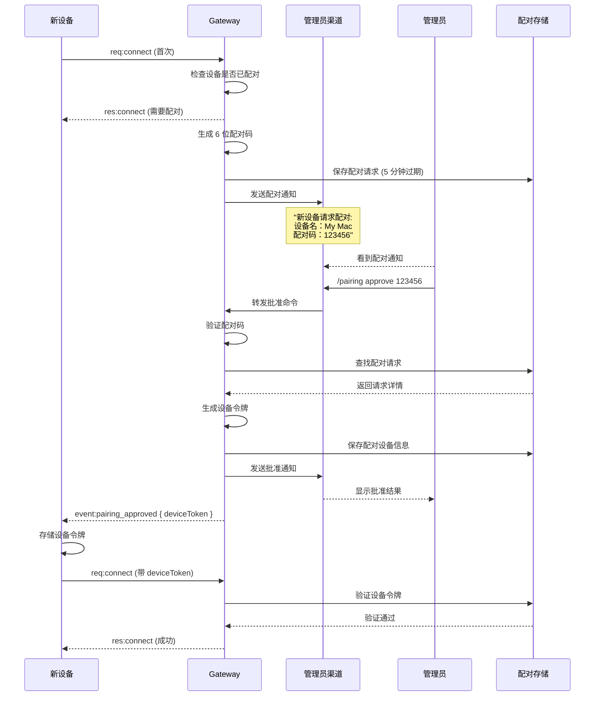

### 5.2 配对码生成与验证

```typescript
// src/gateway/device-auth.ts

class DevicePairingManager {
  private pending = new Map<string, PairingRequest>();

  /**
   * 创建配对请求
   */
  async createPairingRequest(params: {
    deviceId: string;
    deviceInfo: DeviceInfo;
    channel: string;
  }): Promise<string> {
    // 生成 6 位数字配对码
    const code = crypto.randomInt(100000, 999999).toString();

    const request: PairingRequest = {
      code,
      deviceId: params.deviceId,
      deviceInfo: params.deviceInfo,
      channel: params.channel,
      requestedAt: Date.now(),
      expiresAt: Date.now() + 5 * 60 * 1000,  // 5 分钟过期
    };

    this.pending.set(code, request);

    // 发送配对通知到管理员渠道
    await this.sendPairingNotification(request);

    return code;
  }

  /**
   * 批准配对
   */
  async approvePairing(code: string): Promise<PairingResult> {
    const request = this.pending.get(code);
    if (!request) {
      return { ok: false, reason: 'code_not_found' };
    }

    // 检查是否过期
    if (Date.now() > request.expiresAt) {
      this.pending.delete(code);
      return { ok: false, reason: 'code_expired' };
    }

    // 生成设备令牌
    const deviceToken = await this.generateDeviceToken(request.deviceId);

    // 存储配对设备
    await this.pairedStore.set(request.deviceId, {
      deviceId: request.deviceId,
      deviceInfo: request.deviceInfo,
      deviceToken,
      pairedAt: Date.now(),
      pairedVia: request.channel,
    });

    // 清理配对请求
    this.pending.delete(code);

    // 发送批准通知
    await this.sendApprovalNotification(request);

    return { ok: true, deviceToken };
  }

  /**
   * 生成设备令牌 (使用 HMAC)
   */
  private async generateDeviceToken(deviceId: string): Promise<string> {
    const key = await crypto.subtle.generateKey(
      { name: 'HMAC', hash: 'SHA-256', length: 256 },
      true,
      ['sign', 'verify']
    );

    const exported = await crypto.subtle.exportKey('raw', key);
    const token = arrayBufferToBase64Url(exported);

    // 存储密钥用于后续验证
    this.deviceKeys.set(deviceId, key);

    return token;
  }
}
```

### 5.3 配对状态机

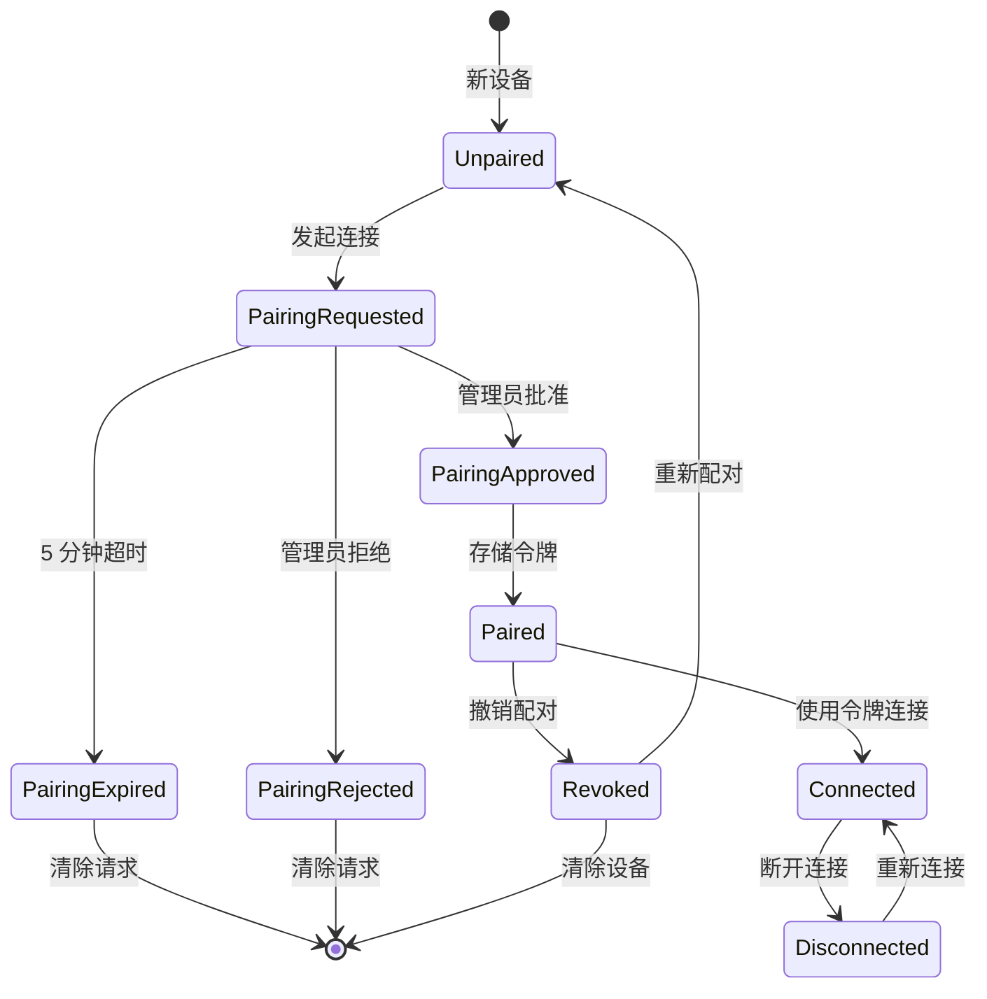

---

## 6. 工具执行流程

### 6.1 Bash 工具执行序列图

```mermaid
sequenceDiagram
    participant Model as AI 模型
    participant Agent as Agent Loop
    participant Approval as 批准管理器
    participant Admin as 管理员
    participant Executor as 执行器
    participant Process as 子进程

    Model->>Agent: 工具调用 {
  name: 'bash',
  input: { command: 'ls -la' }
}

    Agent->>Approval: shouldRequireApproval('ls -la')
    Approval->>Approval: 检查命令模式

    alt 命令在允许列表
        Approval-->>Agent: 不需要批准
    else 命令需要批准
        Approval-->>Agent: 需要批准

        Agent->>Admin: 发送批准请求
        Admin->>Admin: 审查命令

        alt 批准
            Admin->>Admin: /approve <request-id>
            Admin->>Agent: 批准通知
            Agent->>Approval: recordApproval()
        else 拒绝
            Admin->>Admin: /deny <request-id>
            Admin->>Agent: 拒绝通知
            Agent->>Model: 工具执行被拒绝
        end
    end

    Agent->>Executor: execute({ command, cwd, env })
    Executor->>Process: spawn(command, { shell: true })

    Process->>Executor: stdout 数据
    Executor-->>Agent: 流式输出
    Process->>Executor: stderr 数据
    Executor-->>Agent: 错误输出

    Process->>Executor: exit(code)
    Executor-->>Agent: { stdout, stderr, exitCode }

    Agent->>Model: 工具执行结果
```

### 6.2 命令风险评估

```typescript
// src/agents/bash-tools.exec-approval-request.ts

class ExecApprovalManager {
  private denyPatterns = [
    /rm\s+(-[rf]+\s+)?\//,           // 删除根目录
    /sudo\s+/,                        // 提权命令
    /curl.*\|\s*(ba)?sh/,             // 下载并执行
    /wget.*\|\s*(ba)?sh/,
    /chmod\s+[0-7]+777/,              // 设置可执行权限
    /mkfs/,                           // 格式化
    /dd\s+.*of=\/dev/,                // 直接写入设备
    /:\(\)\{\s*:\|:\s*&\}\s*;/,       // Shellshock
  ];

  private allowPatterns = [
    /^ls\s+/,                         // 列出文件
    /^cat\s+/,                        // 查看文件
    /^grep\s+/,                       // 搜索
    /^head\s+/,                       // 查看文件头
    /^tail\s+/,                       // 查看文件尾
    /^pwd$/,                          // 当前目录
    /^echo\s+/,                       // 输出文本
    /^date$/,                         // 日期
  ];

  async shouldRequireApproval(command: string): Promise<{
    requiresApproval: boolean;
    reason?: string;
  }> {
    // 检查拒绝模式 (总是需要批准)
    for (const pattern of this.denyPatterns) {
      if (pattern.test(command)) {
        return { requiresApproval: true, reason: 'denied_pattern' };
      }
    }

    // 检查允许模式 (自动批准)
    for (const pattern of this.allowPatterns) {
      if (pattern.test(command)) {
        return { requiresApproval: false };
      }
    }

    // 默认需要批准
    return { requiresApproval: true };
  }

  assessRisk(command: string): 'low' | 'medium' | 'high' {
    const highRiskPatterns = [
      /rm\s+(-[rf]+\s+)?\//,
      /sudo\s+/,
      /curl.*\|\s*(ba)?sh/,
    ];

    const mediumRiskPatterns = [
      /rm\s+/,                        // 删除文件
      /mv\s+.*\/dev/,                 // 移动到设备
      /echo\s+.*>\s*\//,              // 写入系统文件
    ];

    for (const pattern of highRiskPatterns) {
      if (pattern.test(command)) {
        return 'high';
      }
    }

    for (const pattern of mediumRiskPatterns) {
      if (pattern.test(command)) {
        return 'medium';
      }
    }

    return 'low';
  }
}
```

### 6.3 工具执行批准 UI (Telegram)

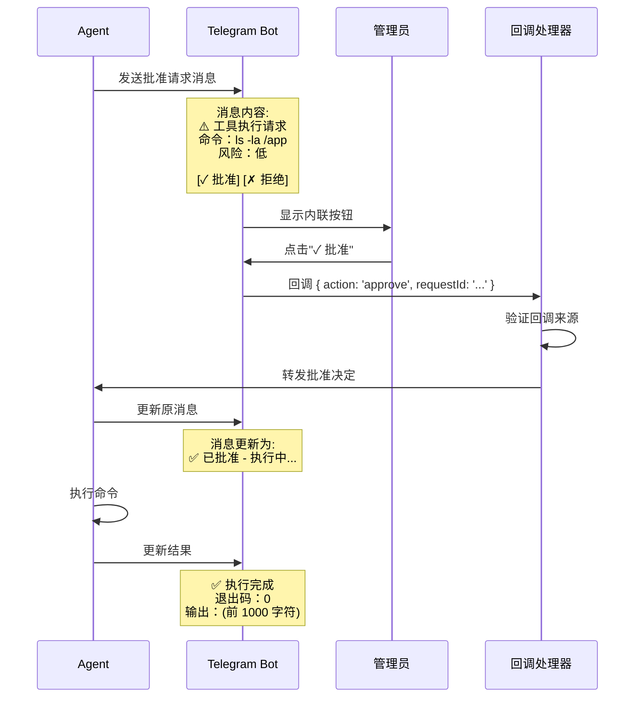

---

## 7. 会话管理流程

### 7.1 会话键派生流程

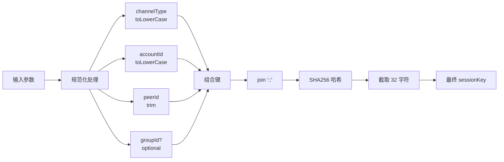

### 7.2 会话存储操作序列图

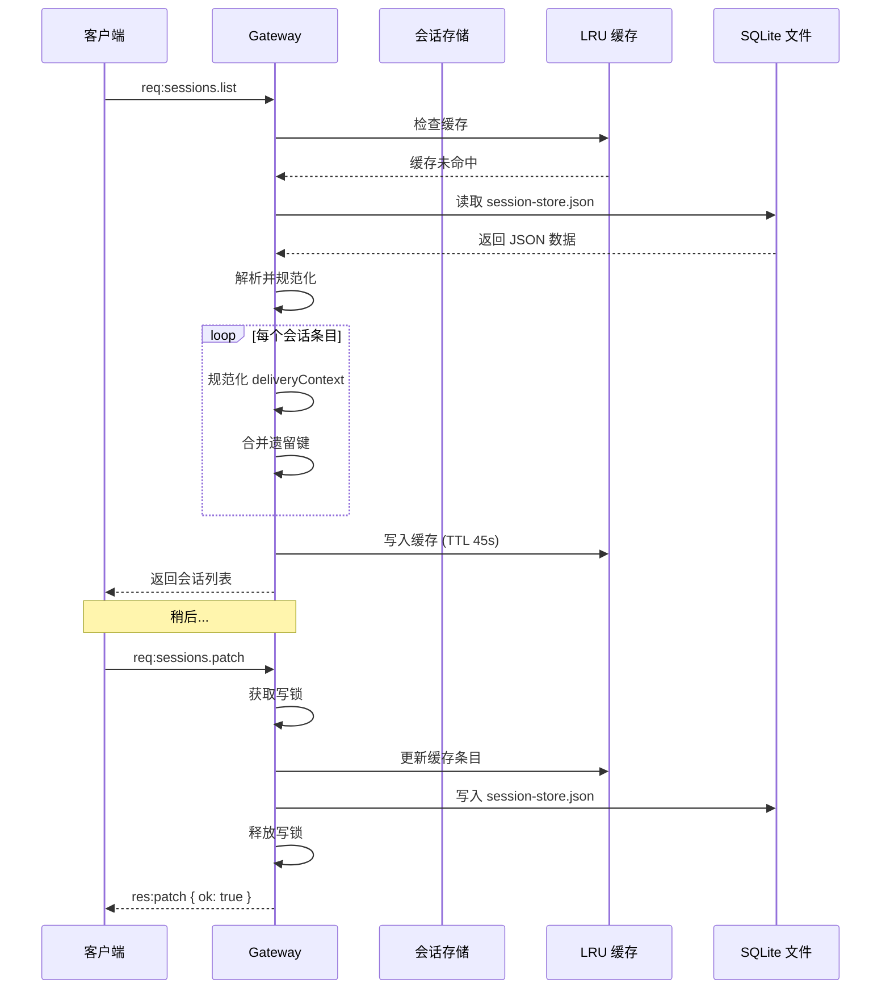

### 7.3 会话维护流程

```typescript
// src/config/sessions/store-maintenance.ts

interface MaintenanceConfig {
  maxEntries: number;           // 最大会话数：1000
  maxAgeDays: number;           // 最大保留天数：90
  pruneStaleAfterDays: number;  // 清理不活跃会话：30
}

async function maintainSessionStore(
  store: SessionStore,
  config: MaintenanceConfig
): Promise<MaintenanceResult> {
  const now = Date.now();
  const staleThreshold = now - config.pruneStaleAfterDays * 24 * 60 * 60 * 1000;
  const maxAgeThreshold = now - config.maxAgeDays * 24 * 60 * 60 * 1000;

  const toRemove: string[] = [];

  // 1. 清理过期会话
  for (const [key, entry] of Object.entries(store)) {
    if (entry.createdAt < maxAgeThreshold) {
      toRemove.push(key);
      continue;
    }
    if (entry.lastActivityAt < staleThreshold) {
      toRemove.push(key);
    }
  }

  // 2. 如果会话数超限，删除最旧的
  if (Object.keys(store).length > config.maxEntries) {
    const sorted = Object.entries(store)
      .sort((a, b) => a[1].lastActivityAt - b[1].lastActivityAt);

    const excessCount = Object.keys(store).length - config.maxEntries;
    for (let i = 0; i < excessCount; i++) {
      toRemove.push(sorted[i][0]);
    }
  }

  // 3. 执行删除
  for (const key of toRemove) {
    delete store[key];
  }

  return {
    removed: toRemove.length,
    remaining: Object.keys(store).length,
  };
}
```

### 7.4 会话压缩触发条件

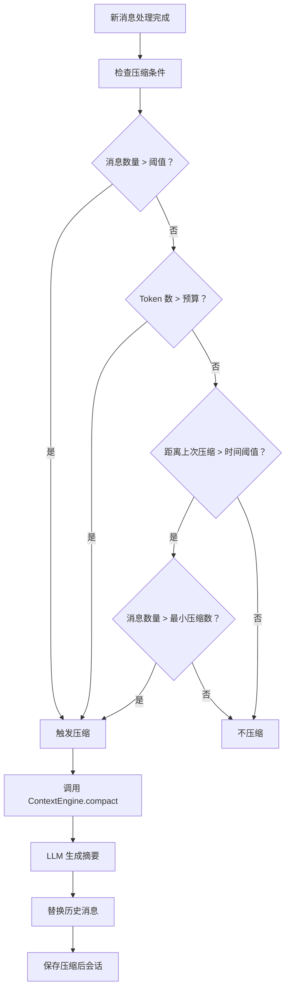

---

## 8. 插件加载流程

### 8.1 插件发现与加载序列图

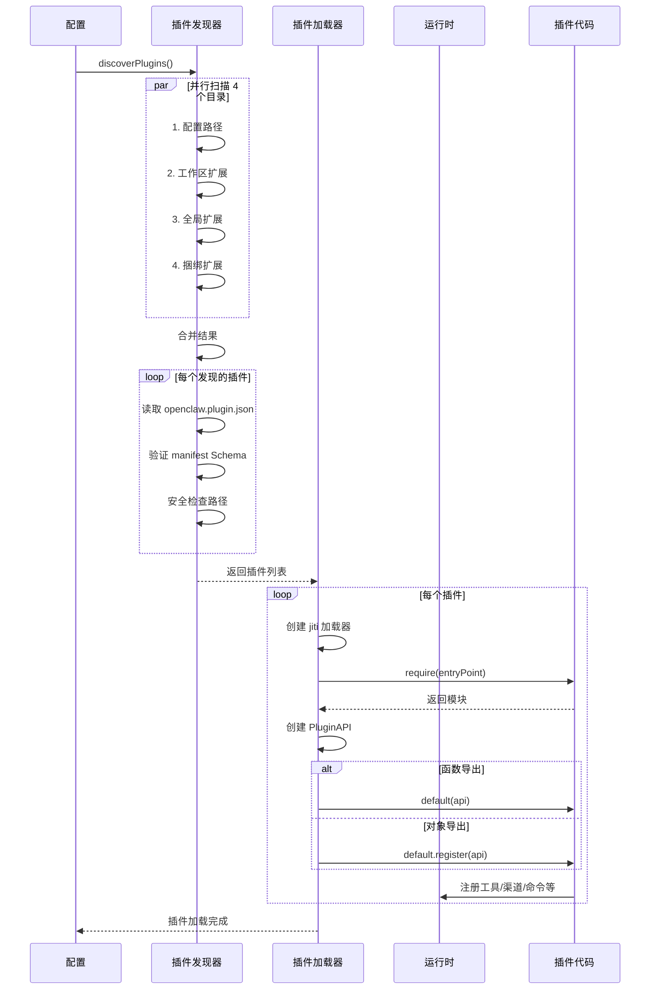

### 8.2 插件 API 注册流程

```typescript
// src/plugins/runtime/index.ts

class PluginRuntimeAPI {
  private tools = new Map<string, ToolDefinition>();
  private channels = new Map<string, ChannelPlugin>();
  private routes = new Map<string, HttpRoute>();
  private hooks = new Map<string, HookHandler>();

  registerTool(tool: ToolDefinition): void {
    // 验证工具 Schema
    validateToolDefinition(tool);

    // 检查命名冲突
    if (this.tools.has(tool.name)) {
      throw new Error(`Tool already registered: ${tool.name}`);
    }

    this.tools.set(tool.name, tool);
    this.gateway.tools.register(tool);
    this.logger.info(`Plugin registered tool: ${tool.name}`);
  }

  registerChannel(channel: ChannelPlugin): void {
    validateChannelPlugin(channel);

    // 检查渠道 ID 冲突
    if (this.channels.has(channel.id)) {
      throw new Error(`Channel already registered: ${channel.id}`);
    }

    this.channels.set(channel.id, channel);
    this.gateway.channels.registerPlugin(channel);
    this.logger.info(`Plugin registered channel: ${channel.id}`);
  }

  registerHttpRoute(route: HttpRoute): void {
    // 检查路由冲突
    const existing = this.gateway.http.getRoute(route.path);
    if (existing && !route.replaceExisting) {
      throw new Error(
        `Route conflict at ${route.path}. ` +
        `Use replaceExisting: true to override.`
      );
    }

    this.gateway.http.registerRoute(route);
    this.logger.info(`Plugin registered route: ${route.path}`);
  }

  on(hookName: string, handler: HookHandler, options?: { priority?: number }): void {
    this.hooks.set(`${hookName}:${handler.name}`, {
      hookName,
      handler,
      priority: options?.priority ?? 0,
    });
    this.gateway.hooks.register({
      phase: 'before',
      target: hookName,
      handler,
      priority: options?.priority ?? 0,
    });
  }
}
```

### 8.3 插件依赖加载流程图

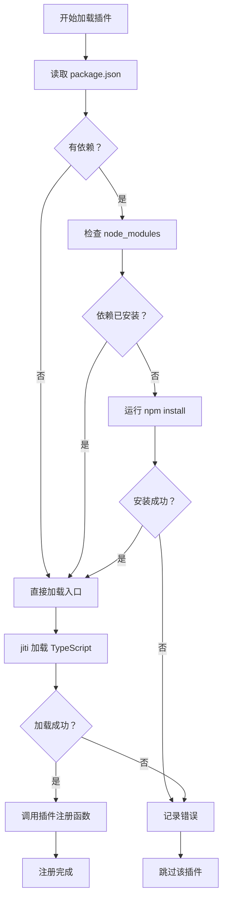

---

## 9. 错误处理与恢复

### 9.1 WebSocket 重连流程

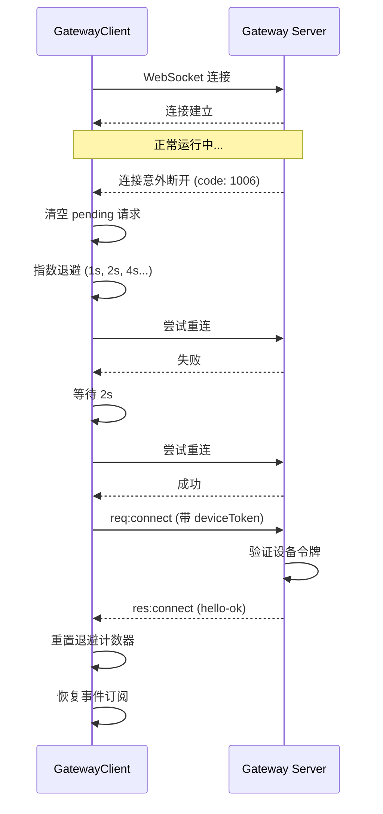

### 9.2 渠道错误恢复策略

```typescript
// src/channels/channel-health-monitor.ts

interface ChannelHealthConfig {
  maxRetries: number;           // 最大重试次数：5
  retryDelayMs: number;         // 重试间隔：5000
  circuitBreakerThreshold: number; // 熔断阈值：10
  circuitBreakerTimeoutMs: number; // 熔断超时：60000
}

class ChannelHealthMonitor {
  private state = new Map<string, ChannelState>();

  async reportError(channelId: string, error: Error): Promise<void> {
    let state = this.state.get(channelId);

    if (!state) {
      state = { failures: 0, lastFailure: Date.now(), circuitOpen: false };
      this.state.set(channelId, state);
    }

    state.failures += 1;
    state.lastFailure = Date.now();

    // 检查是否触发熔断
    if (state.failures >= this.config.circuitBreakerThreshold) {
      state.circuitOpen = true;
      this.logger.warn(`Channel ${channelId} circuit breaker opened`);

      // 设置超时恢复
      setTimeout(() => {
        state.circuitOpen = false;
        state.failures = 0;
        this.logger.info(`Channel ${channelId} circuit breaker closed`);
      }, this.config.circuitBreakerTimeoutMs);
    }

    // 通知渠道重启
    if (!state.circuitOpen) {
      await this.scheduleRetry(channelId);
    }
  }

  private async scheduleRetry(channelId: string): Promise<void> {
    const state = this.state.get(channelId);
    const delay = Math.min(
      this.config.retryDelayMs * Math.pow(2, state?.failures ?? 0),
      300000  // 最大 5 分钟
    );

    await this.sleep(delay);
    await this.gateway.channels.restart(channelId);
  }
}
```

---

## 10. 监控与日志

### 10.1 日志层级结构

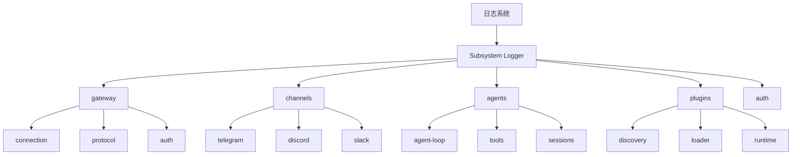

### 10.2 日志输出格式

```typescript
// src/logging.ts

interface LogEntry {
  timestamp: string;      // ISO 8601
  level: 'debug' | 'info' | 'warn' | 'error';
  subsystem: string;      // e.g., 'gateway/connection'
  message: string;
  context?: Record<string, unknown>;
  stack?: string;         // 仅 error 级别
}

// 示例输出
/*
2026-03-10T14:30:45.123Z [INFO] [gateway] WebSocket server started on 127.0.0.1:18789
2026-03-10T14:30:46.456Z [INFO] [channels/telegram] Connected to Telegram API
2026-03-10T14:31:00.789Z [DEBUG] [gateway/connection] New connection from 127.0.0.1
2026-03-10T14:31:01.012Z [WARN] [auth] Failed login attempt from 192.168.1.100
2026-03-10T14:31:02.345Z [ERROR] [channels/discord] Gateway connection failed
  Error: Rate limited
    at DiscordClient.connect (...)
    ...
*/
```

---

## 附录：缩写与术语

| 缩写 | 含义 |
|------|------|
| DM | Direct Message (私聊) |
| RPC | Remote Procedure Call |
| TTL | Time To Live |
| LRU | Least Recently Used |
| HMAC | Hash-based Message Authentication Code |
| E2E | End-to-End |

---

*文档版本：1.0*
*OpenClaw 版本：2026.3.9*
