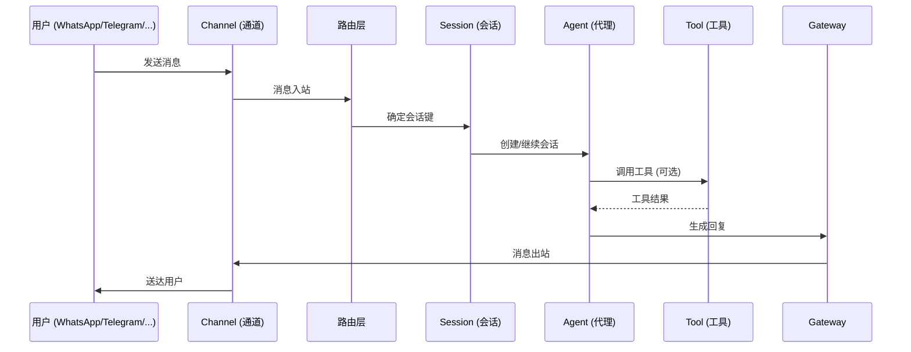
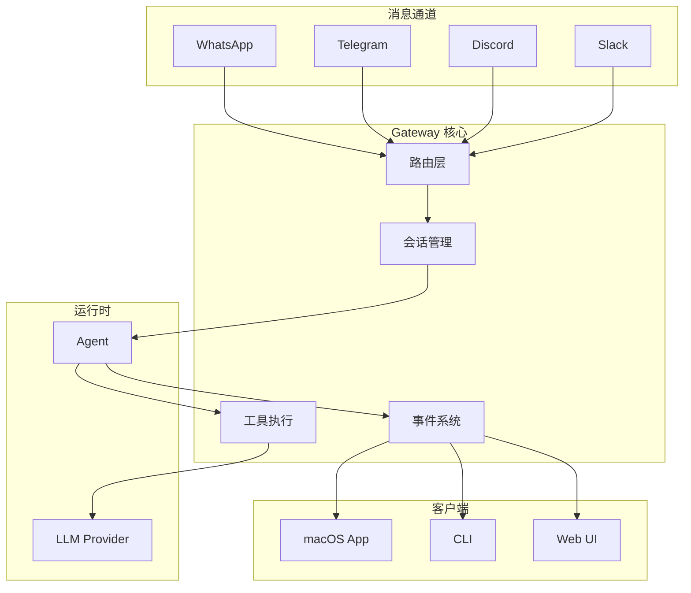
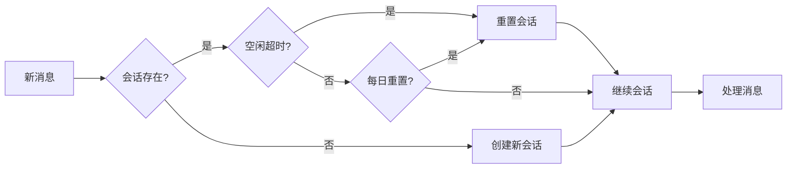

# 第 3 章：核心概念

> 本章概述：深入讲解 OpenClaw 的核心概念和架构设计。理解这些概念将帮助你更好地配置和使用 OpenClaw。

## 学习目标

- 理解 Gateway（网关）的核心作用
- 掌握 Session（会话）的工作机制
- 了解 Channel（通道）、Agent（代理）、Tool（工具）、Skill（技能）的定义和关系
- 熟悉 OpenClaw 的整体架构

## 前置条件

- 已完成 OpenClaw 的安装和基础配置
- 了解基本的命令行操作

---

## 3.1 Gateway（网关）

**Gateway** 是 OpenClaw 的核心控制平面，是所有消息、工具和事件的中央枢纽。

### 3.1.1 Gateway 的职责

| 职责 | 说明 |
|------|------|
| 消息路由 | 接收来自各渠道的消息，路由到对应的 Agent |
| 连接管理 | 维护与 LLM 提供商、消息渠道、客户端的 WebSocket 连接 |
| 会话管理 | 存储和管理会话历史、上下文、状态 |
| 工具执行 | 协调工具调用、执行结果返回 |
| 事件分发 | 向订阅客户端推送状态、健康、存在等事件 |

### 3.1.2 Gateway 架构

```
┌─────────────────────────────────────────────────────────────────┐
│                         Gateway                                  │
│  ┌──────────────┐  ┌──────────────┐  ┌──────────────┐          │
│  │  WhatsApp    │  │  Telegram    │  │   Slack      │          │
│  │  (Baileys)   │  │  (grammY)     │  │   (Bolt)     │          │
│  └──────┬───────┘  └──────┬───────┘  └──────┬───────┘          │
│         │                 │                 │                   │
│         └─────────────────┴─────────────────┘                   │
│                           │                                     │
│                  ┌────────▼────────┐                            │
│                  │  消息路由层      │                            │
│                  └────────┬────────┘                            │
│                           │                                     │
│         ┌─────────────────┼─────────────────┐                  │
│         │                 │                 │                   │
│  ┌──────▼───────┐  ┌──────▼───────┐  ┌──────▼───────┐          │
│  │  会话管理     │  │  工具执行     │  │  事件系统     │          │
│  └──────┬───────┘  └──────┬───────┘  └──────┬───────┘          │
│         │                 │                 │                   │
│         └─────────────────┼─────────────────┘                   │
│                           │                                     │
│                  ┌────────▼────────┐                            │
│                  │  WebSocket API  │                            │
│                  └────────┬────────┘                            │
└───────────────────────────┼─────────────────────────────────────┘
                            │
        ┌───────────────────┼───────────────────┐
        │                   │                   │
  ┌─────▼─────┐     ┌──────▼──────┐    ┌──────▼──────┐
  │  macOS    │     │    CLI      │    │   WebChat   │
  │   App     │     │  客户端     │    │    UI       │
  └───────────┘     └─────────────┘    └─────────────┘
```

### 3.1.3 消息处理流程



### 3.1.4 组件协作图



### 3.1.5 Gateway 配置要点

Gateway 的配置文件位于 `~/.openclaw/openclaw.json`：

```json5
{
  gateway: {
    // 网络绑定
    bind: "127.0.0.1",  // 默认本地回环
    port: 18789,        // 默认端口

    // 认证配置
    auth: {
      mode: "token",           // token | password | tailscale | none
      token: "your-token-here" // 或使用环境变量
    },

    // Tailscale 远程访问（可选）
    tailscale: {
      mode: "serve",  // off | serve | funnel
      resetOnExit: true
    }
  }
}
```

<Note>
**安全提示**：
- Gateway 默认绑定到 `127.0.0.1`，仅本地访问
- 启用远程访问时，务必配置认证（token 或 password）
- Tailscale Serve 提供尾网内安全访问，Funnel 提供公网访问（需密码）
</Note>

### 3.1.4 Gateway 操作命令

```bash
# 启动 Gateway（前台模式）
openclaw gateway --port 18789 --verbose

# 查看 Gateway 状态
openclaw gateway status

# 重启 Gateway
openclaw gateway restart

# 查看 Gateway 日志
openclaw logs --tail 100
```

---

## 3.2 Session（会话）

**Session** 是 OpenClaw 中对话的上下文容器，每次对话都关联到一个特定的会话。

### 3.2.1 会话键（Session Key）规则

会话键决定了消息如何被分组到不同的会话中：

| 会话类型 | 会话键格式 | 说明 |
|----------|-----------|------|
| 直接对话（默认） | `agent:<agentId>:main` | 所有 DM 共享主会话 |
| 每用户隔离 | `agent:<agentId>:dm:<peerId>` | 按发送者隔离 |
| 每渠道 + 用户 | `agent:<agentId>:<channel>:dm:<peerId>` | 推荐用于多用户收件箱 |
| 群组聊天 | `agent:<agentId>:<channel>:group:<id>` | 群组隔离 |
| Telegram 话题 | `agent:<agentId>:<channel>:group:<id>:topic:<threadId>` | 话题隔离 |

### 3.2.2 DM 作用域（dmScope）配置

`dmScope` 控制直接消息如何分组到会话：

```json5
{
  session: {
    // 选项：main | per-peer | per-channel-peer | per-account-channel-peer
    dmScope: "per-channel-peer"  // 推荐：按渠道 + 发送者隔离
  }
}
```

**安全建议**：

| 场景 | 推荐配置 |
|------|----------|
| 单用户 | `dmScope: "main"`（连续性最佳） |
| 多用户共享收件箱 | `dmScope: "per-channel-peer"`（隔离隐私） |
| 多账户 + 多用户 | `dmScope: "per-account-channel-peer"`（完全隔离） |

<Warning>
**安全风险**：如果多个用户可以向你的 Agent 发送 DM，但不启用隔离模式，不同用户的对话上下文会共享，可能导致隐私泄露。

示例问题：
- Alice 询问私人医疗预约信息
- Bob 问"我们刚才在聊什么？"
- 模型可能基于 Alice 的上下文回答 Bob
</Warning>

### 3.2.3 会话重置策略

会话可以配置为自动重置，以清理旧上下文：



```json5
{
  session: {
    reset: {
      // 每日重置（默认凌晨 4 点）
      mode: "daily",
      atHour: 4,

      // 空闲重置（可选）
      idleMinutes: 120,  // 2 小时无活动重置

      // 两种条件任一满足即触发重置
    }
  }
}
```

**手动重置命令**：
- `/new` 或 `/reset` — 开始新会话
- `/new <model>` — 指定新会话的模型
- `/compact` — 压缩旧上下文（摘要化）

### 3.2.4 会话存储位置

```
~/.openclaw/agents/<agentId>/sessions/
├── sessions.json              # 会话索引（元数据）
├── <SessionId>.jsonl          # 会话转录（完整对话历史）
└── <SessionId>.jsonl.deleted  # 已删除归档（可恢复）
```

### 3.2.5 会话维护

OpenClaw 自动执行会话维护，防止存储无限增长：

```json5
{
  session: {
    maintenance: {
      mode: "enforce",      // warn | enforce
      pruneAfter: "45d",    // 45 天后清理
      maxEntries: 800,      // 最多 800 个会话
      rotateBytes: "20mb",  // 索引文件大小限制
      resetArchiveRetention: "14d"  // 归档保留期
    }
  }
}
```

---

## 3.3 Channel（通道）

**Channel** 是 OpenClaw 与外部消息平台的连接接口。

### 3.3.1 支持的通道类型

| 类型 | 平台 | 库/协议 |
|------|------|---------|
| 即时通讯 | WhatsApp | Baileys |
| 即时通讯 | Telegram | grammY |
| 即时通讯 | Signal | signal-cli |
| 团队协作 | Slack | Bolt SDK |
| 团队协作 | Discord | discord.js |
| 团队协作 | Microsoft Teams | Graph API |
| 苹果生态 | iMessage | 原生/BlueBubbles |
| 开源协议 | Matrix, Nostr, IRC | 原生协议 |
| 其他 | Google Chat, LINE, Feishu, Zalo, Twitch 等 | 原生 API |

### 3.3.2 通道配置示例

**WhatsApp 配置**：
```json5
{
  channels: {
    whatsapp: {
      allowFrom: ["+1234567890"],  // 允许的用户列表
      groups: ["*"],               // "*" 允许所有群组
      requireMention: false        // 是否需要 @ 提及
    }
  }
}
```

**Telegram 配置**：
```json5
{
  channels: {
    telegram: {
      botToken: "123456:ABCDEF",  // 或使用环境变量 TELEGRAM_BOT_TOKEN
      allowFrom: ["username1", "username2"],
      groups: {
        "*": {
          requireMention: true
        }
      }
    }
  }
}
```

**Discord 配置**：
```json5
{
  channels: {
    discord: {
      token: "bot-token-here",
      dmPolicy: "pairing",  // pairing | open（DM 配对策略）
      allowFrom: ["user-id-1", "user-id-2"],
      guilds: ["guild-id-1"]  // 允许的服务器
    }
  }
}
```

### 3.3.3 DM 配对机制

当 `dmPolicy: "pairing"` 时，未知发送者会收到配对码：

```
[Bot] 收到配对码：ABCD1234
[Bot] 请联系管理员批准此设备。

管理员批准命令：
openclaw pairing approve discord ABCD1234
```

**配对相关命令**：
```bash
# 查看待批准的配对请求
openclaw pairing list

# 批准配对
openclaw pairing approve <channel> <code>

# 拒绝配对
openclaw pairing reject <channel> <code>

# 查看已配对设备
openclaw pairing approved --channel discord
```

---

## 3.4 Agent（代理）

**Agent** 是 OpenClaw 中执行 AI 推理和工具调用的运行时。

### 3.4.1 Agent 工作区

Agent 的工作空间位于 `~/.openclaw/workspace`，包含以下核心文件：

| 文件 | 作用 | 加载时机 |
|------|------|----------|
| `AGENTS.md` | 操作指令和记忆 | 每次会话 |
| `SOUL.md` | 人格、语调、边界 | 每次会话 |
| `USER.md` | 用户信息、称呼偏好 | 每次会话 |
| `IDENTITY.md` | Agent 名称、风格、emoji | 每次会话 |
| `TOOLS.md` | 工具使用说明 | 每次会话 |
| `BOOTSTRAP.md` | 一次性初始化指引 | 仅首次 |
| `memory/YYYY-MM-DD.md` | 每日记忆日志 | 按需读取 |
| `MEMORY.md` | 长期记忆（可选） | 主会话 |

### 3.4.2 工作区文件示例

**AGENTS.md 示例内容**：
```markdown
# 操作指令

## 核心规则
1. 始终验证用户身份后再执行敏感操作
2. 文件修改前必须获得用户确认
3. 遇到错误时提供清晰的解决方案

## 记忆
- 用户偏好用 pnpm 而非 npm
- 项目使用 TypeScript
- 工作时间：周一至周五 9:00-18:00
```

**SOUL.md 示例内容**：
```markdown
# 人格设定

## 名称
Clawdia (爪迪娅) 🦞

## 语调
- 友好、专业、略带幽默
- 简洁明了，避免冗长
- 必要时使用龙虾相关 emoji

## 边界
- 不提供医疗/法律/财务建议
- 不执行可能损害系统的操作
- 拒绝处理成人内容
```

### 3.4.3 多代理路由

OpenClaw 支持多个 Agent，根据规则路由消息：

```json5
{
  agents: {
    list: [
      {
        id: "main",           // 主代理
        workspace: "~/.openclaw/workspace",
        model: "anthropic/claude-opus-4-6"
      },
      {
        id: "support",        // 客服代理
        workspace: "~/.openclaw/workspace-support",
        model: "openai/gpt-4o",
        tools: {
          profile: "messaging"  // 仅消息工具
        }
      },
      {
        id: "coder",          // 编程代理
        workspace: "~/.openclaw/workspace-coder",
        model: "anthropic/claude-sonnet-4-6",
        tools: {
          profile: "coding"
        }
      }
    ]
  }
}
```

---

## 3.5 Tool（工具）

**Tool** 是 Agent 可以调用的能力，分为内置工具和扩展工具。

### 3.5.1 工具配置文件

工具配置文件 (`tools/profile`) 定义了 Agent 可以使用的工具集合：

| 配置文件 | 包含工具 | 适用场景 |
|----------|----------|----------|
| `minimal` | `session_status` | 最简对话 |
| `coding` | 文件系统、运行时、会话、记忆、图像 | 编程任务 |
| `messaging` | 消息工具、会话列表 | 客服/通信 |
| `full` | 所有工具 | 完全访问 |

### 3.5.2 核心工具概览

**文件系统工具**：
- `read` — 读取文件
- `write` — 写入文件
- `edit` — 编辑文件
- `apply_patch` — 应用结构化补丁（实验性）

**运行时工具**：
- `exec` — 执行命令
- `bash` — Shell 执行
- `process` — 管理后台进程

**会话工具**：
- `sessions_list` — 列出会话
- `sessions_history` — 查看历史
- `sessions_send` — 发送消息到另一会话
- `sessions_spawn` — 启动子代理

**浏览器工具**：
- `browser.status/start/stop` — 浏览器控制
- `browser.snapshot` — 页面快照
- `browser.screenshot` — 截图
- `browser.act` — UI 操作（点击/输入）

**节点工具**：
- `nodes.status/describe` — 节点发现
- `nodes.notify` — 发送通知
- `nodes.run` — 执行本地命令
- `nodes.camera_snap` — 拍照
- `nodes.screen_record` — 录屏

### 3.5.3 工具策略配置

```json5
{
  tools: {
    // 基础配置
    profile: "coding",

    // 额外允许的工具
    allow: ["browser", "slack"],

    // 明确拒绝的工具
    deny: ["exec", "bash"],

    // 按提供商限制
    byProvider: {
      "google-antigravity": {
        profile: "minimal"  // 对特定模型使用最简配置
      }
    },

    // 循环检测
    loopDetection: {
      enabled: true,
      warningThreshold: 10,
      criticalThreshold: 20
    }
  }
}
```

### 3.5.4 工具组速记

配置中可使用工具组速记：

| 组名 | 包含工具 |
|------|----------|
| `group:runtime` | exec, bash, process |
| `group:fs` | read, write, edit, apply_patch |
| `group:sessions` | sessions_list, sessions_history, sessions_send, sessions_spawn |
| `group:memory` | memory_search, memory_get |
| `group:web` | web_search, web_fetch |
| `group:ui` | browser, canvas |
| `group:messaging` | message |
| `group:nodes` | nodes |
| `group:openclaw` | 所有内置工具 |

示例：
```json5
{
  tools: {
    allow: ["group:fs", "browser"]  // 文件工具 + 浏览器
  }
}
```

---

## 3.6 Skill（技能）

**Skill** 是预定义的工作流程和工具组合，用于简化复杂任务。

### 3.6.1 技能来源

OpenClaw 从三个位置加载技能：

| 来源 | 位置 | 优先级 |
|------|------|--------|
| Bundled | 安装包内置 | 最低 |
| Managed | `~/.openclaw/skills` | 中 |
| Workspace | `<workspace>/skills` | 最高（可覆盖） |

### 3.6.2 技能结构

技能目录结构：
```
skills/<skill-name>/
├── SKILL.md          # 技能说明和使用方法
├── prompt.md         # 提示词模板
├── tools.json        # 工具配置（可选）
└── assets/           # 资源文件（可选）
```

**SKILL.md 示例**：
```markdown
# 代码审查技能

## 功能
自动审查提交的代码，检查：
- 代码风格
- 潜在 bug
- 安全漏洞
- 性能问题

## 使用方式
/ review <file-path>

## 输出
- 问题列表（按严重程度）
- 修复建议
- 代码示例
```

### 3.6.3 技能配置

```json5
{
  skills: {
    // 启用 ClawHub（在线技能注册表）
    clawhub: {
      enabled: true
    },

    // 允许的技能列表
    allow: ["code-review", "git-commit", "docker-build"],

    // 拒绝的技能
    deny: ["auto-deploy"],

    // 技能目录
    directories: [
      "~/.openclaw/skills",
      "~/.openclaw/workspace/skills"
    ]
  }
}
```

### 3.6.4 内置技能示例

OpenClaw 提供多个内置技能：

| 技能 | 功能 |
|------|------|
| `code-review` | 代码审查 |
| `git-commit` | Git 提交辅助 |
| `docker-build` | Docker 构建 |
| `test-runner` | 测试执行 |
| `doc-generator` | 文档生成 |

---

## 本章小结

- **Gateway**：中央控制平面，管理所有连接、路由和事件
- **Session**：对话上下文容器，通过会话键分组，支持自动重置和维护
- **Channel**：与外部消息平台的连接，支持 20+ 平台
- **Agent**：AI 运行时，使用工作区文件定义行为和人格
- **Tool**：Agent 可调用的能力，通过配置文件精细控制
- **Skill**：预定义的工作流程，简化复杂任务

## 延伸阅读

- [Gateway 架构详解](https://docs.openclaw.ai/concepts/architecture)
- [会话管理](https://docs.openclaw.ai/concepts/session)
- [Agent 运行时](https://docs.openclaw.ai/concepts/agent)
- [工具系统](https://docs.openclaw.ai/tools)
- [第 4 章：网关配置详解](chapter-04.md)

---

*上一章：[第 2 章：快速开始](chapter-02.md) | 下一章：[第 4 章：网关配置详解](chapter-04.md)*
