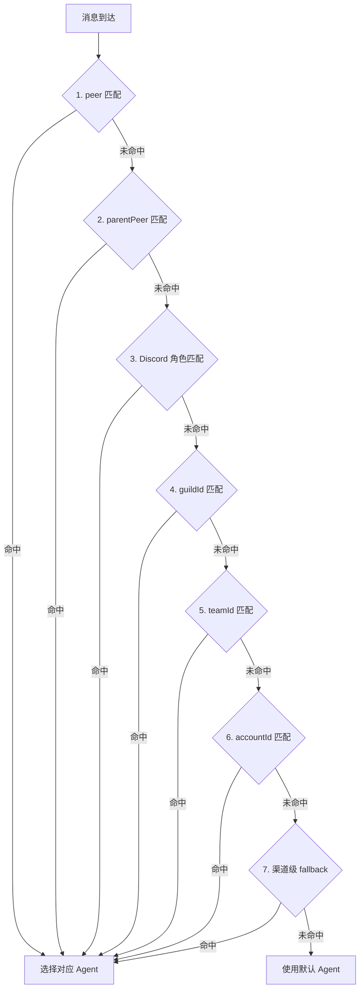

# 第 8 章：多代理路由

> 本章概述：讲解如何配置多个隔离的 Agent，实现多账号管理、多用户共享网关、以及基于角色的消息路由。

## 学习目标

- 理解多代理架构和隔离边界
- 学会配置多个 Agent 工作区
- 掌握 Binding 路由规则
- 实现多账号和多用户场景

## 前置条件

- 已完成基础 Gateway 配置
- 了解 Agent 工作区结构

---

## 8.1 多代理架构概述

### 8.1.1 什么是 Agent

一个 **Agent** 是一个完全隔离的 AI 大脑，拥有独立的：

| 组件 | 说明 | 存储位置 |
|------|------|----------|
| **工作区** | 文件、AGENTS.md、SOUL.md、USER.md | `~/.openclaw/workspace-<agentId>` |
| **状态目录** | 认证 Profile、模型注册表 | `~/.openclaw/agents/<agentId>/agent` |
| **会话存储** | 聊天历史、路由状态 | `~/.openclaw/agents/<agentId>/sessions` |

**重要提示**：
- 认证 Profile 是每个 Agent 独立的
- 不要在不同 Agent 间复用 `agentDir`
- 如需共享凭据，复制 `auth-profiles.json`

### 8.1.2 单代理 vs 多代理

**单代理模式（默认）**：
```json5
{
  // 不配置 agents.list 时使用默认
  // agentId 默认为 "main"
  // 会话键：agent:main:<mainKey>
}
```

**多代理模式**：
```json5
{
  agents: {
    list: [
      { id: "main", workspace: "~/.openclaw/workspace" },
      { id: "coding", workspace: "~/.openclaw/workspace-coding" },
      { id: "social", workspace: "~/.openclaw/workspace-social" }
    ]
  }
}
```

### 8.1.3 多代理应用场景

| 场景 | 说明 |
|------|------|
| **多用户共享** | 多人共享网关，独立数据和人格 |
| **多账号管理** | 多个 WhatsApp/Telegram 账号 |
| **专业分工** | 编程代理、社交代理、研究代理 |
| **测试隔离** | 生产代理 vs 测试代理 |

---

## 8.2 创建和配置 Agent

### 8.2.1 使用向导创建 Agent

```bash
# 创建新的 Agent
openclaw agents add coding

# 创建并查看
openclaw agents list --bindings
```

### 8.2.2 手动配置多 Agent

```json5
{
  agents: {
    list: [
      {
        // 主代理
        id: "main",
        workspace: "~/.openclaw/workspace",
        model: "anthropic/claude-opus-4-6"
      },
      {
        // 编程代理
        id: "coding",
        workspace: "~/.openclaw/workspace-coding",
        agentDir: "~/.openclaw/agents/coding/agent",
        model: "openai/gpt-5.4",
        tools: {
          profile: "coding"
        }
      },
      {
        // 社交代理
        id: "social",
        workspace: "~/.openclaw/workspace-social",
        agentDir: "~/.openclaw/agents/social/agent",
        model: "google/gemini-3.1-pro"
      }
    ]
  }
}
```

### 8.2.3 Agent 工作区文件

每个 Agent 工作区包含：

```
~/.openclaw/workspace-coding/
├── AGENTS.md          # 操作指令
├── SOUL.md            # 人格设定
├── USER.md            # 用户信息
├── IDENTITY.md        # Agent 身份
├── TOOLS.md           # 工具说明
├── memory/            # 记忆日志
│   └── YYYY-MM-DD.md
└── skills/            # 专属技能
```

---

## 8.3 多账号配置

### 8.3.1 WhatsApp 多账号

```json5
{
  channels: {
    whatsapp: {
      // 默认账号
      dmPolicy: "allowlist",
      allowFrom: ["+15551234567"],

      // 多账号配置
      accounts: {
        personal: {
          dmPolicy: "allowlist",
          allowFrom: ["+15551111111", "+15552222222"]
        },
        work: {
          dmPolicy: "pairing",
          allowFrom: ["+15553333333"]
        }
      }
    }
  }
}
```

**链接多个 WhatsApp 设备**：
```bash
# 链接工作账号
openclaw channels login --channel whatsapp --account work

# 链接个人账号
openclaw channels login --channel whatsapp --account personal
```

### 8.3.2 Telegram 多账号

```json5
{
  channels: {
    telegram: {
      // 默认账号
      botToken: "123:abc",
      dmPolicy: "pairing",

      // 多账号配置
      accounts: {
        default: {
          botToken: "123:abc",
          dmPolicy: "pairing"
        },
        support: {
          botToken: "456:def",
          dmPolicy: "allowlist",
          allowFrom: ["123456789"]
        }
      }
    }
  }
}
```

### 8.3.3 Discord 多账号

```json5
{
  channels: {
    discord: {
      // 默认账号
      token: "bot-token-1",
      groupPolicy: "allowlist",

      // 多账号配置
      accounts: {
        primary: {
          token: "bot-token-1",
          guilds: {
            "guild-id-1": { requireMention: true }
          }
        },
        secondary: {
          token: "bot-token-2",
          guilds: {
            "guild-id-2": { requireMention: false }
          }
        }
      }
    }
  }
}
```

---

## 8.4 Binding 路由规则

### 8.4.1 Binding 匹配优先级

Binding 采用**最具体匹配优先**原则：



**优先级顺序**：
```
1. peer 匹配（精确 DM/群组/渠道 ID）
   ↓
2. parentPeer 匹配（线程继承）
   ↓
3. guildId + roles（Discord 角色路由）
   ↓
4. guildId（Discord 服务器）
   ↓
5. teamId（Slack 团队）
   ↓
6. accountId 匹配
   ↓
7. 渠道级匹配（accountId: "*"）
   ↓
8. 默认 Agent（default 或第一个）
```

### 8.4.2 Binding 配置示例

**按发送者路由**：
```json5
{
  bindings: [
    {
      // Alex 的消息路由到 alex 代理
      agentId: "alex",
      match: {
        channel: "whatsapp",
        peer: { kind: "direct", id: "+15551230001" }
      }
    },
    {
      // Mia 的消息路由到 mia 代理
      agentId: "mia",
      match: {
        channel: "whatsapp",
        peer: { kind: "direct", id: "+15551230002" }
      }
    }
  ]
}
```

**按群组路由**：
```json5
{
  bindings: [
    {
      agentId: "main",
      match: {
        channel: "telegram",
        peer: { kind: "group", id: "-1001234567890" }
      }
    },
    {
      agentId: "support",
      match: {
        channel: "telegram",
        peer: { kind: "group", id: "-1009876543210" }
      }
    }
  ]
}
```

**按 Discord 角色路由**：
```json5
{
  bindings: [
    {
      agentId: "opus",
      match: {
        channel: "discord",
        guildId: "123456789012345678",
        roles: ["111111111111111111"]  // VIP 角色
      }
    },
    {
      agentId: "sonnet",
      match: {
        channel: "discord",
        guildId: "123456789012345678"
        // 其他成员
      }
    }
  ]
}
```

### 8.4.3 完整多用户配置示例

```json5
{
  // 两个独立 Agent
  agents: {
    list: [
      {
        id: "alex",
        workspace: "~/.openclaw/workspace-alex",
        model: "anthropic/claude-opus-4-6"
      },
      {
        id: "mia",
        workspace: "~/.openclaw/workspace-mia",
        model: "openai/gpt-5.4"
      }
    ]
  },

  // 共享一个 WhatsApp 账号
  channels: {
    whatsapp: {
      dmPolicy: "allowlist",
      allowFrom: ["+15551230001", "+15551230002"]
    }
  },

  // 按发送者路由
  bindings: [
    {
      agentId: "alex",
      match: {
        channel: "whatsapp",
        peer: { kind: "direct", id: "+15551230001" }
      }
    },
    {
      agentId: "mia",
      match: {
        channel: "whatsapp",
        peer: { kind: "direct", id: "+15551230002" }
      }
    }
  ]
}
```

---

## 8.5 账号作用域 Binding

### 8.5.1 账号作用域规则

| Binding 配置 | 匹配行为 |
|-------------|----------|
| 无 `accountId` | 仅匹配默认账号 |
| `accountId: "work"` | 匹配特定账号 |
| `accountId: "*"` | 匹配所有账号（渠道级 fallback） |

### 8.5.2 账号作用域示例

```json5
{
  channels: {
    whatsapp: {
      accounts: {
        personal: { /* 个人账号配置 */ },
        work: { /* 工作账号配置 */ }
      }
    }
  },

  bindings: [
    {
      // 个人账号的 DM 路由到 main 代理
      agentId: "main",
      match: {
        channel: "whatsapp",
        accountId: "personal",
        peer: { kind: "direct", id: "+" }
      }
    },
    {
      // 工作账号的群组路由到 work 代理
      agentId: "work",
      match: {
        channel: "whatsapp",
        accountId: "work",
        peer: { kind: "group", id: "group-id" }
      }
    },
    {
      // 渠道级 fallback（所有账号的未匹配消息）
      agentId: "fallback",
      match: {
        channel: "whatsapp",
        accountId: "*"
      }
    }
  ]
}
```

---

## 8.6 多代理最佳实践

### 8.6.1 家庭共享场景

```json5
{
  agents: {
    list: [
      {
        id: "dad",
        workspace: "~/.openclaw/workspace-dad",
        model: "anthropic/claude-opus-4-6"
      },
      {
        id: "mom",
        workspace: "~/.openclaw/workspace-mom",
        model: "openai/gpt-5.4"
      },
      {
        id: "kids",
        workspace: "~/.openclaw/workspace-kids",
        model: "google/gemini-3.1-pro",
        tools: {
          deny: ["exec", "browser"]  // 限制工具
        }
      }
    ]
  },

  bindings: [
    {
      agentId: "dad",
      match: { channel: "telegram", peer: { kind: "direct", id: "dad-id" } }
    },
    {
      agentId: "mom",
      match: { channel: "telegram", peer: { kind: "direct", id: "mom-id" } }
    },
    {
      agentId: "kids",
      match: { channel: "telegram", peer: { kind: "direct", id: "kids-id" } }
    }
  ]
}
```

### 8.6.2 专业分工场景

```json5
{
  agents: {
    list: [
      {
        id: "coder",
        workspace: "~/.openclaw/workspace-coder",
        tools: { profile: "coding" }
      },
      {
        id: "writer",
        workspace: "~/.openclaw/workspace-writer",
        tools: { profile: "messaging" }
      },
      {
        id: "researcher",
        workspace: "~/.openclaw/workspace-researcher",
        tools: { allow: ["group:web", "browser"] }
      }
    ]
  }
}
```

### 8.6.3 生产/测试隔离

```json5
{
  agents: {
    list: [
      {
        id: "production",
        workspace: "~/.openclaw/workspace-prod",
        sandbox: { mode: "all" }
      },
      {
        id: "staging",
        workspace: "~/.openclaw/workspace-staging",
        sandbox: { mode: "off" }  // 测试环境禁用沙箱
      }
    ]
  }
}
```

---

## 8.6.4 协作工作流模式

| 模式 | 说明 | 适用场景 |
|------|------|----------|
| **链式调用** | Agent A → Agent B → Agent C | 流水线处理 |
| **主从架构** | Main Agent 分派给 Worker Agents | 任务分解 |
| **发布订阅** | 一个 Agent 输出，多个 Agent 订阅 | 广播通知 |
| **请求响应** | Agent A 请求，Agent B 响应后返回 | 专业咨询 |

---

## 8.7 Agent 间通信配置

### 8.7.1 通信架构概述

OpenClaw 支持多种 Agent 间通信方式：

```
┌─────────────────────────────────────────────────────────────┐
│                    Gateway Router                          │
└─────────────┬───────────────────────────────────────────────┘
              │
    ┌─────────┼─────────┬─────────────┐
    │         │         │             │
    ▼         ▼         ▼             ▼
┌────────┐ ┌────────┐ ┌────────┐ ┌──────────┐
│ Main   │ │ Coder  │ │ Writer │ │ Reviewer │
│ Agent  │ │ Agent  │ │ Agent  │ │ Agent    │
└───┬────┘ └───┬────┘ └───┬────┘ └────┬─────┘
    │          │         │           │
    └──────────┴────┬────┴───────────┘
                    │
         ┌──────────▼──────────┐
         │   Inter-Agent Bus   │
         │   (消息中间件)       │
         └──────────┬──────────┘
                    │
    ┌───────────────┼───────────────┐
    │               │               │
    ▼               ▼               ▼
┌─────────┐   ┌──────────┐   ┌──────────┐
│ Shared  │   │ Event    │   │ Task     │
│ Memory  │   │ Queue    │   │ Registry │
└─────────┘   └──────────┘   └──────────┘
```

### 8.7.2 配置 Inter-Agent 路由

在 `gateway.json5` 中启用 Agent 间路由：

```json5
{
  agents: {
    list: [
      {
        id: "main",
        workspace: "~/.openclaw/workspace-main",
        model: "anthropic/claude-opus-4-6"
      },
      {
        id: "coder",
        workspace: "~/.openclaw/workspace-coder",
        model: "anthropic/claude-sonnet-4-6"
      },
      {
        id: "reviewer",
        workspace: "~/.openclaw/workspace-reviewer",
        model: "anthropic/claude-opus-4-6"
      }
    ],

    // Agent 间通信配置
    routing: {
      // 启用内部路由
      enabled: true,

      // 路由表
      routes: [
        {
          // 代码审查请求
          from: ["main", "coder"],
          to: "reviewer",
          trigger: {
            type: "keyword",
            pattern: "/review|代码审查|code review"
          }
        },
        {
          // 编码任务委派
          from: ["main"],
          to: "coder",
          trigger: {
            type: "intent",
            pattern: "/code|实现 | 编写 | 创建文件"
          }
        }
      ]
    }
  }
}
```

### 8.7.2 agentToAgent 配置参考

`agentToAgent` 配置允许一个 Agent 直接调用另一个 Agent。配置格式如下：

```json5
{
  agents: {
    list: [
      {
        id: "main",
        workspace: "~/.openclaw/workspace-main",
        model: "anthropic/claude-opus-4-6",

        // agentToAgent 配置
        agentToAgent: {
          // 允许调用的目标 Agent 列表
          allowedTargets: ["coder", "reviewer", "researcher"],

          // 调用模式
          mode: "async",  // "sync" | "async" | "fire-and-forget"

          // 默认超时（秒）
          timeout: 300,

          // 重试配置
          retry: {
            maxAttempts: 3,
            delay: 5
          }
        }
      },
      {
        id: "coder",
        workspace: "~/.openclaw/workspace-coder",
        model: "anthropic/claude-sonnet-4-6",

        // 子代理配置（被调用时）
        subAgent: {
          // 允许被调用
          enabled: true,

          // 输入验证
          inputSchema: {
            type: "object",
            required: ["task"],
            properties: {
              task: { type: "string" },
              language: { type: "string", enum: ["python", "javascript", "rust"] },
              testRequired: { type: "boolean" }
            }
          },

          // 输出处理
          output: {
            format: "diff",  // "diff" | "full" | "summary"
            includeTests: true
          }
        }
      }
    ]
  }
}
```

### 8.7.3 完整 agentToAgent 配置示例

**场景：Main Agent 调用 Coder Agent 和 Reviewer Agent**

```json5
{
  agents: {
    list: [
      {
        id: "main",
        workspace: "~/.openclaw/workspace-main",
        model: "anthropic/claude-opus-4-6",

        agentToAgent: {
          // 定义可调用的目标
          targets: {
            coder: {
              // 目标 Agent ID
              agentId: "coder",

              // 调用方式
              invokeMode: "sync",  // sync=等待结果，async=后台执行

              // 超时配置
              timeout: 600,

              // 传递的上下文
              context: {
                pass: ["conversationId", "userId", "preferences"],
                omit: ["authToken"]
              },

              // 输入映射（将当前上下文映射到子代理输入）
              inputMap: {
                task: "${currentTask.description}",
                files: "${workspace.modifiedFiles}",
                instructions: "${currentTask.instructions}"
              }
            },

            reviewer: {
              agentId: "reviewer",
              invokeMode: "sync",
              timeout: 300,
              inputMap: {
                diff: "${lastCommit.diff}",
                guidelines: "${reviewGuidelines}"
              }
            },

            researcher: {
              agentId: "researcher",
              invokeMode: "async",  // 异步执行
              timeout: 900,
              callback: {
                // 完成后通知
                notify: true,
                target: "main",
                event: "research:complete"
              }
            }
          },

          // 编排规则
          orchestration: {
            // 链式调用：main -> coder -> reviewer
            chain: ["coder", "reviewer"],

            // 或者并行调用
            parallel: {
              agents: ["coder", "researcher"],
              waitForAll: true
            }
          }
        }
      },

      {
        id: "coder",
        workspace: "~/.openclaw/workspace-coder",
        model: "anthropic/claude-sonnet-4-6",

        subAgent: {
          enabled: true,
          // 能力声明（供调用方了解）
          capabilities: [
            "code-generation",
            "refactoring",
            "bug-fix",
            "test-writing"
          ],
          // 支持的编程语言
          languages: ["python", "javascript", "typescript", "rust", "go"],
          // 输出配置
          output: {
            format: "patch",
            includeExplanation: true
          }
        }
      },

      {
        id: "reviewer",
        workspace: "~/.openclaw/workspace-reviewer",
        model: "anthropic/claude-opus-4-6",

        subAgent: {
          enabled: true,
          capabilities: [
            "code-review",
            "security-audit",
            "performance-check"
          ],
          // 审查配置
          review: {
            checkSecurity: true,
            checkPerformance: true,
            checkStyle: true,
            suggestImprovements: true
          }
        }
      }
    ]
  }
}
```

### 8.7.4 在 AGENTS.md 中声明 agentToAgent 能力

```markdown
# AGENTS.md - Main Agent

## 可调用的子代理

| 子代理 | 用途 | 调用命令 |
|--------|------|----------|
| @coder | 代码编写 | `/delegate coder <task>` |
| @reviewer | 代码审查 | `/delegate reviewer <diff>` |
| @researcher | 网络调研 | `/delegate researcher <query>` |

## 委派配置

```agent-to-agent
targets:
  - id: coder
    command: "openclaw agent invoke coder"
    mode: sync
    timeout: 600
    input:
      task: "${task}"
      context: "${context}"

  - id: reviewer
    command: "openclaw agent invoke reviewer"
    mode: sync
    timeout: 300
    input:
      diff: "${diff}"
```

## 使用示例

```bash
# 同步调用（等待结果）
result=$(openclaw agent invoke coder --sync --input '{"task":"实现排序"}')

# 异步调用（后台执行）
openclaw agent invoke coder --async --input '{"task":"优化查询"}'

# 链式调用
openclaw agent chain coder reviewer --input '{"task":"实现并审查用户登录"}'

# 并行调用
openclaw agent parallel coder researcher --input '{"task":"实现新功能"}'
```
```

### 8.7.5 agentToAgent API 参考

| 参数 | 类型 | 必填 | 说明 |
|------|------|------|------|
| `agentId` | string | 是 | 目标 Agent ID |
| `invokeMode` | string | 否 | `sync`/`async`/`fire-and-forget`，默认 `sync` |
| `timeout` | number | 否 | 超时秒数，默认 300 |
| `input` | object | 是 | 传递给子代理的输入 |
| `context` | object | 否 | 上下文传递配置 |
| `callback` | object | 否 | 异步回调配置 |
| `retry` | object | 否 | 重试配置 |

### 8.7.6 使用示例

**在代码中调用子代理**：

```bash
#!/bin/bash
# 调用 Coder Agent 实现功能

# 同步调用并获取结果
response=$(openclaw agent invoke coder \
  --mode sync \
  --timeout 600 \
  --input '{
    "task": "实现用户登录功能",
    "requirements": [
      "支持邮箱和密码登录",
      "支持 JWT token",
      "包含错误处理"
    ],
    "language": "python"
  }')

# 解析响应
code=$(echo "$response" | jq -r '.code')
tests=$(echo "$response" | jq -r '.tests')

# 将代码传递给 Reviewer Agent
review=$(echo "$code" | openclaw agent invoke reviewer \
  --mode sync \
  --input '{
    "diff": "'"$code"'",
    "checkSecurity": true,
    "checkPerformance": true
  }')

echo "$review"
```

**Python SDK 调用**：

```python
from openclaw import AgentClient

# 创建客户端
client = AgentClient()

# 同步调用
result = client.invoke(
    agent_id="coder",
    input={
        "task": "实现快速排序",
        "language": "python"
    },
    mode="sync",
    timeout=600
)

print(result.code)
print(result.explanation)

# 异步调用
task_id = client.invoke(
    agent_id="researcher",
    input={"query": "最新 Python 异步编程最佳实践"},
    mode="async",
    callback=lambda result: print(result.summary)
)

# 等待异步任务完成
result = client.wait(task_id)
```

### 8.7.7 诊断命令

```bash
# 查看 agentToAgent 状态
openclaw agents status --agent-to-agent

# 测试子代理调用
openclaw agent test-invoke coder --input '{"task":"test"}'

# 查看调用历史
openclaw agent invoke-history --limit 10

# 查看正在进行的调用
openclaw agent active-invocations
```

### 8.7.3 直接消息传递

使用 `openclaw agent send` 命令发送消息到指定 Agent：

```bash
# 发送消息到 Coder Agent
openclaw agent send coder --message "实现一个快速排序算法"

# 发送消息并等待响应
openclaw agent send reviewer --message "审查这个 PR" --wait

# 广播消息到多个 Agent
openclaw agent broadcast --agents "coder,reviewer" --message "开始新迭代"
```

### 8.7.8 任务委派配置

在 AGENTS.md 中配置委派规则：

```markdown
# AGENTS.md - Main Agent

## 委派规则

当遇到以下情况时，将任务委派给专业 Agent：

| 任务类型 | 目标 Agent | 触发条件 |
|----------|-----------|----------|
| 代码编写 | @coder | 包含"实现"、"创建"、"修复" |
| 代码审查 | @reviewer | 包含"审查"、"check"、"review" |
| 文档编写 | @writer | 包含"文档"、"说明"、"README" |
| 网络搜索 | @researcher | 包含"搜索"、"查找"、"调研" |

## 委派命令

```bash
# 委派并等待返回
@coder --wait 实现用户登录功能

# 委派后继续其他工作（异步）
@coder 优化数据库查询性能

# 委派时传递上下文
@reviewer --context ./pr-diff.txt 审查这个变更
```
```

### 8.7.9 共享状态配置

配置 Agent 间共享的记忆和状态：

```json5
{
  agents: {
    list: [
      {
        id: "main",
        workspace: "~/.openclaw/workspace-main"
      },
      {
        id: "coder",
        workspace: "~/.openclaw/workspace-coder",

        // 共享配置
        shared: {
          // 共享记忆目录
          memory: {
            enabled: true,
            path: "~/.openclaw/shared/memory",
            access: ["read", "write"]
          },

          // 共享知识库
          knowledge: {
            enabled: true,
            path: "~/.openclaw/shared/knowledge",
            access: ["read"]
          },

          // 共享会话上下文
          context: {
            enabled: true,
            propagateFrom: "main"
          }
        }
      }
    ]
  }
}
```

### 8.7.10 事件驱动通信

配置事件触发器实现松耦合通信：

```json5
{
  agents: {
    routing: {
      events: {
        // 定义事件类型
        types: {
          "code:complete": {
            description: "代码任务完成",
            subscribers: ["reviewer", "main"]
          },
          "review:complete": {
            description: "审查完成",
            subscribers: ["main"]
          },
          "task:failed": {
            description: "任务失败",
            subscribers: ["main"]
          }
        },

        // 事件处理器
        handlers: [
          {
            event: "code:complete",
            action: {
              type: "notify",
              target: "reviewer",
              message: "代码已完成，请审查"
            }
          },
          {
            event: "review:complete",
            action: {
              type: "update-status",
              target: "main",
              field: "reviewStatus"
            }
          }
        ]
      }
    }
  }
}
```

### 8.7.11 子代理调用

在 AGENTS.md 中配置子代理调用：

```markdown
## 子代理配置

当需要专业能力时，调用子代理：

```json
{
  "subagents": {
    "coder": {
      "command": "openclaw agent invoke coder",
      "input": {
        "task": "${task}",
        "context": "${context}"
      },
      "timeout": 300,
      "retry": 2
    },
    "reviewer": {
      "command": "openclaw agent invoke reviewer",
      "input": {
        "diff": "${diff}",
        "guidelines": "${reviewGuidelines}"
      }
    }
  }
}
```

### 使用示例

调用子代理并获取结果：
```bash
result=$(openclaw agent invoke coder --input '{"task":"实现排序"}')
echo "$result" | openclaw agent invoke reviewer
```
```

### 8.7.12 会话状态传递

配置跨 Agent 的会话状态：

```json5
{
  agents: {
    routing: {
      // 会话状态传递
      sessionPropagation: {
        enabled: true,

        // 传递的字段
        fields: [
          "userId",
          "conversationId",
          "context",
          "preferences"
        ],

        // 排除的敏感字段
        exclude: [
          "authToken",
          "credentials"
        ]
      }
    }
  }
}
```

### 8.7.13 完整工作流示例

**场景：代码开发工作流**

```json5
{
  agents: {
    list: [
      { id: "main", workspace: "~/.openclaw/workspace-main" },
      { id: "architect", workspace: "~/.openclaw/workspace-architect" },
      { id: "coder", workspace: "~/.openclaw/workspace-coder" },
      { id: "tester", workspace: "~/.openclaw/workspace-tester" },
      { id: "reviewer", workspace: "~/.openclaw/workspace-reviewer" }
    ],

    routing: {
      enabled: true,

      // 工作流定义
      workflow: {
        name: "code-development",
        steps: [
          {
            name: "design",
            agent: "architect",
            input: "${requirement}",
            output: "${designDoc}"
          },
          {
            name: "implement",
            agent: "coder",
            input: "${designDoc}",
            dependsOn: ["design"],
            output: "${code}"
          },
          {
            name: "test",
            agent: "tester",
            input: "${code}",
            dependsOn: ["implement"],
            output: "${testReport}"
          },
          {
            name: "review",
            agent: "reviewer",
            input: "${code}",
            dependsOn: ["test"],
            output: "${reviewResult}"
          }
        ]
      }
    }
  }
}
```

**执行工作流**：

```bash
# 启动完整工作流
openclaw workflow run code-development \
  --input "实现用户认证系统" \
  --follow

# 查看工作流状态
openclaw workflow status code-development

# 查看特定步骤日志
openclaw workflow logs code-development --step implement
```

---

## 8.9 诊断和调试

### 8.7.1 诊断命令

```bash
# 查看 Agent 列表和 Binding
openclaw agents list --bindings

# 查看通道状态
openclaw channels status --probe

# 检查路由
openclaw gateway call bindings.match --params '{"channel":"whatsapp","peer":"+1234567890"}'
```

### 8.7.2 日志分析

```bash
# 查看路由日志
openclaw logs --follow | grep -E "binding|routing|agent"

# 检查特定会话
openclaw sessions --active 60
```

---

## 本章小结

- **多代理架构**：每个 Agent 有独立的工作区、状态和会话
- **多账号支持**：WhatsApp、Telegram、Discord 支持多账号
- **Binding 路由**：最具体匹配优先，支持 peer/guild/role 匹配
- **账号作用域**：`accountId` 控制 Binding 匹配范围
- **Agent 间通信**：支持直接消息、事件驱动、工作流编排
- **共享状态**：配置共享记忆、知识库和会话上下文
- **应用场景**：多用户共享、专业分工、生产/测试隔离

## 延伸阅读

- [Binding 配置参考](https://docs.openclaw.ai/gateway/configuration#bindings)
- [通道路由详解](https://docs.openclaw.ai/channels/channel-routing)
- [Agent 间通信指南](https://docs.openclaw.ai/agents/inter-agent)
- [第 9 章：工具系统](chapter-09.md)

---

*上一章：[第 7 章：安全与权限](chapter-07.md) | 下一章：[第 9 章：工具系统](chapter-09.md)*
