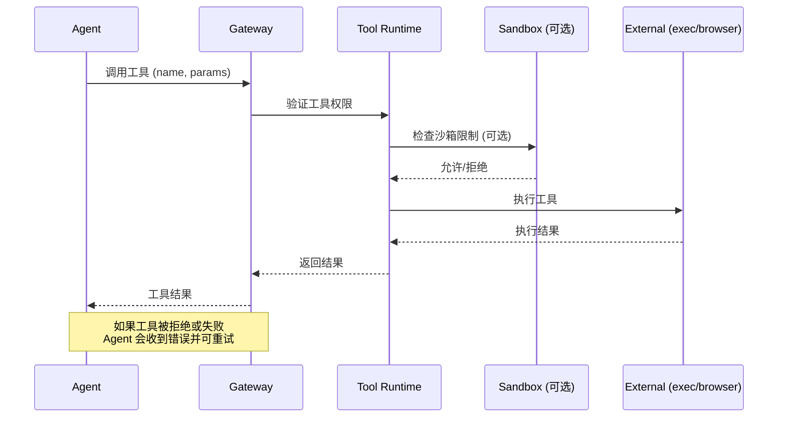

# 第 9 章：工具系统

> 本章概述：深入讲解 OpenClaw 的工具系统，包括内置工具、工具组、工具策略和工具开发。

## 学习目标

- 掌握所有内置工具的使用方法
- 理解工具配置文件和工具组
- 学会配置工具策略
- 了解工具开发和扩展

## 前置条件

- 已完成基础 Agent 配置
- 了解工具执行的基本概念

---

## 9.1 工具系统概述

### 9.1.1 工具分类

OpenClaw 工具分为以下几类：

| 类别 | 工具 | 说明 |
|------|------|------|
| **文件系统** | read, write, edit, apply_patch | 文件操作 |
| **运行时** | exec, bash, process | 命令执行和进程管理 |
| **会话** | sessions_list, sessions_history, sessions_send | 会话管理 |
| **记忆** | memory_search, memory_get | 记忆查询 |
| **网络** | web_search, web_fetch | 网页搜索和抓取 |
| **UI** | browser, canvas | 浏览器和画布控制 |
| **消息** | message | 消息发送 |
| **节点** | nodes | 设备节点控制 |
| **自动化** | cron, gateway | 定时任务和网关控制 |

### 9.1.2 工具调用流程



```
Agent 决定调用工具
       ↓
工具参数验证
       ↓
工具执行（可能在沙箱中）
       ↓
结果返回给 Agent
       ↓
Agent 继续推理或回复
```

---

## 9.2 核心工具详解

### 9.2.1 文件系统工具

**read - 读取文件**
```json
{
  "tool": "read",
  "params": {
    "path": "src/main.ts",
    "offset": 0,
    "limit": 100
  }
}
```

**write - 写入文件**
```json
{
  "tool": "write",
  "params": {
    "path": "src/output.ts",
    "content": "export const hello = 'world';"
  }
}
```

**edit - 编辑文件**
```json
{
  "tool": "edit",
  "params": {
    "path": "src/main.ts",
    "oldString": "const x = 1;",
    "newString": "const x = 2;"
  }
}
```

**apply_patch - 应用补丁（实验性）**
```json
{
  "tool": "apply_patch",
  "params": {
    "patches": [
      {
        "file": "src/main.ts",
        "diff": "@@ -1,3 +1,3 @@\n-const x = 1;\n+const x = 2;"
      }
    ]
  }
}
```

### 9.2.2 运行时工具

**exec - 执行命令**
```json
{
  "tool": "exec",
  "params": {
    "command": "npm install",
    "yieldMs": 10000,
    "timeout": 1800,
    "elevated": false
  }
}
```

**参数说明**：
- `command`（必需）：要执行的命令
- `yieldMs`：自动后台运行的超时（默认 10000ms）
- `timeout`：执行超时（秒，默认 1800）
- `elevated`：是否在提升权限模式下运行
- `background`：立即后台运行
- `pty`：使用真实 TTY

**process - 管理后台进程**
```json
{
  "tool": "process",
  "params": {
    "action": "list"
  }
}
```

**可用操作**：
| 操作 | 说明 |
|------|------|
| `list` | 列出所有后台进程 |
| `poll` | 轮询进程输出 |
| `log` | 获取日志（支持 offset/limit） |
| `write` | 向进程 stdin 写入 |
| `kill` | 终止进程 |
| `clear` | 清除进程记录 |
| `remove` | 移除进程记录 |

### 9.2.3 会话工具

**sessions_list - 列出会话**
```json
{
  "tool": "sessions_list",
  "params": {
    "kinds": ["direct", "group"],
    "limit": 10,
    "activeMinutes": 60,
    "messageLimit": 5
  }
}
```

**sessions_history - 查看历史**
```json
{
  "tool": "sessions_history",
  "params": {
    "sessionKey": "agent:main:main",
    "limit": 50,
    "includeTools": true
  }
}
```

**sessions_send - 发送消息到另一会话**
```json
{
  "tool": "sessions_send",
  "params": {
    "sessionKey": "agent:main:telegram:dm:123456",
    "message": "请处理这个任务",
    "timeoutSeconds": 30
  }
}
```

**sessions_spawn - 启动子代理**
```json
{
  "tool": "sessions_spawn",
  "params": {
    "task": "分析这个项目结构",
    "label": "项目分析",
    "agentId": "coder",
    "model": "anthropic/claude-sonnet-4-6",
    "runTimeoutSeconds": 300
  }
}
```

### 9.2.4 浏览器工具

**browser.status - 查看浏览器状态**
```json
{
  "tool": "browser",
  "params": { "action": "status" }
}
```

**browser.start - 启动浏览器**
```json
{
  "tool": "browser",
  "params": {
    "action": "start",
    "profile": "chrome"
  }
}
```

**browser.snapshot - 页面快照**
```json
{
  "tool": "browser",
  "params": {
    "action": "snapshot",
    "type": "ai",
    "interactive": true
  }
}
```

**browser.act - UI 操作**
```json
{
  "tool": "browser",
  "params": {
    "action": "act",
    "actionType": "click",
    "ref": "12"
  }
}
```

**可用操作**：
| 操作 | 说明 |
|------|------|
| `click` | 点击元素 |
| `type` | 输入文本 |
| `press` | 按键 |
| `hover` | 悬停 |
| `drag` | 拖拽 |
| `select` | 选择选项 |
| `fill` | 填写表单 |
| `resize` | 调整窗口大小 |
| `wait` | 等待 |
| `evaluate` | 执行 JS |

### 9.2.5 节点工具

**nodes.status - 查看节点状态**
```json
{
  "tool": "nodes",
  "params": { "action": "status" }
}
```

**nodes.describe - 描述节点能力**
```json
{
  "tool": "nodes",
  "params": {
    "action": "describe",
    "node": "office-mac"
  }
}
```

**nodes.notify - 发送通知**
```json
{
  "tool": "nodes",
  "params": {
    "action": "notify",
    "node": "office-mac",
    "title": "提醒",
    "body": "任务完成"
  }
}
```

**nodes.camera_snap - 拍照**
```json
{
  "tool": "nodes",
  "params": {
    "action": "camera_snap",
    "node": "office-iphone"
  }
}
```

**nodes.screen_record - 录屏**
```json
{
  "tool": "nodes",
  "params": {
    "action": "screen_record",
    "node": "office-mac",
    "duration": 30
  }
}
```

### 9.2.6 Web 工具

**web_search - 搜索网页**
```json
{
  "tool": "web_search",
  "params": {
    "query": "最新 React 版本",
    "count": 10
  }
}
```

**web_fetch - 抓取网页**
```json
{
  "tool": "web_fetch",
  "params": {
    "url": "https://example.com",
    "extractMode": "markdown",
    "maxChars": 10000
  }
}
```

### 9.2.7 图像工具

**image - 分析图像**
```json
{
  "tool": "image",
  "params": {
    "image": "/path/to/image.png",
    "prompt": "描述这张图片",
    "model": "openai/gpt-4o"
  }
}
```

### 9.2.8 PDF 工具

**pdf - 分析 PDF 文档**
```json
{
  "tool": "pdf",
  "params": {
    "path": "/path/to/document.pdf",
    "prompt": "总结这个文档",
    "pages": "1-10"
  }
}
```

---

## 9.3 工具配置文件

### 9.3.1 工具配置层级

工具配置从全局到代理的优先级：

```
1. agents.list[].tools（代理级）
   ↓
2. agents.defaults.tools（全局默认）
   ↓
3. 内置默认值
```

### 9.3.2 工具配置文件类型

| 配置文件 | 包含工具 | 适用场景 |
|----------|----------|----------|
| `minimal` | `session_status` | 最简对话 |
| `coding` | group:fs, group:runtime, group:sessions, group:memory, image | 编程任务 |
| `messaging` | group:messaging, sessions_list, sessions_history, sessions_send, session_status | 客服/通信 |
| `full` | 所有工具 | 完全访问 |

### 9.3.3 配置示例

**编程配置文件**：
```json5
{
  tools: {
    profile: "coding"
  }
}
```

**消息配置文件**：
```json5
{
  tools: {
    profile: "messaging",
    allow: ["slack", "discord"]
  }
}
```

**自定义配置**：
```json5
{
  tools: {
    allow: ["group:fs", "browser", "web_search"],
    deny: ["exec", "bash"]
  }
}
```

---

## 9.4 工具策略配置

### 9.4.1 全局工具策略

```json5
{
  tools: {
    // 基础配置
    profile: "coding",

    // 额外允许
    allow: ["browser"],

    // 明确拒绝
    deny: ["exec"],

    // 按提供商限制
    byProvider: {
      "google-antigravity": {
        profile: "minimal"
      }
    },

    // 循环检测
    loopDetection: {
      enabled: true,
      warningThreshold: 10,
      criticalThreshold: 20
    }
  }
}
```

### 9.4.2 代理级工具策略

```json5
{
  agents: {
    list: [
      {
        id: "main",
        tools: {
          profile: "full"
        }
      },
      {
        id: "support",
        tools: {
          profile: "messaging",
          deny: ["exec", "browser"]
        }
      },
      {
        id: "coder",
        tools: {
          profile: "coding"
        }
      }
    ]
  }
}
```

### 9.4.3 沙箱工具策略

```json5
{
  agents: {
    defaults: {
      sandbox: {
        tools: {
          allow: ["bash", "process", "read", "write", "edit"],
          deny: ["browser", "canvas", "nodes", "cron"]
        }
      }
    }
  }
}
```

---

## 9.5 工具组详解

### 9.5.1 可用工具组

| 组名 | 包含工具 |
|------|----------|
| `group:runtime` | exec, bash, process |
| `group:fs` | read, write, edit, apply_patch |
| `group:sessions` | sessions_list, sessions_history, sessions_send, sessions_spawn |
| `group:memory` | memory_search, memory_get |
| `group:web` | web_search, web_fetch |
| `group:ui` | browser, canvas |
| `group:messaging` | message |
| `group:nodes` | nodes |
| `group:automation` | cron, gateway |
| `group:openclaw` | 所有内置工具 |

### 9.5.2 工具组配置示例

```json5
{
  tools: {
    // 仅文件工具和浏览器
    allow: ["group:fs", "browser"],

    // 拒绝所有运行时工具
    deny: ["group:runtime"]
  }
}
```

---

## 9.6 工具开发

### 9.6.1 插件工具

插件可以注册额外的工具：

```json5
{
  plugins: {
    entries: {
      "voice-call": {
        enabled: true
      }
    }
  }
}
```

### 9.6.2 工具命名规范

- 工具名使用小写字母和下划线
- 避免与内置工具冲突
- 使用插件前缀（如 `voicecall_*`）

### 9.6.3 工具 Schema

工具参数使用 TypeBox 定义 Schema：

```typescript
const ToolParams = Type.Object({
  action: Type.String(),
  target: Type.Optional(Type.String()),
  options: Type.Optional(Type.Object({}))
});
```

---

## 9.7 工具最佳实践

### 9.7.1 安全建议

1. **最小权限原则**：仅开放必要的工具
2. **沙箱隔离**：非主会话使用沙箱
3. **Elevated 禁用**：生产环境禁用 elevated
4. **循环检测**：启用 loop detection

### 9.7.2 性能建议

1. **限制并发**：控制并发工具调用
2. **超时设置**：为 exec 设置合理超时
3. **后台运行**：长任务使用 background
4. **进程清理**：定期清理已完成进程

### 9.7.3 调试建议

1. **日志记录**：记录工具调用和结果
2. **dry-run 模式**：先模拟后执行
3. **权限检查**：执行前检查权限

---

## 本章小结

- **内置工具**：9 大类工具，覆盖文件、运行时、会话、Web 等
- **工具配置**：通过 profile/allow/deny 精细控制
- **工具组**：使用组速记简化配置
- **代理级策略**：每个 Agent 可独立配置工具
- **沙箱工具**：沙箱环境可限制工具
- **循环检测**：防止工具调用死循环

## 延伸阅读

- [工具系统详解](https://docs.openclaw.ai/tools)
- [Exec 审批](https://docs.openclaw.ai/tools/exec-approvals)
- [插件开发](https://docs.openclaw.ai/tools/plugin)
- [第 10 章：技能开发](chapter-10.md)

---

*上一章：[第 8 章：多代理路由](chapter-08.md) | 下一章：[第 10 章：技能开发](chapter-10.md)*
