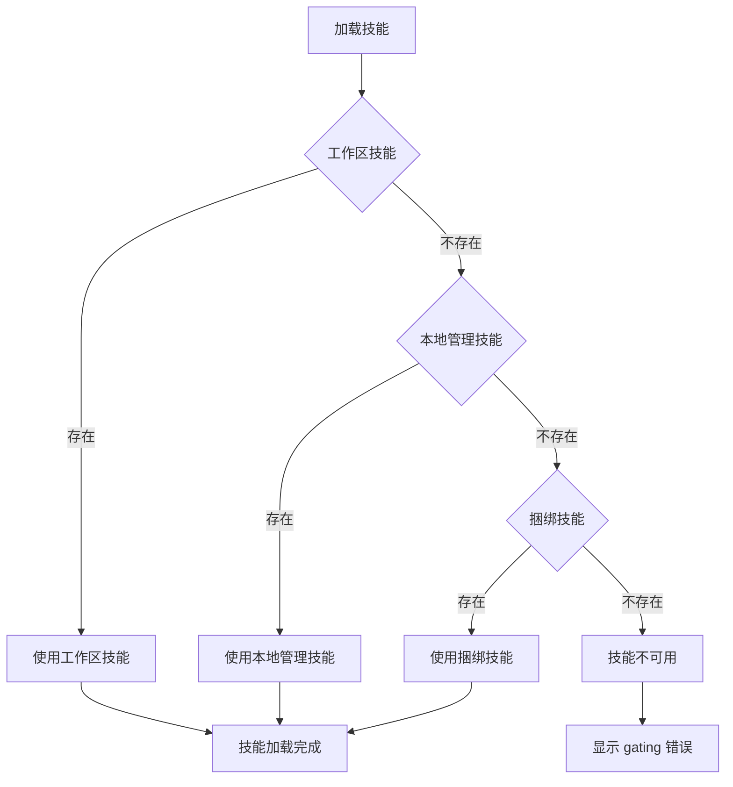

# 第 10 章：技能开发

> 本章概述：讲解 OpenClaw 的技能系统，包括技能概念、结构、开发流程、 gating 机制和 ClawHub 使用。

## 学习目标

- 理解技能的概念和作用
- 掌握 SKILL.md 文件格式和元数据
- 学会开发和测试自定义技能
- 了解 ClawHub 技能注册表
- 掌握技能配置和权限控制

## 前置条件

- 已完成基础 Agent 配置
- 了解工具系统的基本使用

---

## 10.1 技能概述

### 10.1.1 什么是技能

**技能（Skill）** 是一个版本化的文件包，用于教会 OpenClaw 如何执行特定任务。每个技能包含一个 `SKILL.md` 文件（带 YAML frontmatter）和可选的支持文件。

技能的作用类似于"上岗培训指南"——它将通用 AI 代理转变为具备特定领域专业知识的专用代理。

**技能提供什么**：

| 功能 | 说明 | 示例 |
|------|------|------|
| **专业工作流** | 特定领域的多步骤流程 | PDF 处理、数据分析 |
| **工具集成** | 与特定 API 或文件格式协作 | GitHub API、BigQuery |
| **领域知识** | 公司特定的知识和业务逻辑 | 财务指标、数据库 Schema |
| **捆绑资源** | 脚本、模板和参考文档 | 代码生成器、报告模板 |

### 10.1.2 技能 vs 工具

| 维度 | 工具（Tool） | 技能（Skill） |
|------|-------------|--------------|
| **定义** | 单一操作（如读文件、执行命令） | 多步骤工作流 + 工具使用指南 |
| **触发** | Agent 自主决定调用 | 基于用户请求或上下文触发 |
| **内容** | 预定义函数 | SKILL.md + 可选脚本/资源 |
| **示例** | `read`, `write`, `exec` | `pdf-editor`, `big-query`, `brand-guidelines` |

### 10.1.3 技能加载位置

技能从三个位置加载，优先级从高到低：



```
1. 工作区技能：<workspace>/skills（最高优先级）
   ↓
2. 本地管理技能：~/.openclaw/skills
   ↓
3. 捆绑技能：npm 包或 OpenClaw.app 自带（最低优先级）
```

**多代理场景**：
- 每个 Agent 有独立的工作区，`<workspace>/skills` 仅对该 Agent 可见
- `~/.openclaw/skills` 是共享的，所有 Agent 都能看到
- 可通过 `skills.load.extraDirs` 添加额外的共享技能目录

---

## 10.2 技能结构

### 10.2.1 技能目录结构

```
skill-name/
├── SKILL.md（必需）
│   ├── YAML frontmatter 元数据（必需）
│   │   ├── name（必需）
│   │   ├── description（必需）
│   │   └── metadata（可选）
│   └── Markdown 指令（必需）
└── 捆绑资源（可选）
    ├── scripts/     - 可执行代码（Python/Bash 等）
    ├── references/  - 参考文档
    └── assets/      - 输出资源（模板、图片等）
```

### 10.2.2 SKILL.md 格式

**必需字段**：

```markdown
---
name: pdf-editor
description: PDF 文件创建、编辑、旋转和提取文本。使用户说"旋转这个 PDF"、"提取 PDF 文本"或"合并 PDF 文件"时触发。
---

# PDF 编辑器技能

## 何时使用

当用户要求：
- 旋转/翻转 PDF 页面
- 提取 PDF 文本或元数据
- 合并/拆分 PDF 文件
- 创建新的 PDF 文档
```

**完整 frontmatter 示例**：

```markdown
---
name: nano-banana-pro
description: 通过 Gemini 3 Pro Image 生成或编辑图像
homepage: https://example.com
metadata:
  {"openclaw":{"requires":{"bins":["uv"],"env":["GEMINI_API_KEY"],"config":["browser.enabled"]},"primaryEnv":"GEMINI_API_KEY","emoji":"🍌"}}
---
```

### 10.2.3 元数据字段

| 字段 | 说明 | 示例 |
|------|------|------|
| `name` | 技能名称（必需） | `pdf-editor` |
| `description` | 触发条件和使用说明（必需） | "旋转/编辑 PDF 时使用..." |
| `homepage` | 项目主页（可选，macOS UI 显示） | `https://...` |
| `metadata.openclaw.emoji` | macOS 技能 UI 图标 | `"📄"` |
| `metadata.openclaw.requires.bins` | 需要的二进制文件 | `["uv", "node"]` |
| `metadata.openclaw.requires.env` | 需要的环境变量 | `["GEMINI_API_KEY"]` |
| `metadata.openclaw.requires.config` | 需要的配置项 | `["browser.enabled"]` |
| `metadata.openclaw.primaryEnv` | 主要环境变量名 | `"GEMINI_API_KEY"` |
| `metadata.openclaw.os` | 支持的操作系统 | `["darwin", "linux"]` |
| `metadata.openclaw.install` | 安装器配置 | Homebrew/npm/下载 |
| `metadata.openclaw.always` | 总是启用（跳过 gating） | `true` |

### 10.2.4 安装器配置示例

```markdown
---
name: gemini
description: 使用 Gemini CLI 进行编程协助
metadata:
  {
    "openclaw": {
      "emoji": "♊️",
      "requires": {"bins": ["gemini"]},
      "install": [
        {
          "id": "brew",
          "kind": "brew",
          "formula": "gemini-cli",
          "bins": ["gemini"],
          "label": "安装 Gemini CLI（brew）"
        }
      ]
    }
  }
---
```

---

## 10.3 技能 Gating 机制

### 10.3.1 加载时过滤

OpenClaw 在加载时根据 `metadata` 过滤技能：

```json5
{
  "metadata.openclaw": {
    // 跳过 gating，总是启用
    "always": true,

    // 操作系统限制
    "os": ["darwin", "linux"],

    // 必需的二进制文件（在 PATH 中）
    "requires.bins": ["uv", "node"],

    // 至少需要一个二进制文件
    "requires.anyBins": ["pip", "uv"],

    // 必需的环境变量（或配置提供）
    "requires.env": ["GEMINI_API_KEY"],

    // 必需的配置项（truthy）
    "requires.config": ["browser.enabled"]
  }
}
```

### 10.3.2 沙箱二进制要求

如果 Agent 运行在沙箱中：
- 二进制文件必须在**主机**和**容器**中都存在
- 容器内安装：通过 `agents.defaults.sandbox.docker.setupCommand`
- 容器需要网络访问和可写根文件系统

**示例**：`summarize` 技能需要 `summarize` CLI 在沙箱容器中可用

### 10.3.3 远程 macOS 节点

当 Gateway 运行在 Linux 但连接了 macOS 节点时：
- macOS 专属技能可以在节点报告二进制存在时被启用
- Agent 通过 `nodes` 工具远程执行这些技能

---

## 10.4 技能配置

### 10.4.1 配置文件位置

`~/.openclaw/openclaw.json`：

```json5
{
  "skills": {
    "entries": {
      "nano-banana-pro": {
        "enabled": true,
        "apiKey": {
          "source": "env",
          "provider": "default",
          "id": "GEMINI_API_KEY"
        },
        "env": {
          "GEMINI_API_KEY": "GEMINI_KEY_HERE"
        },
        "config": {
          "endpoint": "https://example.invalid",
          "model": "nano-pro"
        }
      },
      "peekaboo": {"enabled": true},
      "sag": {"enabled": false}
    }
  }
}
```

### 10.4.2 配置规则

| 配置项 | 说明 |
|--------|------|
| `enabled: false` | 禁用技能（即使已安装） |
| `env` | 注入环境变量（仅当未设置时） |
| `apiKey` | 便捷配置，用于声明 `primaryEnv` 的技能 |
| `config` | 自定义技能字段 |
| `allowBundled` | 捆绑技能允许列表 |

### 10.4.3 环境变量注入流程

```
1. Agent 启动
2. 读取技能元数据
3. 应用 skills.entries.<key>.env 或 .apiKey 到 process.env
4. 构建系统提示（包含符合条件的技能）
5. Agent 运行结束，恢复原始环境
```

**注意**：环境变量仅作用于单次 Agent 运行，不是全局 shell 环境。

---

## 10.5 技能开发流程

### 10.5.1 创建技能的步骤

**Step 1：理解技能用途**

通过具体示例理解技能将被如何使用：
- "用户会说些什么来触发这个技能？"
- "这个技能需要完成哪些具体任务？"
- "有哪些边缘情况需要处理？"

**Step 2：规划可复用资源**

分析每个使用场景，确定需要的资源：
- **scripts/**：可执行代码（重复使用的逻辑）
- **references/**：参考文档（Schema、API 文档）
- **assets/**：输出资源（模板、图片）

**Step 3：初始化技能**

```bash
# 基础初始化
scripts/init_skill.py <skill-name> --path <output-directory>

# 带资源目录
scripts/init_skill.py my-skill --path skills --resources scripts,references

# 带示例文件
scripts/init_skill.py my-skill --path skills --examples
```

**Step 4：编辑技能**

1. 实现 scripts/references/assets 内容
2. 编写 SKILL.md 指令
3. 测试脚本功能

**Step 5：打包技能**

```bash
# 打包并验证
scripts/package_skill.py <path/to/skill-folder>

# 指定输出目录
scripts/package_skill.py <path/to/skill-folder> ./dist
```

**Step 6：迭代改进**

1. 在真实任务中使用技能
2. 发现不足之处
3. 更新 SKILL.md 或资源
4. 重新测试

### 10.5.2 技能命名规范

- 使用小写字母、数字和连字符
- 长度限制：< 64 字符
- 偏好动词开头的短语
- 按工具命名空间（如 `gh-issues`, `linear-task`）
- 文件夹名称与技能名称一致

### 10.5.3 设计原则

**简洁是关键**

上下文窗口是公共资源。技能与对话历史、其他技能共享上下文。

- 只添加 Agent 不知道的信息
- 质疑每条信息："Agent 真的需要这个解释吗？"
- 偏好简洁示例而非冗长说明

**设置合适的自由度**

| 自由度 | 使用场景 | 示例 |
|--------|----------|------|
| **高** | 多种方法都有效、依赖上下文 | 文本指令 |
| **中** | 有优选模式、可接受变体 | 伪代码/带参数脚本 |
| **低** | 操作脆弱、一致性关键 | 具体脚本、固定流程 |

**渐进式披露**

技能使用三级加载系统：

1. **元数据**（~100 词）：始终在上下文中
2. **SKILL.md 正文**（<5k 词）：触发时加载
3. **捆绑资源**：按需加载

**模式 1：高级指南 + 参考**

```markdown
# PDF 处理

## 快速开始

使用 pdfplumber 提取文本：
[代码示例]

## 高级功能

- **表单填写**：见 [FORMS.md](FORMS.md)
- **API 参考**：见 [REFERENCE.md](REFERENCE.md)
- **示例**：见 [EXAMPLES.md](EXAMPLES.md)
```

**模式 2：领域分离**

```
bigquery-skill/
├── SKILL.md（概述和导航）
└── references/
    ├── finance.md（收入、账单指标）
    ├── sales.md（机会、销售渠道）
    ├── product.md（API 使用、功能）
    └── marketing.md（活动、归因）
```

---

## 10.6 ClawHub 技能注册表

### 10.6.1 什么是 ClawHub

**ClawHub** 是 OpenClaw 的公共技能注册表，免费服务：
- 所有技能都是公开、开放、可见的
- 支持技能版本管理和元数据索引
- 提供搜索、标签和使用信号发现

网站：[clawhub.ai](https://clawhub.ai)

### 10.6.2 CLI 安装

```bash
# npm
npm i -g clawhub

# pnpm
pnpm add -g clawhub
```

### 10.6.3 常用命令

**搜索技能**：
```bash
clawhub search "calendar"
clawhub search "postgres backups" --limit 10
```

**安装技能**：
```bash
clawhub install <skill-slug>
clawhub install my-skill-pack --version 2.0.0
clawhub install my-skill-pack --force
```

**更新技能**：
```bash
clawhub update <slug>
clawhub update --all
clawhub update <slug> --version 2.0.0 --force
```

**查看已安装**：
```bash
clawhub list
```

### 10.6.4 发布技能

**发布单个技能**：
```bash
clawhub publish ./my-skill \
  --slug my-skill \
  --name "My Skill" \
  --version 1.0.0 \
  --changelog "Initial release" \
  --tags latest
```

**同步多个技能**：
```bash
# 扫描并发布所有更新
clawhub sync --all

# 预览将要发布的内容
clawhub sync --dry-run

# 指定版本递增类型
clawhub sync --bump patch
```

### 10.6.5 认证

```bash
# 浏览器登录
clawhub login

# 使用 Token 登录
clawhub login --token <token>

# 查看当前用户
clawhub whoami

# 登出
clawhub logout
```

### 10.6.6 安全和审核

| 机制 | 说明 |
|------|------|
| **GitHub 账号要求** | 至少一周历史才能发布 |
| **举报机制** | 任何登录用户可举报技能 |
| **自动隐藏** | 超过 3 个独特举报自动隐藏 |
| **审核员操作** | 可查看/恢复/删除/封禁 |
| **滥用限制** | 滥用举报功能可能导致封禁 |

---

## 10.7 技能最佳实践

### 10.7.1 开发建议

1. **保持 SKILL.md 简洁**
   - 正文控制在 500 行以内
   - 将详细参考移至 `references/` 目录
   - 避免深嵌套引用（保持一级）

2. **合理组织资源**
   - 长文件（>10k 词）包含目录
   - 按领域/变体分离内容
   - 仅在 SKILL.md 中引用必要文件

3. **测试脚本**
   - 实际运行测试每个脚本
   - 验证输出符合预期
   - 抽样测试类似脚本

### 10.7.2 配置建议

```json5
{
  "skills": {
    "load": {
      "watch": true,         // 启用文件变化监听
      "watchDebounceMs": 250,
      "extraDirs": [         // 额外的共享技能目录
        "/shared/skills"
      ]
    },
    "install": {
      "nodeManager": "npm"   // npm/pnpm/yarn/bun
    }
  }
}
```

### 10.7.3 安全建议

1. **视第三方技能为不可信代码**
   - 使用前仔细阅读
   - 优先在沙箱中运行

2. **密钥管理**
   - `skills.entries.*.env` 和 `skills.entries.*.apiKey` 注入到**主机**进程
   - 密钥不在提示词和日志中暴露

3. **路径安全**
   - 技能发现仅接受配置根目录内的文件
   - realpath 必须位于配置的根目录内

---

## 10.8 技能 Token 消耗

### 10.8.1 Token 计算公式

当技能被启用时，OpenClaw 在系统提示中注入技能列表：

```
基础开销（仅当≥1 技能）：195 字符
每个技能：97 字符 + XML 转义后的 <name>、<description>、<location> 长度
```

**公式**：
```
total = 195 + Σ (97 + len(name_escaped) + len(description_escaped) + len(location_escaped))
```

**估算**：
- 约 4 字符/token（OpenAI 风格）
- 97 字符 ≈ 24 tokens/技能
- 实际消耗取决于字段长度

### 10.8.2 会话快照

- 技能列表在**会话开始时**快照
- 同一会话的后续 turn 复用该列表
- 技能或配置变更在下一新会话生效
- 启用 watcher 时可热重载

---

## 本章小结

- **技能结构**：SKILL.md + scripts/references/assets
- **元数据**：name/description 触发，metadata gating
- **加载位置**：工作区 > 本地 > 捆绑
- **Gating**：bins/env/config/os 过滤
- **配置**：env/apiKey/config 注入
- **开发流程**：理解→规划→初始化→编辑→打包→迭代
- **ClawHub**：搜索/安装/更新/发布技能
- **安全**：视第三方技能为不可信，优先沙箱

## 延伸阅读

- [技能详解](https://docs.openclaw.ai/tools/skills)
- [ClawHub CLI](https://docs.openclaw.ai/tools/clawhub)
- [技能配置](https://docs.openclaw.ai/tools/skills-config)
- [第 11 章：插件开发](chapter-11.md)

---

*上一章：[第 9 章：工具系统](chapter-09.md) | 下一章：[第 11 章：插件开发](chapter-11.md)*
