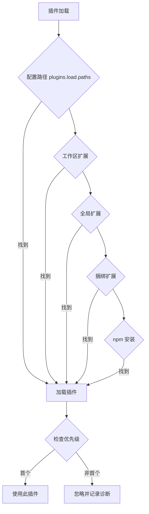

# 第 11 章：插件开发

> 本章概述：讲解 OpenClaw 插件系统，包括插件结构、 manifest 配置、插件 API、通道开发和分发。

## 学习目标

- 理解插件架构和加载机制
- 掌握插件 manifest 配置
- 学会使用插件 API 注册功能
- 了解通道插件开发
- 掌握插件分发和发布流程

## 前置条件

- 已完成基础 Agent 配置
- 了解 TypeScript/JavaScript 基础
- 熟悉 npm 包管理

---

## 11.1 插件概述

### 11.1.1 什么是插件

**插件（Plugin）** 是一个 TypeScript 模块，运行时通过 jiti 加载，可以扩展 OpenClaw 的功能：

- 注册 Gateway RPC 方法
- 注册 HTTP 路由
- 注册 Agent 工具
- 注册 CLI 命令
- 注册后台服务
- 注册上下文引擎
- 注册技能
- 注册自动回复命令

**关键特性**：
- 插件与 Gateway **同进程**运行，视为可信代码
- 配置验证使用 JSON Schema，不执行插件代码
- 支持热加载和优先级覆盖

### 11.1.2 官方插件列表

| 插件 | npm Spec | 说明 |
|------|----------|------|
| Voice Call | `@openclaw/voice-call` | 语音通话（Twilio/日志） |
| Microsoft Teams | `@openclaw/msteams` | Teams 通道 |
| Memory Core | 内置 | 记忆搜索（默认启用） |
| Memory LanceDB | 内置 | 长期记忆 |
| Matrix | `@openclaw/matrix` | Matrix 协议 |
| Nostr | `@openclaw/nostr` | Nostr 协议 |
| Zalo | `@openclaw/zalo` | Zalo 通道 |
| Google Antigravity OAuth | 内置 | Google 认证 |
| Qwen Portal OAuth | 内置 | 通义千问认证 |

### 11.1.3 插件发现顺序

OpenClaw 按以下顺序扫描插件：



```
1. 配置路径
   plugins.load.paths（文件或目录）
   ↓
2. 工作区扩展
   <workspace>/.openclaw/extensions/*.ts
   <workspace>/.openclaw/extensions/*/index.ts
   ↓
3. 全局扩展
   ~/.openclaw/extensions/*.ts
   ~/.openclaw/extensions/*/index.ts
   ↓
4. 捆绑扩展
   <openclaw>/extensions/*（大多默认禁用）
   ↓
5. npm 安装
   ~/.openclaw/extensions/<id>/
```

**优先级规则**：
- 相同 ID 的插件，第一个匹配的获胜
- 低优先级的插件被忽略并记录诊断

---

## 11.2 插件结构

### 11.2.1 插件目录结构

```
my-plugin/
├── openclaw.plugin.json    # 插件 manifest（必需）
├── package.json            # npm 包配置（可选）
├── index.ts                # 插件入口
├── src/                    # 源代码
│   └── ...
└── skills/                 # 捆绑技能（可选）
    └── my-skill/
        └── SKILL.md
```

### 11.2.2 Plugin Manifest

`openclaw.plugin.json` 是插件的核心配置文件：

```json
{
  "id": "my-plugin",
  "name": "My Plugin",
  "version": "1.0.0",
  "description": "插件描述",
  "entry": "./index.ts",
  "configSchema": {
    "type": "object",
    "properties": {
      "apiKey": {"type": "string"},
      "region": {"type": "string", "default": "us-east-1"}
    }
  },
  "uiHints": {
    "apiKey": {"label": "API 密钥", "sensitive": true},
    "region": {"label": "区域", "placeholder": "us-east-1"}
  },
  "openclaw": {
    "extensions": ["./index.ts"],
    "channel": {
      "id": "mychat",
      "label": "MyChat",
      "docsPath": "/channels/mychat"
    },
    "install": {
      "npmSpec": "@openclaw/my-plugin",
      "localPath": "extensions/my-plugin"
    }
  }
}
```

**必需字段**：
- `id`：插件唯一标识符
- `entry` 或 `openclaw.extensions`：入口文件

**可选字段**：
- `configSchema`：配置验证的 JSON Schema
- `uiHints`：UI 渲染提示
- `openclaw.channel`：通道元数据
- `openclaw.install`：安装提示

### 11.2.3 插件包（Package Packs）

一个目录可包含多个扩展：

```json
{
  "name": "my-pack",
  "openclaw": {
    "extensions": ["./src/safety.ts", "./src/tools.ts"]
  }
}
```

每个扩展成为独立插件，ID 为 `name/<fileBase>`。

---

## 11.3 插件配置

### 11.3.1 基础配置

```json5
{
  plugins: {
    enabled: true,                    // 总开关
    allow: ["voice-call"],            // 允许列表
    deny: ["untrusted-plugin"],       // 拒绝列表
    load: {
      paths: ["~/Projects/my-plugin"] // 额外路径
    },
    slots: {
      memory: "memory-core",          // 记忆插件槽
      contextEngine: "legacy"         // 上下文引擎槽
    },
    entries: {
      "voice-call": {
        enabled: true,
        config: {
          provider: "twilio",
          twilio: {
            accountSid: "ACxxx",
            authToken: "${TWILIO_AUTH_TOKEN}",
            from: "+1234567890"
          }
        }
      }
    }
  }
}
```

### 11.3.2 配置规则

| 字段 | 说明 |
|------|------|
| `enabled` | 总开关，默认 `true` |
| `allow` | 允许列表（可选） |
| `deny` | 拒绝列表（可选，deny 优先） |
| `load.paths` | 额外插件路径 |
| `slots` | 独占槽位选择 |
| `entries.<id>` | 每个插件的配置 |

**验证规则**：
- 未知插件 ID 在 `entries`/`allow`/`deny`/`slots` 中是**错误**
- 未知 `channels.<id>` 是**错误**，除非插件 manifest 声明
- 插件配置用 `configSchema` 验证
- 禁用插件时配置保留，发出警告

### 11.3.3 插件槽（Slots）

某些插件类别是独占的：

```json5
{
  plugins: {
    slots: {
      // 记忆插件（"none" 禁用）
      memory: "memory-core",

      // 上下文引擎（"legacy" 是内置默认）
      contextEngine: "lossless-claw"
    }
  }
}
```

支持的独占槽：
- `memory`：活跃的记忆插件
- `contextEngine`：活跃的上下文引擎

---

## 11.4 插件 API

### 11.4.1 插件导出格式

插件导出**函数**或**对象**：

**函数导出**：
```typescript
export default function(api) {
  // 插件逻辑
}
```

**对象导出**：
```typescript
export default {
  id: "my-plugin",
  name: "My Plugin",
  configSchema: {...},
  register(api) {
    // 注册逻辑
  }
}
```

### 11.4.2 注册 HTTP 路由

```typescript
api.registerHttpRoute({
  path: "/acme/webhook",
  auth: "plugin",        // "gateway" 或 "plugin"
  match: "exact",        // "exact" 或 "prefix"
  handler: async (_req, res) => {
    res.statusCode = 200;
    res.end("ok");
    return true;
  }
});
```

**路由字段**：
- `path`：路由路径
- `auth`：认证要求（必需）
- `match`：匹配模式
- `replaceExisting`：允许替换自己的路由
- `handler`：返回 `true` 表示处理完成

### 11.4.3 注册 Gateway RPC 方法

```typescript
export default function(api) {
  api.registerGatewayMethod("myplugin.status", ({ respond }) => {
    respond(true, { ok: true, version: "1.0.0" });
  });
}
```

### 11.4.4 注册 CLI 命令

```typescript
export default function(api) {
  api.registerCli(({ program }) => {
    program.command("mycmd").action(() => {
      console.log("Hello from plugin!");
    });
  }, { commands: ["mycmd"] });
}
```

### 11.4.5 注册自动回复命令

```typescript
api.registerCommand({
  name: "mystatus",
  description: "显示插件状态",
  acceptsArgs: true,
  requireAuth: true,
  handler: async (ctx) => {
    const mode = ctx.args?.trim() || "default";
    await saveMode(mode);
    return { text: `模式设置为：${mode}` };
  }
});
```

**命令选项**：
- `name`：命令名（不含 `/`）
- `nativeNames`：原生命令别名
- `description`：帮助文本
- `acceptsArgs`：是否接受参数
- `requireAuth`：是否需要授权
- `handler`：返回 `{ text: string }`

**命令上下文**：
- `senderId`：发送者 ID
- `channel`：发送渠道
- `isAuthorizedSender`：是否授权
- `args`：参数
- `config`：当前配置

### 11.4.6 注册后台服务

```typescript
export default function(api) {
  api.registerService({
    id: "my-service",
    start: () => api.logger.info("服务启动"),
    stop: () => api.logger.info("服务停止")
  });
}
```

### 11.4.7 注册钩子（Hooks）

**显式注册钩子**：
```typescript
export default function(api) {
  api.registerHook(
    "command:new",
    async () => {
      // /new 命令触发时执行
    },
    {
      name: "my-plugin.command-new",
      description: "当 /new 被调用时运行"
    }
  );
}
```

**生命周期钩子（api.on）**：
```typescript
export default function(api) {
  api.on(
    "before_prompt_build",
    (event, ctx) => {
      return {
        prependSystemContext: "遵循公司风格指南。",
      };
    },
    { priority: 10 }
  );
}
```

**重要钩子**：
| 钩子 | 说明 | 可用数据 |
|------|------|----------|
| `before_model_resolve` | 会话加载前 | 无 messages |
| `before_prompt_build` | 会话加载后 | 有 messages |
| `before_agent_start` | Agent 启动前（遗留兼容） | 完整上下文 |

**提示词构建结果字段**：
- `prependContext`：前置到用户提示词
- `systemPrompt`：完整系统提示覆盖
- `prependSystemContext`：前置到系统提示
- `appendSystemContext`：追加到系统提示

### 11.4.8 注册上下文引擎

```typescript
export default function(api) {
  api.registerContextEngine("lossless-claw", () => ({
    info: {
      id: "lossless-claw",
      name: "Lossless Claw",
      ownsCompaction: true
    },
    async ingest() {
      return { ingested: true };
    },
    async assemble({ messages }) {
      return { messages, estimatedTokens: 0 };
    },
    async compact() {
      return { ok: true, compacted: false };
    }
  }));
}
```

### 11.4.9 运行时助手

**TTS（语音合成）**：
```typescript
const result = await api.runtime.tts.textToSpeechTelephony({
  text: "Hello from OpenClaw",
  cfg: api.config
});
// 返回 PCM 音频缓冲 + 采样率
```

**STT（语音识别）**：
```typescript
const { text } = await api.runtime.stt.transcribeAudioFile({
  filePath: "/tmp/inbound-audio.ogg",
  cfg: api.config,
  mime: "audio/ogg"
});
```

---

## 11.5 通道插件开发

### 11.5.1 通道插件结构

```typescript
const myChannel = {
  id: "mychat",
  meta: {
    id: "mychat",
    label: "MyChat",
    selectionLabel: "MyChat (API)",
    docsPath: "/channels/mychat",
    blurb: "演示通道插件",
    aliases: ["my"]
  },
  capabilities: { chatTypes: ["direct"] },
  config: {
    listAccountIds: (cfg) =>
      Object.keys(cfg.channels?.mychat?.accounts ?? {}),
    resolveAccount: (cfg, accountId) =>
      cfg.channels?.mychat?.accounts?.[accountId ?? "default"] ?? {
        accountId
      }
  },
  outbound: {
    deliveryMode: "direct",
    sendText: async ({ text, peer }) => {
      // 发送消息逻辑
      return { ok: true };
    }
  }
};

export default function(api) {
  api.registerChannel({ plugin: myChannel });
}
```

### 11.5.2 通道元数据

| 字段 | 说明 |
|------|------|
| `meta.label` | CLI/UI 列表显示的名称 |
| `meta.selectionLabel` | 选择器显示的名称 |
| `meta.docsPath` | 文档路径 |
| `meta.blurb` | 简短描述 |
| `meta.aliases` | 别名列表 |
| `meta.preferOver` | 优先替代的通道 ID |
| `meta.detailLabel` | 详情标签 |
| `meta.systemImage` | 系统图标 |

### 11.5.3 通道配置

```json5
{
  channels: {
    mychat: {
      accounts: {
        default: {
          token: "MYCHAT_TOKEN",
          enabled: true
        }
      }
    }
  }
}
```

### 11.5.4 通道适配器

**必需适配器**：
- `config.listAccountIds`：列出账号 ID
- `config.resolveAccount`：解析账号配置
- `capabilities`：能力声明
- `outbound.deliveryMode`：投递模式
- `outbound.sendText`：发送文本

**可选适配器**：
- `setup`：向导设置
- `security`：DM 策略
- `status`：健康检查
- `gateway`：启动/停止/登录
- `mentions`：提及处理
- `threading`：线程支持
- `streaming`：流式响应
- `actions`：消息操作
- `commands`：原生命令

### 11.5.5 通道入职钩子

```typescript
plugin.onboarding = {
  // 基础配置流程
  async configure(ctx) {
    // ...
  },

  // 完全交互式设置（可选）
  async configureInteractive(ctx) {
    // ctx.configured, ctx.label
    return { cfg: updatedCfg };
  },

  // 已配置时的覆盖行为
  async configureWhenConfigured(ctx) {
    return "skip"; // 或 { cfg, accountId }
  }
};
```

**优先级**：
1. `configureInteractive`（如果存在）
2. `configureWhenConfigured`（仅当已配置）
3. `configure`（回退）

---

## 11.6 Provider 插件（模型认证）

### 11.6.1 注册 Provider 认证

```typescript
api.registerProvider({
  id: "acme",
  label: "AcmeAI",
  auth: [
    {
      id: "oauth",
      label: "OAuth",
      kind: "oauth",
      run: async (ctx) => {
        // 运行 OAuth 流程
        return {
          profiles: [
            {
              profileId: "acme:default",
              credential: {
                type: "oauth",
                provider: "acme",
                access: "...",
                refresh: "...",
                expires: Date.now() + 3600 * 1000
              }
            }
          ],
          defaultModel: "acme/opus-1",
          configPatch: {
            models: {
              providers: {
                acme: {
                  baseUrl: "https://api.acme.ai/v1"
                }
              }
            }
          }
        };
      }
    }
  ]
});
```

### 11.6.2 认证方法类型

| kind | 说明 |
|------|------|
| `oauth` | OAuth 2.0 流程 |
| `api-key` | API Key 输入 |
| `device-code` | 设备码认证 |

---

## 11.7 插件安全

### 11.7.1 安全检查

OpenClaw 对插件进行以下检查：

| 检查项 | 行为 |
|--------|------|
| **路径逃逸** | 阻止 symlink 逃逸插件根目录 |
| **世界可写** | 阻止世界可写的插件目录 |
| **所有权检查** | 非捆绑插件检查 POSIX 所有者 |
| **来源追踪** | 记录插件安装来源 |

### 11.7.2 安全配置

```json5
{
  plugins: {
    allow: ["voice-call", "msteams"],  // 明确允许
    deny: ["untrusted"]                // 明确拒绝
  }
}
```

**建议**：
- 使用 `allow` 列表限制插件
- 仅安装可信来源的插件
- 重启 Gateway 后生效

### 11.7.3 提示词注入控制

```json5
{
  plugins: {
    entries: {
      "my-plugin": {
        hooks: {
          allowPromptInjection: false  // 禁用提示词修改
        }
      }
    }
  }
}
```

当禁用时：
- `before_prompt_build` 被阻止
- `before_agent_start` 的提示词修改字段被忽略
- `modelOverride`/`providerOverride` 仍保留

---

## 11.8 CLI 命令

### 11.8.1 插件管理

```bash
# 列出插件
openclaw plugins list

# 查看插件信息
openclaw plugins info <id>

# 安装插件
openclaw plugins install <path>              # 本地文件/目录
openclaw plugins install ./plugin.tgz        # tarball
openclaw plugins install ./plugin.zip        # zip
openclaw plugins install -l ./extensions/... # 链接（开发用）
openclaw plugins install @openclaw/voice-call # npm
openclaw plugins install @openclaw/voice-call --pin # 固定版本

# 更新插件
openclaw plugins update <id>
openclaw plugins update --all

# 启用/禁用
openclaw plugins enable <id>
openclaw plugins disable <id>

# 健康检查
openclaw plugins doctor
```

### 11.8.2 安装追踪

- `plugins.installs` 记录 npm 安装的元数据
- 完整性元数据变化时提示确认
- 使用 `--yes` 绕过提示

---

## 11.9 插件分发

### 11.9.1 npm 发布

**推荐结构**：
```json
{
  "name": "@openclaw/voice-call",
  "version": "1.0.0",
  "main": "dist/index.js",
  "openclaw": {
    "extensions": ["./dist/index.js"]
  }
}
```

**发布步骤**：
1. 构建 TypeScript 到 `dist/`
2. `npm publish --access public`
3. 用户使用 `openclaw plugins install @openclaw/voice-call`

### 11.9.2 通道目录元数据

外部通道目录可通过 JSON 文件提供：

```json
{
  "entries": [
    {
      "name": "@scope/pkg",
      "openclaw": {
        "channel": {...},
        "install": {...}
      }
    }
  ]
}
```

放置位置：
- `~/.openclaw/mpm/plugins.json`
- `~/.openclaw/mpm/catalog.json`
- `~/.openclaw/plugins/catalog.json`

或通过环境变量：
```bash
export OPENCLAW_PLUGIN_CATALOG_PATHS="/path/to/catalog.json"
```

---

## 11.10 示例：Voice Call 插件

### 11.10.1 插件结构

```
voice-call/
├── openclaw.plugin.json
├── package.json
├── index.ts
├── src/
│   ├── twilio.ts
│   └── log.ts
└── skills/
    └── voice-call/
        └── SKILL.md
```

### 11.10.2 配置示例

**Twilio 模式**：
```json5
{
  plugins: {
    entries: {
      "voice-call": {
        enabled: true,
        config: {
          provider: "twilio",
          twilio: {
            accountSid: "ACxxx",
            authToken: "${TWILIO_AUTH_TOKEN}",
            from: "+1234567890",
            statusCallbackUrl: "https://.../callback",
            twimlUrl: "https://.../twiml"
          }
        }
      }
    }
  }
}
```

**开发模式（日志回退）**：
```json5
{
  plugins: {
    entries: {
      "voice-call": {
        enabled: true,
        config: {
          provider: "log"  // 无网络，仅日志
        }
      }
    }
  }
}
```

### 11.10.3 功能清单

- CLI：`openclaw voicecall start|status`
- 工具：`voice_call`
- RPC：`voicecall.start`, `voicecall.status`
- 技能：`skills/voice-call/SKILL.md`

---

## 本章小结

- **插件结构**：manifest + 入口文件 + 可选技能
- **加载顺序**：配置路径 → 工作区 → 全局 → 捆绑 → npm
- **插件 API**：HTTP 路由、RPC、CLI、命令、钩子、服务
- **通道插件**：注册通道、配置验证、适配器实现
- **Provider 插件**：OAuth/API Key 认证流程
- **插件槽**：memory/contextEngine 独占
- **安全**：路径检查、allow/deny 列表
- **分发**：npm 发布、目录元数据

## 延伸阅读

- [插件详解](https://docs.openclaw.ai/tools/plugin)
- [插件 Agent 工具](https://docs.openclaw.ai/plugins/agent-tools)
- [Voice Call 插件](https://docs.openclaw.ai/plugins/voice-call)
- [第 12 章：macOS 应用](chapter-12.md)

---

*上一章：[第 10 章：技能开发](chapter-10.md) | 下一章：[第 12 章：macOS 应用](chapter-12.md)*
