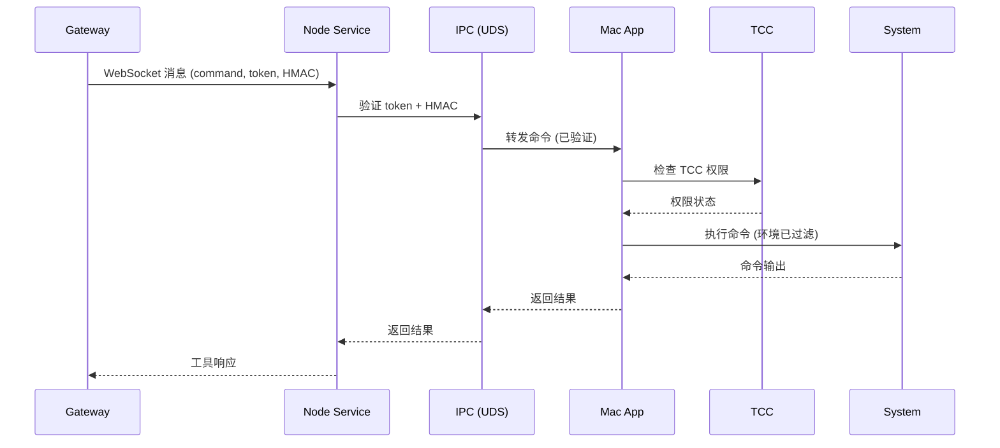

# 第 12 章：macOS 应用

> 本章概述：讲解 OpenClaw macOS  companion 应用的功能、配置和使用。包括节点能力、权限管理、远程连接和开发工作流。

## 学习目标

- 理解 macOS 应用的架构和功能
- 掌握节点能力和工具使用
- 了解 TCC 权限管理
- 学会配置远程连接
- 掌握开发工作流和调试

## 前置条件

- 已安装 macOS 应用
- 了解节点（Nodes）基本概念

---

## 12.1 macOS 应用概述

### 12.1.1 应用定位

**OpenClaw macOS 应用** 是一个菜单栏 companion 应用，主要功能：

| 功能 | 说明 |
|------|------|
| **原生通知** | 菜单栏显示通知和状态 |
| **TCC 权限** | 拥有所有 macOS 权限提示 |
| **Gateway 管理** | 运行或连接 Gateway（本地/远程） |
| **macOS 工具** | Canvas、相机、屏幕录制、system.run |
| **节点主机** | 远程模式下启动节点服务 |
| **CLI 安装** | 通过 npm/pnpm 安装全局 CLI |

### 12.1.2 本地 vs 远程模式

**本地模式（默认）**：
- 应用附加到运行的本地 Gateway
- 如果 Gateway 未运行，启用 launchd 服务
- 命令：`openclaw gateway install`

**远程模式**：
- 应用通过 SSH/Tailscale 连接远程 Gateway
- 不启动本地 Gateway 进程
- 启动本地节点主机服务供远程 Gateway 访问

---

## 12.2 节点能力

### 12.2.1 可用命令

macOS 应用作为节点向 Agent 暴露以下能力：

| 类别 | 命令 | 说明 |
|------|------|------|
| **Canvas** | `canvas.present` | 呈现画布 |
| | `canvas.navigate` | 导航 URL |
| | `canvas.eval` | 执行 JS |
| | `canvas.snapshot` | 画布快照 |
| | `canvas.a2ui.*` | A2UI 自动化 |
| **相机** | `camera.snap` | 拍照 |
| | `camera.clip` | 剪贴板图像 |
| **屏幕** | `screen.record` | 录屏 |
| **系统** | `system.run` | 执行命令 |
| | `system.notify` | 发送通知 |

### 12.2.2 权限映射

节点报告 `permissions` 映射，Agent 据此决定允许的操作：

```json
{
  "permissions": {
    "notifications": true,
    "accessibility": true,
    "screenRecording": false,
    "microphone": false,
    "speechRecognition": false,
    "automation": true,
    "systemRun": true
  }
}
```

### 12.2.3 系统运行（system.run）

`system.run` 执行流程：



```
Gateway → Node Service (WS)
              | IPC (UDS + token + HMAC + TTL)
              v
          Mac App (UI + TCC + system.run)
```

**环境变量过滤**：
以下环境变量会被过滤后与应用环境合并：
- `PATH`, `DYLD_*`, `LD_*`, `NODE_OPTIONS`
- `PYTHON*`, `PERL*`, `RUBYOPT`
- `SHELLOPTS`, `PS4`

---

## 12.3 权限管理

### 12.3.1 TCC 权限

macOS 应用需要以下 TCC 权限：

| 权限 | 用途 |
|------|------|
| **通知** | 显示原生通知 |
| **辅助功能** | UI 自动化控制 |
| **屏幕录制** | 截图和录屏 |
| **麦克风** | 语音输入 |
| **语音识别** | 语音转文本 |
| **自动化/AppleScript** | 脚本自动化 |

### 12.3.2 Exec 审批

`system.run` 通过 **Exec approvals** 控制：

**配置文件**：`~/.openclaw/exec-approvals.json`

```json
{
  "version": 1,
  "defaults": {
    "security": "deny",
    "ask": "on-miss"
  },
  "agents": {
    "main": {
      "security": "allowlist",
      "ask": "on-miss",
      "allowlist": [
        {"pattern": "/opt/homebrew/bin/rg"}
      ]
    }
  }
}
```

**安全级别**：
| 级别 | 行为 |
|------|------|
| `deny` | 拒绝所有 |
| `allowlist` | 仅允许列表中的命令 |
| `full` | 完全允许 |

**询问模式**：
| 模式 | 行为 |
|------|------|
| `on-miss` | 允许列表未命中时询问 |
| `always` | 总是询问 |
| `off` | 从不询问 |

### 12.3.3 允许列表规则

- 条目是解析后二进制路径的 glob 模式
- 选择"Always Allow"添加到允许列表
- Shell 包装器（`bash -c`）需要单独批准

---

## 12.4 深度链接

### 12.4.1 openclaw:// 协议

应用注册 `openclaw://` URL scheme 用于本地操作。

### 12.4.2 agent 动作

触发 Gateway `agent` 请求：

```bash
open 'openclaw://agent?message=Hello%20from%20deep%20link'
```

**查询参数**：
| 参数 | 必需 | 说明 |
|------|------|------|
| `message` | 是 | 发送给 Agent 的消息 |
| `sessionKey` | 否 | 指定会话 |
| `thinking` | 否 | 思考模式 |
| `deliver`/`to`/`channel` | 否 | 投递选项 |
| `timeoutSeconds` | 否 | 超时（秒） |
| `key` | 否 | 无人值守模式密钥 |

**安全限制**：
- 无 `key`：提示确认，忽略投递选项
- 有 `key`：无人值守运行（用于个人自动化）

---

## 12.5 Launchd 管理

### 12.5.1 LaunchAgent 配置

应用管理每用户 LaunchAgent：

- 默认标签：`ai.openclaw.gateway`
- 配置文件标签：`ai.openclaw.<profile>`
- 旧版兼容：`com.openclaw.*`（仍会卸载）

### 12.5.2 控制命令

```bash
# 启动服务
launchctl kickstart -k gui/$UID/ai.openclaw.gateway

# 停止服务
launchctl bootout gui/$UID/ai.openclaw.gateway
```

### 12.5.3 配置文件支持

使用命名配置文件时：

```bash
# 环境变量
export OPENCLAW_PROFILE=myprofile

# LaunchAgent 标签变为
ai.openclaw.myprofile
```

---

## 12.6 远程连接

### 12.6.1 SSH 隧道

远程模式下，应用打开 SSH 隧道连接远程 Gateway：

**控制隧道**：
| 属性 | 值 |
|------|-----|
| **目的** | 健康检查、状态、配置 |
| **本地端口** | Gateway 端口（默认 18789） |
| **远程端口** | 远程主机相同端口 |
| **SSH 形式** | `ssh -N -L <local>:127.0.0.1:<remote>` |

**IP 报告**：
- SSH 隧道使用 loopback，Gateway 看到节点 IP 为 `127.0.0.1`
- 如需真实 IP，使用 **Direct (ws/wss)** 传输

### 12.6.2 SSH 选项

```bash
ssh -N -L 18789:127.0.0.1:18789 remote-host \
  -o BatchMode=yes \
  -o ExitOnForwardFailure=yes \
  -o ServerAliveInterval=30
```

---

## 12.7 新手引导流程

### 12.7.1 典型安装步骤

```
1. 安装并启动 OpenClaw.app
   ↓
2. 完成 TCC 权限提示
   - 通知
   - 辅助功能
   - 屏幕录制
   - 麦克风
   - 语音识别
   - 自动化
   ↓
3. 确认本地模式激活
   - Gateway 运行状态
   - 菜单栏图标
   ↓
4. 可选：安装 CLI 工具
   - npm/pnpm 安装
   - 终端访问
```

### 12.7.2 权限清单

```
□ 通知（Notifications）
□ 辅助功能（Accessibility）
□ 屏幕录制（Screen Recording）
□ 麦克风（Microphone）
□ 语音识别（Speech Recognition）
□ 自动化（Automation/AppleScript）
```

---

## 12.8 开发工作流

### 12.8.1 本地构建

```bash
# 进入 macOS 应用目录
cd apps/macos

# 构建
swift build

# 运行（或 Xcode）
swift run OpenClaw
```

### 12.8.2 打包应用

```bash
scripts/package-mac-app.sh
```

### 12.8.3 调试连接

```bash
cd apps/macos

# 测试连接
swift run openclaw-mac connect --json

# 测试发现
swift run openclaw-mac discover --timeout 3000 --json
```

**连接选项**：
- `--url <ws://host:port>`：覆盖配置
- `--mode <local|remote>`：从配置解析
- `--probe`：强制健康探测
- `--timeout <ms>`：请求超时
- `--json`：结构化输出

**发现选项**：
- `--include-local`：包含被过滤的本地 Gateway
- `--timeout <ms>`：发现窗口
- `--json`：结构化输出

### 12.8.4 对比 Gateway 发现

```bash
# Node CLI 发现
openclaw gateway discover --json

# macOS 应用发现（Swift CLI）
swift run openclaw-mac discover --json
```

对比两者输出，验证 macOS 应用的发现管道（NWBrowser + tailnet DNS-SD 回退）是否与 Node CLI 基于 `dns-sd` 的发现一致。

---

## 12.9 状态目录注意事项

### 12.9.1 避免云同步目录

不要将 OpenClaw 状态目录放在 iCloud 或其他云同步目录：

**应避免的路径**：
- `~/Library/Mobile Documents/com~apple~CloudDocs/...`
- `~/Library/CloudStorage/...`

**推荐路径**：
```bash
OPENCLAW_STATE_DIR=~/.openclaw
```

### 12.9.2 云同步问题

同步目录可能导致：
- 延迟增加
- 文件锁竞争
- 会话和凭证同步冲突

`openclaw doctor` 检测到云同步路径时会警告并建议迁移。

---

## 12.10 CLI 节点管理

### 12.10.1 常用命令

```bash
# 列出节点
openclaw nodes list
openclaw nodes list --connected
openclaw nodes list --last-connected 24h

# 查看待批准
openclaw nodes pending

# 批准请求
openclaw nodes approve <requestId>

# 查看状态
openclaw nodes status
openclaw nodes status --connected
openclaw nodes status --last-connected 24h
```

### 12.10.2 调用节点命令

```bash
# 使用 invoke
openclaw nodes invoke \
  --node <id|name|ip> \
  --command <command> \
  --params <json>

# 使用 run（类似 exec）
openclaw nodes run --node <id> --raw "git status"

# 指定 Agent 审批
openclaw nodes run \
  --agent main \
  --node <id> \
  --raw "git status"
```

**invoke 选项**：
- `--params <json>`：JSON 参数（默认 `{}`）
- `--invoke-timeout <ms>`：调用超时（默认 15000ms）
- `--idempotency-key <key>`：幂等键

**run 选项**：
- `--cwd <path>`：工作目录
- `--env <key=val>`：环境覆盖（可重复）
- `--command-timeout <ms>`：命令超时
- `--needs-screen-recording`：需要屏幕录制权限

---

## 本章小结

- **菜单栏应用**：原生通知、状态显示、TCC 权限
- **节点能力**：Canvas、相机、屏幕、系统命令
- **权限管理**：TCC 提示 + Exec 审批
- **运行模式**：本地（launchd）或远程（SSH/Tailscale）
- **深度链接**：`openclaw://agent` 触发 Agent 请求
- **开发工作流**：Swift 构建，调试 CLI 测试连接
- **状态目录**：避免云同步，使用 `~/.openclaw`

## 延伸阅读

- [Gateway 运维手册](https://docs.openclaw.ai/gateway)
- [macOS 权限](https://docs.openclaw.ai/platforms/mac/permissions)
- [Canvas](https://docs.openclaw.ai/platforms/mac/canvas)
- [第 13 章：iOS 节点](chapter-13.md)

---

*上一章：[第 11 章：插件开发](chapter-11.md) | 下一章：[第 13 章：iOS 节点](chapter-13.md)*
