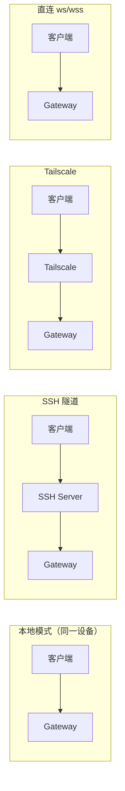

# 第 15 章：远程访问

> 本章概述：讲解如何通过 SSH 隧道、Tailscale 和 VPN 远程访问 OpenClaw Gateway，包括 macOS 应用远程控制、Web Chat 和安全配置。

## 学习目标

- 理解远程访问架构和模式
- 掌握 SSH 隧道配置
- 学会使用 Tailscale 进行跨网络连接
- 了解 macOS 应用远程控制设置
- 掌握安全最佳实践

## 前置条件

- 已配置基础 Gateway
- 了解 SSH 基础命令
- 有远程服务器或 Tailscale 账号

---

## 15.1 远程访问概述

### 15.1.1 核心架构

```
┌─────────────────────────────────────────────────────────┐
│                  Gateway 主机（Master）                  │
│  - 运行 Gateway WebSocket（默认端口 18789）              │
│  - 拥有会话、认证 Profile、通道、状态                    │
│  - 运行 Agent 和节点工具调用                             │
└─────────────────────────────────────────────────────────┘
                            │
         ┌──────────────────┼──────────────────┐
         │                  │                  │
    SSH 隧道           Tailscale          局域网直连
         │                  │                  │
    ┌────┴────┐     ┌───────┴───────┐   ┌─────┴─────┐
    │ 笔记本   │     │   iOS/Android │   │   macOS   │
    │  客户端  │     │     节点      │   │   应用    │
    └─────────┘     └───────────────┘   └───────────┘
```

**关键概念**：
- **Gateway 主机**：Agent 生活地方，拥有所有状态
- **节点**：外围设备（iOS/Android/macOS），通过 Gateway WebSocket 连接
- **单一 Gateway**：每台主机只运行一个 Gateway（除非使用多 Profile）

### 15.1.2 访问模式



| 模式 | 说明 | 适用场景 |
|------|------|----------|
| **本地模式** | Gateway 和客户端在同一设备 | 个人使用 |
| **SSH 隧道** | 通过 SSH 转发 Gateway 端口 | 远程访问 |
| **Tailscale Serve** | 使用 Tailscale 身份认证 | 零信任网络 |
| **直连（ws/wss）** | 直接连接 Gateway URL | 公网/可信网络 |

---

## 15.2 常见远程场景

### 15.2.1 场景 1：始终在线的 Gateway（VPS/家庭服务器）

**架构**：
```
Tailscale/SSH → 家庭服务器/VPS → Gateway
```

**配置步骤**：

1. **在远程主机安装 OpenClaw**：
   ```bash
   # VPS 示例（Hetzner/Exe.dev）
   pnpm install -g openclaw
   ```

2. **配置 Gateway 绑定**：
   ```json5
   {
     gateway: {
       bind: "loopback"  // 推荐：仅 loopback + SSH/Tailscale
     }
   }
   ```

3. **使用 Tailscale Serve（最佳体验）**：
   ```bash
   # 在 VPS 上
   tailscale serve 18789
   ```

4. **客户端连接**：
   - SSH 隧道或
   - Tailscale MagicDNS

**优势**：
- Agent 始终在线
- 笔记本休眠不影响
- 多设备共享

### 15.2.2 场景 2：家庭桌面运行 Gateway，笔记本远程控制

**架构**：
```
笔记本（远程）→ SSH 隧道 → 家庭桌面（Gateway）
```

**macOS 应用设置**：

1. 打开 **设置 → 通用**
2. **OpenClaw 运行位置** 选择 **Remote over SSH**
3. 配置：
   - **SSH 目标**：`user@host`（可从发现列表选择）
   - **身份文件**：SSH 密钥路径（可选）
   - **项目根目录**：远程代码路径
   - **CLI 路径**：`openclaw` 可执行文件路径

4. **测试远程**：验证 `openclaw status --json` 成功

**功能**：
- 健康检查通过 SSH 隧道
- Web Chat 自动使用隧道
- 语音唤醒转发

### 15.2.3 场景 3：笔记本运行 Gateway，其他设备远程访问

**架构**：
```
其他设备 → SSH 隧道/Tailscale → 笔记本（Gateway）
```

**配置选项**：

1. **SSH 隧道**（从其他设备）：
   ```bash
   ssh -N -L 18789:127.0.0.1:18789 user@laptop
   ```

2. **Tailscale Serve**：
   ```bash
   # 在笔记本上
   tailscale serve 18789
   ```

---

## 15.3 SSH 隧道配置

### 15.3.1 基础隧道命令

```bash
# 转发 Gateway WebSocket 端口
ssh -N -L 18789:127.0.0.1:18789 user@host
```

**参数说明**：
| 参数 | 说明 |
|------|------|
| `-N` | 不执行远程命令（仅隧道） |
| `-L` | 本地端口转发 |
| `18789:127.0.0.1:18789` | 本地 18789 → 远程 127.0.0.1:18789 |

### 15.3.2 隧道验证

```bash
# 隧道建立后验证
openclaw health
openclaw status --deep
```

### 15.3.3 CLI 远程默认配置

**配置文件**（`~/.openclaw/openclaw.json`）：
```json5
{
  gateway: {
    mode: "remote",
    remote: {
      url: "ws://127.0.0.1:18789",
      token: "your-token"
    }
  }
}
```

**使用方式**：
```bash
# CLI 命令自动使用远程配置
openclaw status
openclaw gateway call node.list --params "{}"
```

### 15.3.4 显式凭证

```bash
# 使用 --url 时必须显式提供凭证
openclaw gateway status \
  --url ws://127.0.0.1:18789 \
  --token your-token
```

**注意**：
- `--url` 覆盖不使用隐式配置/环境凭证
- 必须显式包含 `--token` 或 `--password`

---

## 15.4 Tailscale 集成

### 15.4.1 Tailscale Serve 配置

**步骤 1：启用 Serve**
```bash
# 在 Gateway 主机
tailscale serve 18789
```

**步骤 2：获取 URL**
```bash
tailscale status
# 输出：https://gateway-hostname.ts.net:443
```

**步骤 3：客户端配置**
```json5
{
  gateway: {
    remote: {
      url: "wss://gateway-hostname.ts.net",
      token: "your-token"
    }
  }
}
```

### 15.4.2 单播 DNS-SD（跨网络发现）

**场景**：Android/iOS 节点需要跨网络发现 Gateway

**配置步骤**：

1. **设置 DNS-SD 区域**（示例：`openclaw.internal.`）

2. **发布服务记录**：
   ```
   _openclaw-gw._tcp.openclaw.internal.
   ```

3. **配置 Tailscale 分割 DNS**：
   - Tailscale DNS 设置 → 添加 DNS 服务器
   - 将 `openclaw.internal.` 指向你的 DNS 服务器

4. **CoreDNS 示例配置**：
   ```corefile
   openclaw.internal. {
       hosts {
         100.x.y.z gateway.openclaw.internal.
         fallthrough
       }
       dns64
   }
   ```

### 15.4.3 MagicDNS 使用

```bash
# 使用 MagicDNS 名称连接
openclaw nodes invoke \
  --node "<Android Node>" \
  --command canvas.navigate \
  --params '{"url":"http://gateway-hostname.ts.net:18789/__openclaw__/canvas/"}'
```

---

## 15.5 macOS 应用远程控制

### 15.5.1 远程模式设置

**路径**：设置 → 通用 → OpenClaw 运行位置

**选项**：
| 选项 | 说明 |
|------|------|
| **本地（此 Mac）** | 无 SSH，本地运行 |
| **Remote over SSH** | 默认，通过 SSH 执行命令 |
| **Remote direct（ws/wss）** | 直连 Gateway URL，无 SSH |

### 15.5.2 传输方式对比

| 传输 | 说明 | IP 可见性 |
|------|------|----------|
| **SSH 隧道** | `ssh -N -L` 转发 | Gateway 看到 `127.0.0.1` |
| **直连（ws/wss）** | 直接 WebSocket 连接 | Gateway 看到真实客户端 IP |

### 15.5.3 远程前置条件

**远程主机配置**：

1. **安装 Node + pnpm**：
   ```bash
   brew install node
   curl -fsSL https://pnpm.io/install.sh | sh
   ```

2. **安装 OpenClaw CLI**：
   ```bash
   pnpm install -g openclaw
   ```

3. **确保 CLI 在非交互式 shell 可用**：
   ```bash
   # 检查
   ssh user@host 'which openclaw'

   # 如需修复，创建符号链接
   ssh user@host 'ln -s $(which openclaw) /usr/local/bin/openclaw'
   ```

4. **配置 SSH 密钥认证**：
   ```bash
   ssh-copy-id user@host
   ```

### 15.5.4 测试远程连接

```bash
# macOS 应用内测试
# 设置 → 通用 → 测试远程

# 预期输出
{
  "status": "ok",
  "gateway": "connected",
  "channels": {...}
}

# exit 127 表示 CLI 未找到
```

---

## 15.6 Web Chat 远程访问

### 15.6.1 Web Chat 架构

- **不再使用独立 HTTP 端口**
- **直接连接 Gateway WebSocket**
- **通过 SSH 隧道或直连**

### 15.6.2 SSH 隧道方式

```bash
# 1. 建立隧道
ssh -N -L 18789:127.0.0.1:18789 user@host

# 2. 浏览器访问
open http://localhost:18789
```

### 15.6.3 Tailscale Serve 方式

```bash
# 1. 启用 Serve
tailscale serve 18789

# 2. 获取 URL
tailscale status

# 3. 浏览器访问
open https://gateway-hostname.ts.net
```

---

## 15.7 安全配置

### 15.7.1 绑定模式

| 绑定模式 | 说明 | 安全级别 |
|----------|------|----------|
| `loopback` | 仅本地回环（默认） | 最高 |
| `lan` | 局域网接口 | 中等 |
| `tailnet` | Tailscale 接口 | 高 |
| `custom` | 自定义接口 | 取决于配置 |
| `auto` | 自动检测（loopback 不可用时回退） | 中等 |

**推荐配置**：
```json5
{
  gateway: {
    bind: "loopback"  // 默认且最安全
  }
}
```

### 15.7.2 认证要求

**非 loopback 绑定必须配置认证**：

```json5
{
  gateway: {
    auth: {
      token: "your-secure-token",
      password: "your-strong-password"
    }
  }
}
```

**环境变量**：
```bash
export OPENCLAW_GATEWAY_TOKEN="your-token"
export OPENCLAW_GATEWAY_PASSWORD="your-password"
```

### 15.7.3 Tailscale 身份认证

**启用 Tailscale 身份认证**：
```json5
{
  gateway: {
    auth: {
      allowTailscale: true  // 允许 Tailscale 身份头认证
    }
  }
}
```

**说明**：
- Control UI/WebSocket 可通过 Tailscale 身份头认证
- HTTP API 端点仍需 token/password 认证
- 假设 Gateway 主机是可信的

### 15.7.4 TLS 证书固定

**配置指纹**：
```json5
{
  gateway: {
    remote: {
      url: "wss://gateway.example.com",
      tlsFingerprint: "SHA256:xxxxx..."
    }
  }
}
```

### 15.7.5 不安全连接突破玻璃

**场景**：可信私有网络需要 `ws://`

```bash
# 客户端进程设置
export OPENCLAW_ALLOW_INSECURE_PRIVATE_WS=1
```

**警告**：
- 仅在可信网络使用
- 不应用于公网

---

## 15.8 WhatsApp 远程登录流程

### 15.8.1 登录步骤

```bash
# 1. SSH 到远程主机
ssh user@host

# 2. 运行登录命令
openclaw channels login --verbose --channel whatsapp

# 3. 扫描二维码（使用手机 WhatsApp）

# 4. 验证状态
openclaw status --json
```

### 15.8.2 过期处理

- WhatsApp 认证可能过期
- 需要重新运行登录
- 健康检查会发现问题

---

## 15.9 故障排除

### 15.9.1 常见问题

| 问题 | 原因 | 解决方案 |
|------|------|----------|
| `exit 127` | CLI 未找到 | 确保 `openclaw` 在非交互式 shell PATH 中 |
| 健康探测失败 | SSH/PATH 问题 | 检查 SSH 连通性和 CLI 路径 |
| Web Chat 卡住 | Gateway 未运行 | 确认远程 Gateway 状态 |
| 节点 IP 显示 `127.0.0.1` | SSH 隧道预期行为 | 切换到 **Direct（ws/wss）** |
| 语音唤醒不转发 | 远程模式配置错误 | 检查 SSH 隧道状态 |

### 15.9.2 诊断命令

```bash
# SSH 连通性
ssh user@host 'openclaw status --json'

# 隧道状态
ssh -O check -L 18789:127.0.0.1:18789 user@host

# WebSocket 测试
wscat -c ws://127.0.0.1:18789

# Tailscale 状态
tailscale status
tailscale netcheck
```

### 15.9.3 日志分析

```bash
# 远程 Gateway 日志
ssh user@host 'openclaw logs --follow'

# 本地隧道日志
ssh -v -N -L 18789:127.0.0.1:18789 user@host
```

---

## 15.10 通知声音

### 15.10.1 发送带声音的通知

```bash
openclaw nodes notify \
  --node <id> \
  --title "提醒" \
  --body "远程 Gateway 就绪" \
  --sound Glass
```

**可用声音**：
- `Glass`
- `Pop`
- `Ping`
- `Bottle`
- `Morse`

**注意**：
- 没有全局"默认声音"开关
- 每次请求时指定声音（或无）

---

## 本章小结

- **远程架构**：单一 Gateway 主机，多客户端连接
- **SSH 隧道**：通用 fallback，端口转发到 localhost
- **Tailscale**：Serve 身份认证 + DNS-SD 发现
- **macOS 应用**：Remote over SSH / Direct 两种模式
- **Web Chat**：直连 Gateway WebSocket，无独立 HTTP 端口
- **安全**：loopback 绑定优先，非 loopback 需认证
- **凭证**：显式 > 配置 > 环境，`--url` 需显式凭证

## 延伸阅读

- [Gateway 安全](https://docs.openclaw.ai/gateway/security)
- [Tailscale 集成](https://docs.openclaw.ai/gateway/tailscale)
- [macOS 远程控制](https://docs.openclaw.ai/platforms/mac/remote)
- [第 16 章：部署与运维](chapter-16.md)

---

*上一章：[第 14 章：Android 节点](chapter-14.md) | 下一章：[第 16 章：部署与运维](chapter-16.md)*
