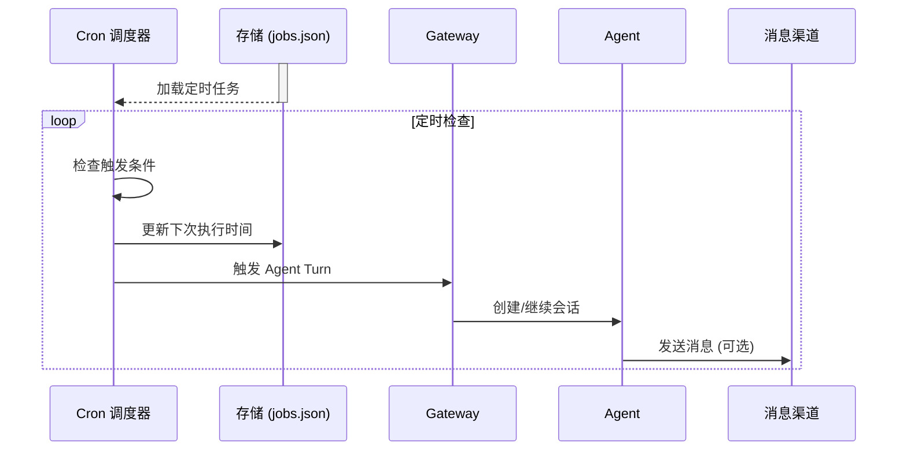
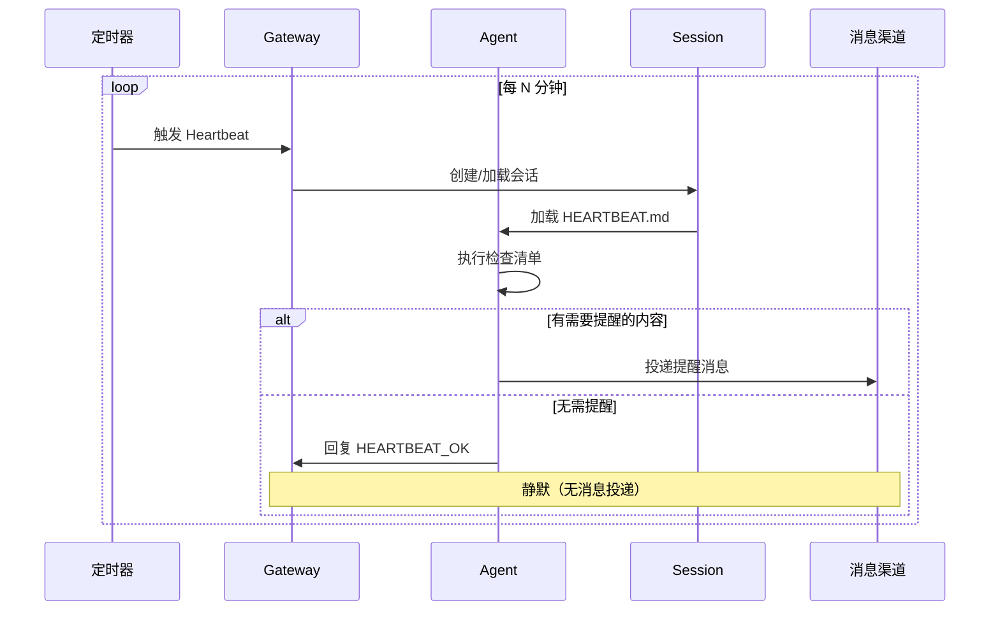

# 第 17 章：自动化

> 本章概述：讲解 OpenClaw 的自动化能力，包括 Cron 定时任务、Heartbeat 心跳监控、Hooks 事件驱动自动化和 Webhook 集成。

## 学习目标

- 理解 Cron 和 Heartbeat 的区别与适用场景
- 掌握定时任务的配置和管理
- 学会使用 Heartbeat 进行周期性监控
- 了解 Hooks 事件驱动自动化
- 掌握 Webhook 集成方法
- 实现高效的自动化工作流

## 前置条件

- 熟悉 Gateway 配置
- 了解基础命令行操作
- 有 JavaScript/TypeScript 基础（用于编写 Hooks）

---

## 17.1 自动化概述

### 17.1.1 自动化机制对比

OpenClaw 提供四种自动化机制：

| 机制 | 触发方式 | 适用场景 | 复杂度 |
|------|----------|----------|--------|
| **Cron** | 定时触发 | 精确时间要求的任务 | 低 |
| **Heartbeat** | 周期性轮询 | 背景监控、批量检查 | 低 |
| **Hooks** | 事件驱动 | 响应系统事件 | 中 |
| **Webhook** | HTTP 请求 | 外部系统集成 | 中 |

### 17.1.2 选择指南

**使用 Cron 当**：
- 需要精确时间（"每天早上 7 点发送简报"）
- 任务独立于主会话上下文
- 需要不同的模型或思考级别
- 一次性提醒（"20 分钟后提醒我"）

**使用 Heartbeat 当**：
- 多个周期性检查可以批处理
- 需要上下文感知的决策
- 背景监控任务
- 低成本轮询

**使用 Hooks 当**：
- 需要响应系统事件（`/new`、`/reset`、消息收发）
- 想在命令处理时自动执行操作
- 需要审计日志或会话记忆

**使用 Webhook 当**：
- 需要外部系统触发 OpenClaw 任务
- 与其他服务集成（Gmail、Calendar 等）

### 17.1.3 组合使用

最高效的自动化 setup 通常组合使用：

```
Heartbeat（每 30 分钟） → 批量检查收件箱、日历、通知
Cron（每天早上 7 点）   → 发送每日简报
Cron（每周一 9 点）     → 每周深度分析
Hooks（/new 命令）     → 保存会话记忆
Webhook                → Gmail 新邮件触发
```

---

## 17.2 Cron 定时任务

### 17.2.1 Cron 架构

Cron 是 Gateway 内置的任务调度器：



```
┌─────────────────────────────────────────┐
│          Gateway (运行中)                │
│  ┌─────────────────────────────────┐    │
│  │      Cron 调度器                 │    │
│  │  ┌─────────┐  ┌─────────┐       │    │
│  │  │ Job 1   │  │ Job 2   │ ...   │    │
│  │  └─────────┘  └─────────┘       │    │
│  └─────────────────────────────────┘    │
│           ↓ 触发                         │
│  ┌─────────────────────────────────┐    │
│  │   Agent Turn (主会话/独立会话)   │    │
│  └─────────────────────────────────┘    │
└─────────────────────────────────────────┘
```

**关键特性**：
- Cron 在 Gateway 进程内运行（不是独立进程）
- Job 持久化存储在 `~/.openclaw/cron/jobs.json`
- 支持两种执行模式：主会话 / 独立会话
- 支持 Webhook 投递

### 17.2.2 快速开始

**创建一次性提醒**：

```bash
openclaw cron add \
  --name "会议提醒" \
  --at "20m" \
  --session main \
  --system-event "提醒：10 分钟后有站会" \
  --wake now \
  --delete-after-run
```

**创建周期性任务**：

```bash
openclaw cron add \
  --name "晨间简报" \
  --cron "0 7 * * *" \
  --tz "Asia/Shanghai" \
  --session isolated \
  --message "总结隔夜消息：收件箱、日历、新闻。" \
  --announce \
  --channel whatsapp \
  --to "+8613800138000"
```

### 17.2.3 调度类型

Cron 支持三种调度类型：

| 类型 | CLI 参数 | 说明 | 示例 |
|------|----------|------|------|
| **一次性** | `--at` | ISO 时间戳或相对时间 | `--at "2026-03-11T10:00:00Z"` 或 `--at "20m"` |
| **周期性** | `--cron` | Cron 表达式 | `--cron "0 7 * * *"` |
| **间隔** | `--every` | 固定间隔 | `--every "4h"` |

**相对时间格式**（`--at`）：
- `20m` - 20 分钟后
- `2h` - 2 小时后
- `1d` - 1 天后

**Cron 表达式**：
```
┌───────────── 分钟 (0-59)
│ ┌───────────── 小时 (0-23)
│ │ ┌───────────── 日期 (1-31)
│ │ │ ┌───────────── 月份 (1-12)
│ │ │ │ ┌───────────── 星期 (0-6, 0=周日)
│ │ │ │ │
* * * * *
```

**常见 Cron 表达式**：

| 表达式 | 说明 |
|--------|------|
| `0 7 * * *` | 每天早上 7:00 |
| `0 */2 * * *` | 每 2 小时 |
| `0 9 * * 1` | 每周一 9:00 |
| `0 0 1 * *` | 每月 1 号 0:00 |
| `*/5 * * * *` | 每 5 分钟 |

### 17.2.4 执行模式

#### 主会话模式（`--session main`）

任务在主会话中执行，与 heartbeat 共享上下文：

```bash
openclaw cron add \
  --name "项目检查" \
  --every "4h" \
  --session main \
  --system-event "进行项目健康检查" \
  --wake now
```

**特点**：
- 使用主会话上下文
- 事件进入下次 heartbeat 处理
- 不能覆盖模型

#### 独立会话模式（`--session isolated`）

任务在独立会话 `cron:<jobId>` 中执行：

```bash
openclaw cron add \
  --name "深度分析" \
  --cron "0 6 * * 0" \
  --session isolated \
  --message "每周代码库深度分析..." \
  --model opus \
  --thinking high \
  --announce
```

**特点**：
- 独立会话，不污染主历史
- 可覆盖模型和思考级别
- 默认 `announce` 模式投递

### 17.2.5 投递模式

独立会话支持三种投递模式：

| 模式 | 说明 | 适用场景 |
|------|------|----------|
| **announce** | 直接投递到频道 + 主会话摘要 | 默认，常规通知 |
| **webhook** | HTTP POST 到指定 URL | 外部系统集成 |
| **none** | 无投递，仅内部处理 | 静默任务 |

**Announce 投递配置**：

```bash
openclaw cron add \
  --name "夜间总结" \
  --cron "0 22 * * *" \
  --session isolated \
  --message "总结今日消息" \
  --announce \
  --channel telegram \
  --to "-1001234567890:topic:123"
```

**Telegram Topic 格式**：
- `-1001234567890` - 仅聊天 ID
- `-1001234567890:topic:123` - 带 Topic（推荐）
- `-1001234567890:123` - 简写

### 17.2.6 模型和思考级别覆盖

仅独立会话支持模型覆盖：

```bash
# 使用 Opus 模型
openclaw cron add \
  --name "高质量分析" \
  --cron "0 9 * * 1" \
  --session isolated \
  --message "深度分析..." \
  --model opus

# 使用 Sonnet 模型（节省成本）
openclaw cron add \
  --name "日常检查" \
  --cron "0 * * * *" \
  --session isolated \
  --message "快速检查..." \
  --model sonnet
```

**思考级别**（仅 GPT-5.2 + Codex 模型）：
- `off` - 关闭思考
- `minimal` - 最小思考
- `low` - 低思考
- `medium` - 中等思考
- `high` - 高思考
- `xhigh` - 极高思考

### 17.2.7 Cron 管理命令

```bash
# 列出所有任务
openclaw cron list

# 查看任务详情
openclaw cron info <job-id>

# 编辑任务
openclaw cron edit <job-id> \
  --message "更新提示词" \
  --model opus

# 手动运行任务
openclaw cron run <job-id>
openclaw cron run <job-id> --due  # 仅当到期时运行

# 查看运行历史
openclaw cron runs --id <job-id> --limit 50

# 删除任务
openclaw cron remove <job-id>

# 启用/禁用
openclaw cron enable <job-id>
openclaw cron disable <job-id>
```

### 17.2.8 高级配置

**精确时间控制**（禁用错开）：

```bash
# 强制精确时间（无错开）
openclaw cron add \
  --name "精确任务" \
  --cron "0 * * * *" \
  --exact

# 自定义错开窗口
openclaw cron add \
  --name "错开任务" \
  --cron "0 * * * *" \
  --stagger 30s
```

**轻量级上下文**（不注入工作区文件）：

```bash
openclaw cron add \
  --name "背景任务" \
  --cron "0 * * * *" \
  --session isolated \
  --light-context
```

**Agent 选择**（多 Agent setup）：

```bash
# 指定 Agent
openclaw cron add \
  --name "运维检查" \
  --cron "0 6 * * *" \
  --session isolated \
  --message "检查运维队列" \
  --agent ops

# 编辑 Agent 绑定
openclaw cron edit <job-id> --agent ops
openclaw cron edit <job-id> --clear-agent
```

### 17.2.9 重试策略

**一次性任务**（`--at`）：
- 瞬时错误：重试最多 3 次（指数退避：30s → 1m → 5m）
- 永久错误：立即禁用

**周期性任务**：
- 任何错误：应用指数退避（30s → 1m → 5m → 15m → 60m）
- 成功后重置退避

**配置重试策略**：

```json5
{
  cron: {
    retry: {
      maxAttempts: 3,
      backoffMs: [60000, 120000, 300000],
      retryOn: ["rate_limit", "overloaded", "network", "server_error"]
    }
  }
}
```

### 17.2.10 存储和维护

**存储位置**：
- Job 存储：`~/.openclaw/cron/jobs.json`
- 运行历史：`~/.openclaw/cron/runs/<jobId>.jsonl`

**维护配置**：

```json5
{
  cron: {
    // 独立会话保留时间
    sessionRetention: "24h",  // 或 false 禁用

    // 运行日志修剪
    runLog: {
      maxBytes: "2mb",      // 默认 2MB
      keepLines: 2000       // 默认 2000 行
    }
  }
}
```

**高容量 Cron 优化**：

```json5
{
  cron: {
    sessionRetention: "12h",
    runLog: {
      maxBytes: "3mb",
      keepLines: 1500
    }
  }
}
```

---

## 17.3 Heartbeat 心跳监控

### 17.3.1 Heartbeat 架构

Heartbeat 运行周期性的 Agent Turn，让模型检查并提醒需要注意的事项：



```
每 30 分钟
    ↓
┌─────────────────────────────────┐
│   Heartbeat 触发                 │
│   - 读取 HEARTBEAT.md           │
│   - 执行提示词中的任务           │
│   - 检查收件箱/日历/通知         │
│   - 决定是否需要提醒用户         │
└─────────────────────────────────┘
    ↓
如果返回 HEARTBEAT_OK → 无消息投递（静默）
如果有内容 → 投递到配置的频道
```

### 17.3.2 快速开始

**基础配置**：

```json5
{
  agents: {
    defaults: {
      heartbeat: {
        every: "30m",           // 间隔
        target: "last",         // 投递到最后联系的频道
        directPolicy: "allow",  // 允许直接/DM 投递
      }
    }
  }
}
```

**创建 HEARTBEAT.md 清单**：

```md
# Heartbeat 检查清单

- 快速扫描：收件箱有紧急消息吗？
- 如果是白天，做个轻量 check-in
- 如果有任务被阻塞，写下_缺少什么_，下次问 Peter
- 检查日历未来 2 小时的事件
```

### 17.3.3 配置选项

**完整配置示例**：

```json5
{
  agents: {
    defaults: {
      heartbeat: {
        every: "30m",                    // 间隔（默认 30m）
        model: "anthropic/claude-opus-4-6",  // 可选模型覆盖
        includeReasoning: false,         // 包含推理消息
        lightContext: false,             // 轻量级上下文（仅 HEARTBEAT.md）
        target: "last",                  // 投递目标：none | last | <channel>
        to: "+8613800138000",           // 可选：指定收件人
        accountId: "ops-bot",           // 多账号频道的账号 ID
        prompt: "读取 HEARTBEAT.md（如果存在）。严格遵守。如果无事，回复 HEARTBEAT_OK。",
        ackMaxChars: 300,               // HEARTBEAT_OK 后允许的最大字符
        activeHours: {                  // 可选：活跃时间
          start: "08:00",
          end: "22:00",
          timezone: "Asia/Shanghai"
        }
      }
    }
  }
}
```

**字段说明**：

| 字段 | 说明 | 默认值 |
|------|------|--------|
| `every` | 心跳间隔 | `30m`（Anthropic OAuth 为 `1h`） |
| `model` | 模型覆盖 | - |
| `includeReasoning` | 包含推理消息 | `false` |
| `lightContext` | 仅加载 HEARTBEAT.md | `false` |
| `target` | 投递目标 | `none`（不投递） |
| `to` | 指定收件人 | - |
| `directPolicy` | DM 投递策略 | `allow` |
| `prompt` | 提示词 | 默认提示词 |
| `ackMaxChars` | 确认消息最大字符 | 300 |
| `activeHours` | 活跃时间窗口 | - |

### 17.3.4 活跃时间配置

**商业小时例**：

```json5
{
  agents: {
    defaults: {
      heartbeat: {
        every: "30m",
        activeHours: {
          start: "09:00",
          end: "18:00",
          timezone: "America/New_York"
        }
      }
    }
  }
}
```

**24/7 配置**：

```json5
// 方式 1：省略 activeHours（默认行为）
{
  agents: {
    defaults: {
      heartbeat: {
        every: "30m"
        // 无 activeHours = 全天候
      }
    }
  }
}

// 方式 2：显式设置
{
  agents: {
    defaults: {
      heartbeat: {
        every: "30m",
        activeHours: {
          start: "00:00",
          end: "24:00"
        }
      }
    }
  }
}
```

**警告**：不要设置相同的 start 和 end 时间（如 `08:00` 到 `08:00`），这会被视为零宽度窗口，心跳总是跳过。

### 17.3.5 多 Agent Heartbeat

当任何 `agents.list[]` 条目包含 `heartbeat` 块时，**只有这些 Agent** 运行心跳：

```json5
{
  agents: {
    defaults: {
      heartbeat: {
        every: "30m",
        target: "last"
      }
    },
    list: [
      { id: "main", default: true },  // 使用默认配置
      {
        id: "ops",
        heartbeat: {
          every: "1h",
          target: "whatsapp",
          to: "+8613800138000",
          prompt: "检查运维队列和监控告警。"
        }
      }
    ]
  }
}
```

### 17.3.6 多账号频道

使用 `accountId` 定位特定账号（如 Telegram）：

```json5
{
  agents: {
    list: [
      {
        id: "ops",
        heartbeat: {
          every: "1h",
          target: "telegram",
          to: "12345678:topic:42",  // Topic 格式
          accountId: "ops-bot"
        }
      }
    ]
  },
  channels: {
    telegram: {
      accounts: {
        "ops-bot": { botToken: "YOUR_TELEGRAM_BOT_TOKEN" }
      }
    }
  }
}
```

### 17.3.7 可见性控制

按频道或账号控制心跳消息投递：

```yaml
channels:
  defaults:
    heartbeat:
      showOk: false      # 隐藏 HEARTBEAT_OK（默认）
      showAlerts: true   # 显示告警内容（默认）
      useIndicator: true # 发送指示器事件（默认）
  slack:
    heartbeat:
      showOk: true       # Slack 显示 OK 确认
    accounts:
      ops:
        heartbeat:
          showAlerts: false  # ops 账号抑制告警
  telegram:
    heartbeat:
      showOk: true
```

**标志说明**：

| 标志 | 说明 |
|------|------|
| `showOk` | 发送 `HEARTBEAT_OK` 确认 |
| `showAlerts` | 发送告警内容 |
| `useIndicator` | 发送 UI 状态指示器 |

**如果三者都为 `false`**：OpenClaw 跳过心跳运行（无模型调用）。

### 17.3.8 手动唤醒

**立即触发心跳**：

```bash
openclaw system event --text "检查紧急待办" --mode now
```

**等待下次心跳**：

```bash
openclaw system event --text "下次心跳时检查日历" --mode next-heartbeat
```

### 17.3.9 HEARTBEAT_OK 响应契约

**正确用法**：

```
如果无事需要关注 → 回复 HEARTBEAT_OK
  ↓
消息被剥离且不投递（节省用户通知）
```

**错误用法**：

```
包含 HEARTBEAT_OK 但还有其他内容 → 正常投递
在中间使用 HEARTBEAT_OK → 不特殊处理
```

**HEARTBEAT.md 示例**：

```md
# Heartbeat 检查清单

- 扫描收件箱是否有紧急邮件
- 检查未来 2 小时的日历事件
- 审查任何待处理任务
- 如果空闲 8+ 小时，轻量 check-in
```

**更新 HEARTBEAT.md**：

可以直接告诉 Agent：
- "更新 HEARTBEAT.md，添加每日日历检查"
- "重写 HEARTBEAT.md，更短，专注于收件箱跟进"

**警告**：不要在 HEARTBEAT.md 中存放密钥（API Key、电话号码等）——它会成为提示词上下文的一部分。

---

## 17.4 Cron vs Heartbeat：选择指南

### 17.4.1 快速决策表

| 用例 | 推荐 | 原因 |
|------|------|------|
| 每 30 分钟检查收件箱 | Heartbeat | 与其他检查批处理，上下文感知 |
| 每天早上 9 点发送报告 | Cron（独立） | 需要精确时间 |
| 监控日历即将开始的事件 | Heartbeat | 周期性监控的自然场景 |
| 每周深度分析 | Cron（独立） | 独立任务，可使用不同模型 |
| 20 分钟后提醒我 | Cron（主会话，`--at`） | 一次性精确时间 |
| 背景项目健康检查 | Heartbeat | 利用现有周期 |
| 外部系统触发 | Webhook | HTTP 请求驱动 |

### 17.4.2 决策流程

```
任务需要精确时间吗？
  是 → 使用 Cron
  否 → 继续...

任务需要独立于主会话吗？
  是 → 使用 Cron（独立）
  否 → 继续...

任务可以与其他周期性检查批处理吗？
  是 → 使用 Heartbeat（添加到 HEARTBEAT.md）
  否 → 使用 Cron

这是一次性提醒吗？
  是 → 使用 Cron + --at

需要不同模型或思考级别吗？
  是 → 使用 Cron（独立）+ --model/--thinking
  否 → 使用 Heartbeat
```

### 17.4.3 高效组合示例

**HEARTBEAT.md**（每 30 分钟检查）：

```md
# Heartbeat 检查清单

- 扫描收件箱紧急邮件
- 检查未来 2 小时日历
- 审查待处理任务
- 空闲 8+ 小时则轻量 check-in
```

**Cron Jobs**（精确时间）：

```bash
# 每日晨间简报（7 点）
openclaw cron add --name "晨间简报" --cron "0 7 * * *" --session isolated --message "..." --announce

# 每周项目评审（周一 9 点）
openclaw cron add --name "每周评审" --cron "0 9 * * 1" --session isolated --message "..." --model opus

# 一次性提醒
openclaw cron add --name "回电" --at "2h" --session main --system-event "回电客户" --wake now
```

---

## 17.5 Hooks 事件驱动自动化

### 17.5.1 Hooks 架构

Hooks 是响应系统事件的轻量级脚本：

```
事件触发（如 /new 命令）
    ↓
┌─────────────────────────────────┐
│   Hook 事件系统                 │
│   - 扫描已启用的 Hooks          │
│   - 调用匹配的 Handler          │
│   - 收集消息和副作用            │
└─────────────────────────────────┘
    ↓
命令处理继续
```

### 17.5.2 Hook 发现

Hooks 从三个目录自动发现（优先级从高到低）：

1. **工作区 Hooks**：`<workspace>/hooks/`（每个 Agent 独立）
2. **托管 Hooks**：`~/.openclaw/hooks/`（用户安装，跨工作区共享）
3. **捆绑 Hooks**：`<openclaw>/dist/hooks/bundled/`（OpenClaw 自带）

**Hook 目录结构**：

```
my-hook/
├── HOOK.md          # 元数据 + 文档
└── handler.ts       # 实现
```

### 17.5.3 捆绑 Hooks 参考

OpenClaw 自带四个 Hooks：

| Hook | 事件 | 说明 |
|------|------|------|
| **session-memory** | `command:new` | `/new` 时保存会话上下文到记忆 |
| **bootstrap-extra-files** | `agent:bootstrap` | 注入额外工作区文件 |
| **command-logger** | `command` | 记录所有命令到审计日志 |
| **boot-md** | `gateway:startup` | Gateway 启动时运行 `BOOT.md` |

**启用 Hook**：

```bash
# 列出可用 Hooks
openclaw hooks list

# 启用 Hook
openclaw hooks enable session-memory

# 查看状态
openclaw hooks check

# 查看详情
openclaw hooks info session-memory

# 禁用 Hook
openclaw hooks disable command-logger
```

### 17.5.4 HOOK.md 格式

```markdown
---
name: my-hook
description: "简短描述"
homepage: https://docs.openclaw.ai/automation/hooks#my-hook
metadata:
  {"openclaw":{"emoji":"🔗","events":["command:new"],"requires":{"bins":["node"]}}}
---

# My Hook

详细文档...

## 功能

- 监听 `/new` 命令
- 执行操作
- 记录结果

## 要求

- 需要 Node.js

## 配置

无需配置。
```

**元数据字段**：

| 字段 | 说明 |
|------|------|
| `emoji` | CLI 显示表情 |
| `events` | 监听的事件数组 |
| `requires.bins` | 需要的二进制文件 |
| `requires.env` | 需要的环境变量 |
| `requires.config` | 需要的配置路径 |
| `requires.os` | 需要的平台 |
| `always` | 跳过资格检查 |

### 17.5.5 Handler 实现

```typescript
const handler = async (event) => {
  // 仅处理 'new' 命令
  if (event.type !== "command" || event.action !== "new") {
    return;
  }

  console.log(`[my-hook] /new 命令触发`);
  console.log(`  会话：${event.sessionKey}`);
  console.log(`  时间：${event.timestamp.toISOString()}`);

  // 自定义逻辑
  try {
    await saveSessionMemory(event);
  } catch (err) {
    console.error("[my-hook] 失败:", err.message);
  }

  // 可选：发送消息给用户
  event.messages.push("✨ 会话记忆已保存！");
};

export default handler;
```

**事件上下文**：

```typescript
{
  type: 'command' | 'session' | 'agent' | 'gateway' | 'message',
  action: string,              // 如 'new', 'reset', 'stop', 'received', 'sent'
  sessionKey: string,          // 会话标识符
  timestamp: Date,             // 事件发生时间
  messages: string[],          // 推送到这里发送给用户
  context: {
    // 命令事件:
    sessionEntry?: SessionEntry,
    sessionId?: string,
    sessionFile?: string,
    commandSource?: string,    // 如 'whatsapp', 'telegram'
    senderId?: string,
    workspaceDir?: string,
    bootstrapFiles?: WorkspaceBootstrapFile[],
    cfg?: OpenClawConfig,
    // 消息事件:
    from?: string,             // message:received
    to?: string,               // message:sent
    content?: string,
    channelId?: string,
    success?: boolean,         // message:sent
  }
}
```

### 17.5.6 事件类型

**命令事件**：

| 事件 | 说明 |
|------|------|
| `command` | 所有命令事件 |
| `command:new` | `/new` 命令 |
| `command:reset` | `/reset` 命令 |
| `command:stop` | `/stop` 命令 |

**会话事件**：

| 事件 | 说明 |
|------|------|
| `session:compact:before` | 压缩前 |
| `session:compact:after` | 压缩后 |

**Agent 事件**：

| 事件 | 说明 |
|------|------|
| `agent:bootstrap` | 工作区引导文件注入前 |

**Gateway 事件**：

| 事件 | 说明 |
|------|------|
| `gateway:startup` | Gateway 启动后 |

**消息事件**：

| 事件 | 说明 |
|------|------|
| `message` | 所有消息事件 |
| `message:received` | 收到入站消息 |
| `message:transcribed` | 音频转录完成 |
| `message:preprocessed` | 媒体/链接理解完成后 |
| `message:sent` | 成功发送出站消息 |

### 17.5.7 创建自定义 Hook

**步骤 1：创建目录**

```bash
mkdir -p ~/.openclaw/hooks/my-hook
cd ~/.openclaw/hooks/my-hook
```

**步骤 2：创建 HOOK.md**

```markdown
---
name: my-hook
description: "做有用的事"
metadata: {"openclaw":{"emoji":"🎯","events":["command:new"]}}
---

# My Custom Hook

当 `/new` 时做有用的事。
```

**步骤 3：创建 handler.ts**

```typescript
const handler = async (event) => {
  if (event.type !== "command" || event.action !== "new") {
    return;
  }

  console.log("[my-hook] 运行！");
  // 你的逻辑
};

export default handler;
```

**步骤 4：启用并测试**

```bash
# 验证发现
openclaw hooks list

# 启用
openclaw hooks enable my-hook

# 重启 Gateway

# 触发事件（通过消息渠道发送 /new）
```

### 17.5.8 Hook 最佳实践

**保持 Handler 轻量**：

```typescript
// ✓ 好的 - 异步工作，立即返回
const handler = async (event) => {
  void processInBackground(event);  // 后台触发
};

// ✗ 坏的 - 阻塞命令处理
const handler = async (event) => {
  await slowDatabaseQuery(event);
  await evenSlowerAPICall(event);
};
```

**优雅处理错误**：

```typescript
const handler = async (event) => {
  try {
    await riskyOperation(event);
  } catch (err) {
    console.error("[my-handler] 失败:", err.message);
    // 不抛出 - 让其他 handler 继续运行
  }
};
```

**尽早过滤事件**：

```typescript
const handler = async (event) => {
  // 只处理 'new' 命令
  if (event.type !== "command" || event.action !== "new") {
    return;
  }

  // 你的逻辑
};
```

**使用具体事件键**：

```yaml
# ✓ 具体
metadata: {"openclaw":{"events":["command:new"]}}

# ✗ 笼统 - 更多开销
metadata: {"openclaw":{"events":["command"]}}
```

### 17.5.9 配置

**新配置格式**（推荐）：

```json
{
  "hooks": {
    "internal": {
      "enabled": true,
      "entries": {
        "session-memory": { "enabled": true },
        "command-logger": { "enabled": false },
        "my-hook": {
          "enabled": true,
          "env": {
            "MY_CUSTOM_VAR": "value"
          }
        }
      }
    }
  }
}
```

**额外目录**：

```json
{
  "hooks": {
    "internal": {
      "enabled": true,
      "load": {
        "extraDirs": ["/path/to/more/hooks"]
      }
    }
  }
}
```

---

## 17.6 Webhook 集成

### 17.6.1 Webhook 架构

Webhook 允许外部系统通过 HTTP 请求触发 OpenClaw 任务：

```
外部系统（如 Gmail）
    ↓ HTTP POST
┌─────────────────────────────────┐
│   OpenClaw Webhook 端点         │
│   - 验证请求                    │
│   - 触发配置的 Handler          │
│   - 执行任务                    │
└─────────────────────────────────┘
```

### 17.6.2 Gmail PubSub 集成

**配置步骤**：

1. **在 GCP 创建 PubSub 主题**
2. **配置 Gmail 推送通知**
3. **设置 Webhook Handler**

**Handler 示例**：

```typescript
const handler = async (event) => {
  if (event.type !== "webhook" || event.source !== "gmail") {
    return;
  }

  const { emailAddress, historyId } = event.payload;

  console.log(`[gmail-webhook] 新邮件通知：${emailAddress}`);

  // 触发收件箱检查
  await checkGmailInbox(emailAddress);
};

export default handler;
```

### 17.6.3 Cron Webhook 投递

Cron 任务可以直接投递到 Webhook：

```bash
openclaw cron add \
  --name "外部通知" \
  --cron "0 9 * * *" \
  --session isolated \
  --message "生成日报" \
  --delivery-mode webhook \
  --delivery-to "https://api.example.com/daily-report"
```

**配置 Webhook Token**：

```json5
{
  cron: {
    webhook: "https://api.example.com/legacy",  // 废弃的回退
    webhookToken: "your-bearer-token"           // 可选认证
  }
}
```

---

## 17.7 自动化最佳实践

### 17.7.1 成本优化

**Heartbeat 优化**：
- 保持 `HEARTBEAT.md` 简短（避免提示词膨胀）
- 使用 `target: "none"` 仅内部处理
- 配置活跃时间避免夜间运行

**Cron 优化**：
- 批处理类似检查到 Heartbeat
- 独立任务使用更便宜的模型
- 配置 `delivery.mode: "none"` 避免不必要的投递

### 17.7.2 错误处理

**Cron 重试**：
- 瞬时错误（429、网络、5xx）自动重试
- 永久错误（认证失败）立即禁用
- 配置自定义重试策略

**Hook 错误**：
- 总是 try-catch 包裹
- 记录错误但不阻塞其他 Hook
- 使用后台处理避免阻塞

### 17.7.3 监控和调试

**查看 Cron 状态**：

```bash
# 列出任务
openclaw cron list

# 查看运行历史
openclaw cron runs --id <job-id> --limit 10

# 手动运行测试
openclaw cron run <job-id>
```

**查看 Hook 状态**：

```bash
# 列出 Hooks
openclaw hooks list --verbose

# 查看日志
tail -f ~/.openclaw/logs/gateway.log | grep hook
```

### 17.7.4 安全考虑

**Hook 安全**：
- 从可信来源安装 Hook packs
- 审查 handler.ts 代码
- 避免在 HOOK.md 中存放密钥

**Webhook 安全**：
- 使用 HTTPS 端点
- 配置 `webhookToken` 认证
- 验证请求来源

---

## 本章小结

- **Cron**：精确时间调度，支持主会话/独立会话，可覆盖模型
- **Heartbeat**：周期性监控，批处理检查，上下文感知决策
- **Hooks**：事件驱动自动化，响应系统事件，易于扩展
- **Webhook**：外部系统集成，HTTP 触发
- **组合使用**：Heartbeat 批处理监控 + Cron 精确调度 + Hooks 事件响应
- **成本优化**：保持配置简短，使用便宜模型，抑制不必要投递
- **错误处理**：自动重试瞬时错误，优雅处理 Hook 错误

## 延伸阅读

- [Cron Jobs](https://docs.openclaw.ai/automation/cron-jobs)
- [Heartbeat](https://docs.openclaw.ai/gateway/heartbeat)
- [Cron vs Heartbeat](https://docs.openclaw.ai/automation/cron-vs-heartbeat)
- [Hooks](https://docs.openclaw.ai/automation/hooks)
- [Webhook](https://docs.openclaw.ai/automation/webhook)
- [第 18 章：故障排除](chapter-18.md)

---

*上一章：[第 16 章：部署与运维](chapter-16.md) | 下一章：[第 18 章：故障排除](chapter-18.md)*
