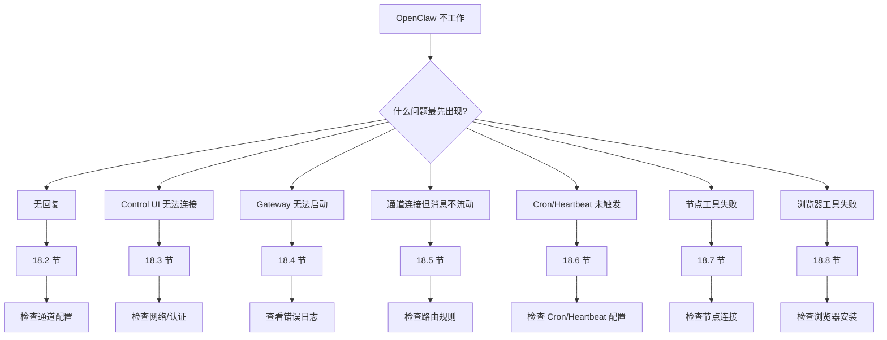

# 第 18 章：故障排除

> 本章概述：提供 OpenClaw 故障排除的系统方法，包括诊断命令阶梯、常见问题解决方案、日志分析和性能调优。

## 学习目标

- 掌握诊断命令阶梯
- 学会使用 `openclaw doctor` 进行健康检查
- 能够快速定位和解决常见问题
- 理解日志分析技巧
- 掌握性能调优方法

## 前置条件

- 熟悉基础 CLI 命令
- 了解 Gateway 架构
- 有基础 Linux/Unix 命令行经验

---

## 18.1 诊断命令阶梯

### 18.1.1 标准诊断流程

当遇到问题时，按顺序执行以下命令：

```bash
# 1. 基础状态检查
openclaw status

# 2. 完整报告
openclaw status --all

# 3. Gateway 探针
openclaw gateway probe

# 4. Gateway 状态
openclaw gateway status

# 5. 健康检查
openclaw doctor

# 6. 通道状态探测
openclaw channels status --probe

# 7. 查看日志
openclaw logs --follow
```

### 18.1.2 正常输出示例

**`openclaw status`**：
```
✓ Gateway: running
✓ Channels: whatsapp (connected), telegram (connected)
✓ Agents: main (active)
```

**`openclaw gateway status`**：
```
Runtime: running
RPC probe: ok
Dashboard: http://127.0.0.1:18789
Service: ai.openclaw.gateway (loaded)
```

**`openclaw doctor`**：
```
✓ Config normalized
✓ State directory intact
✓ Session transcripts valid
✓ No blocking errors
```

### 18.1.3 决策树



```
OpenClaw 不工作
    ↓
什么问题最先出现？
    ├── 无回复 → 18.2 节
    ├── Control UI 无法连接 → 18.3 节
    ├── Gateway 无法启动 → 18.4 节
    ├── 通道连接但消息不流动 → 18.5 节
    ├── Cron/Heartbeat 未触发 → 18.6 节
    ├── 节点工具失败 → 18.7 节
    └── 浏览器工具失败 → 18.8 节
```

---

## 18.2 无回复问题

### 18.2.1 诊断命令

```bash
openclaw status
openclaw gateway status
openclaw channels status --probe
openclaw pairing list --channel <channel> [--account <id>]
openclaw logs --follow
```

### 18.2.2 正常输出

- `Runtime: running`
- `RPC probe: ok`
- 通道显示 `connected` 或 `ready`
- 发送者已批准（或 DM 策略为 open/allowlist）

### 18.2.3 常见日志信号

| 日志信号 | 原因 | 解决方案 |
|----------|------|----------|
| `drop guild message (mention required)` | Discord 需要提及 | 在群组中提及机器人 |
| `pairing request` | 发送者未批准 | 运行 `openclaw devices approve <requestId>` |
| `blocked` / `allowlist` | 发送者被过滤 | 检查通道 allowlist 配置 |
| `unauthorized` | 认证失败 | 检查 token/password 配置 |

### 18.2.4 排查步骤

**步骤 1：检查 Gateway 状态**

```bash
openclaw gateway status
# 应显示 Runtime: running
```

**步骤 2：检查通道连接**

```bash
openclaw channels status --probe
# 应显示 connected
```

**步骤 3：检查配对状态**

```bash
openclaw pairing list --channel whatsapp
# 查看是否有 pending 请求
```

**步骤 4：查看日志**

```bash
openclaw logs --follow | grep -E "(drop|pairing|blocked)"
```

---

## 18.3 Control UI 连接问题

### 18.3.1 诊断命令

```bash
openclaw status
openclaw gateway status
openclaw logs --follow
openclaw doctor
openclaw channels status --probe
```

### 18.3.2 正常输出

- `Dashboard: http://...` 显示在 `openclaw gateway status`
- `RPC probe: ok`
- 无认证循环日志

### 18.3.3 常见日志信号

| 日志信号 | 原因 | 解决方案 |
|----------|------|----------|
| `device identity required` | HTTP/非安全上下文需要设备认证 | 使用 HTTPS 或本地连接 |
| `unauthorized` / 重连循环 | token/password 错误或认证模式不匹配 | 检查认证配置 |
| `gateway connect failed` | UI 目标 URL/端口错误 | 检查 Gateway 地址配置 |

### 18.3.4 解决方案

**问题 1：认证失败**

```json5
{
  gateway: {
    auth: {
      token: "your-correct-token",
      mode: "token"  // 或 "password"
    }
  }
}
```

**问题 2：端口错误**

```bash
# 检查 Gateway 监听端口
openclaw gateway status | grep Dashboard

# 更新 UI 配置
# 设置 → Gateway URL: http://127.0.0.1:<correct-port>
```

---

## 18.4 Gateway 无法启动

### 18.4.1 诊断命令

```bash
openclaw status
openclaw gateway status
openclaw logs --follow
openclaw doctor
openclaw channels status --probe
```

### 18.4.2 正常输出

- `Service: ... (loaded)`
- `Runtime: running`
- `RPC probe: ok`

### 18.4.3 常见日志信号

| 日志信号 | 原因 | 解决方案 |
|----------|------|----------|
| `Gateway start blocked: set gateway.mode=local` | gateway.mode 未设置为 local | 设置 `gateway.mode=local` |
| `refusing to bind ... without auth` | 非 loopback 绑定未配置认证 | 配置 token/password |
| `EADDRINUSE` / `another gateway instance` | 端口被占用 | 更改端口或停止现有进程 |
| `permission denied` | 权限不足 | 检查文件权限或以正确用户运行 |

### 18.4.4 解决方案

**问题 1：模式错误**

```json5
{
  gateway: {
    mode: "local"  // 本地运行必需
  }
}
```

**问题 2：端口冲突**

```bash
# 查找占用端口的进程
lsof -i :18789

# 停止冲突进程
kill <PID>

# 或更改 Gateway 端口
{
  gateway: {
    port: 18790  // 使用不同端口
  }
}
```

**问题 3：服务未运行**

```bash
# macOS
launchctl kickstart -k gui/$UID/ai.openclaw.gateway

# Linux (systemd)
systemctl --user start openclaw-gateway

# Windows
schtasks /Run /TN "OpenClaw Gateway"
```

---

## 18.5 通道连接但消息不流动

### 18.5.1 诊断命令

```bash
openclaw status
openclaw gateway status
openclaw logs --follow
openclaw doctor
openclaw channels status --probe
```

### 18.5.2 正常输出

- 通道传输已连接
- 配对/allowlist 检查通过
- 检测到提及（如需要）

### 18.5.3 常见日志信号

| 日志信号 | 原因 | 解决方案 |
|----------|------|----------|
| `mention required` | 群组提及门控 | 在消息中提及机器人 |
| `pairing` / `pending` | DM 发送者未批准 | 运行 `openclaw devices approve` |
| `not_in_channel` | 机器人不在频道中 | 邀请机器人到频道 |
| `missing_scope` / `Forbidden` | 通道权限不足 | 检查 token 权限范围 |
| `401/403` | 认证失败 | 更新 token/凭证 |

### 18.5.4 特定通道排查

**WhatsApp**：

```bash
# 检查 QR 登录状态
openclaw channels login --verbose --channel whatsapp

# 查看配对设备
openclaw pairing list --channel whatsapp
```

**Telegram**：

```bash
# 检查 Bot Token
openclaw config get channels.telegram.botToken

# 测试 Bot
# 发送 /start 到 Bot
```

**Discord**：

```bash
# 检查 Bot 权限
# Discord 开发者门户 → Bot → OAuth2 → 权限

# 群组需要提及
{
  channels: {
    discord: {
      groups: {
        "*": {
          requireMention: true
        }
      }
    }
  }
}
```

---

## 18.6 Cron 和 Heartbeat 问题

### 18.6.1 诊断命令

```bash
openclaw status
openclaw gateway status
openclaw cron status
openclaw cron list
openclaw cron runs --id <jobId> --limit 20
openclaw system heartbeat last
openclaw logs --follow
```

### 18.6.2 Cron 未触发

**检查步骤**：

```bash
# 1. 查看 Cron 状态
openclaw cron status
# 应显示 enabled 和未来的 nextWakeAtMs

# 2. 列出任务
openclaw cron list
# 任务应启用且有有效的调度/时区

# 3. 查看运行历史
openclaw cron runs --id <jobId> --limit 20
# 应显示 ok 或明确的跳过原因
```

**常见日志信号**：

| 日志信号 | 原因 | 解决方案 |
|----------|------|----------|
| `cron: scheduler disabled` | Cron 在配置中禁用 | 设置 `cron.enabled=true` |
| `cron: timer tick failed` | 调度器 tick 失败 | 检查周围日志上下文 |
| `reason: not-due` | 手动运行但未到期 | 使用 `--force` 或等待 |

**解决方案**：

```bash
# 检查 Cron 是否启用
openclaw config get cron.enabled

# 启用 Cron
{
  cron: {
    enabled: true
  }
}

# 检查任务时区
openclaw cron info <job-id>
# 确认 --tz 设置正确
```

### 18.6.3 Cron 触发但无投递

**检查步骤**：

```bash
# 1. 查看运行状态
openclaw cron runs --id <jobId> --limit 20

# 2. 检查投递配置
openclaw cron list

# 3. 探测通道
openclaw channels status --probe
```

**常见日志信号**：

| 日志信号 | 原因 | 解决方案 |
|----------|------|----------|
| 运行成功但 `delivery.mode=none` | 无外部消息预期 | 正常行为 |
| 投递目标缺失/无效 | channel/to 配置错误 | 检查投递配置 |
| `unauthorized` / `Forbidden` | 通道认证错误 | 更新通道凭证 |

### 18.6.4 Heartbeat 被抑制或跳过

**检查步骤**：

```bash
# 1. 查看上次心跳
openclaw system heartbeat last

# 2. 查看日志
openclaw logs --follow

# 3. 检查心跳配置
openclaw config get agents.defaults.heartbeat

# 4. 探测通道
openclaw channels status --probe
```

**常见日志信号**：

| 日志信号 | 原因 | 解决方案 |
|----------|------|----------|
| `heartbeat skipped reason=quiet-hours` | 在 activeHours 之外 | 调整活跃时间配置 |
| `requests-in-flight` | 主队列忙 | 等待后自动重试 |
| `empty-heartbeat-file` | HEARTBEAT.md 无内容 | 添加检查清单内容 |
| `alerts-disabled` | 可见性设置抑制 | 调整 channel heartbeat 配置 |

### 18.6.5 时区和活跃时间问题

**诊断**：

```bash
# 检查活跃时间配置
openclaw config get agents.defaults.heartbeat.activeHours
openclaw config get agents.defaults.heartbeat.activeHours.timezone

# 检查用户时区
openclaw config get agents.defaults.userTimezone || echo "未设置"

# 列出 Cron 任务
openclaw cron list

# 查看日志
openclaw logs --follow
```

**快速规则**：

- `Config path not found: agents.defaults.userTimezone` 表示未设置；心跳回退到主机时区
- Cron 无 `--tz` 使用 Gateway 主机时区
- Heartbeat `activeHours` 使用配置的时区解析（`user`、`local` 或显式 IANA）
- 无时区的 ISO 时间戳被视为 UTC

**常见场景**：

| 场景 | 问题 | 解决方案 |
|------|------|----------|
| 主机时区变更后任务时间错误 | Cron 使用主机时区 | 显式设置 `--tz` |
| Heartbeat 在白天总是跳过 | `activeHours.timezone` 错误 | 更正时区配置 |
| ISO 时间触发时间不对 | 缺少时区被当作 UTC | 添加时区后缀 `+08:00` |

---

## 18.7 节点工具失败

### 18.7.1 诊断命令

```bash
openclaw status
openclaw gateway status
openclaw nodes status
openclaw nodes describe --node <idOrNameOrIp>
openclaw logs --follow
```

### 18.7.2 正常输出

- 节点列为已连接且配对 role `node`
- 能力存在用于调用的命令
- 权限状态为 granted

### 18.7.3 常见日志信号

| 日志信号 | 原因 | 解决方案 |
|----------|------|----------|
| `NODE_BACKGROUND_UNAVAILABLE` | 应用在后台 | 将节点应用带到前台 |
| `*_PERMISSION_REQUIRED` | OS 权限被拒绝/缺失 | 授予所需权限 |
| `SYSTEM_RUN_DENIED: approval required` | 需要 exec 批准 | 审批执行请求 |
| `SYSTEM_RUN_DENIED: allowlist miss` | 命令不在 allowlist | 添加到 exec allowlist |

### 18.7.4 解决方案

**问题 1：应用在后台（iOS/Android）**

```
iOS：打开 OpenClaw 应用
Android：确保前台服务运行
```

**问题 2：权限缺失（macOS）**

```bash
# 检查 TCC 权限
# 系统设置 → 隐私与安全性 → 辅助功能/屏幕录制/麦克风

# 重新授权
# 移除应用，重新添加
```

**问题 3：Exec 批准**

```json5
// ~/.openclaw/exec-approvals.json
{
  "version": 1,
  "agents": {
    "main": {
      "security": "allowlist",
      "allowlist": [
        {"pattern": "/opt/homebrew/bin/rg"},
        {"pattern": "/usr/bin/git"}
      ]
    }
  }
}
```

---

## 18.8 浏览器工具失败

### 18.8.1 诊断命令

```bash
openclaw status
openclaw gateway status
openclaw browser status
openclaw logs --follow
openclaw doctor
```

### 18.8.2 正常输出

- 浏览器状态显示 `running: true`
- 选择的浏览器/配置文件正常
- `openclaw` 配置文件启动或 `chrome` 中继有连接的标签页

### 18.8.3 常见日志信号

| 日志信号 | 原因 | 解决方案 |
|----------|------|----------|
| `Failed to start Chrome CDP` | 本地浏览器启动失败 | 检查浏览器安装 |
| `browser.executablePath not found` | 配置的二进制路径错误 | 更正路径配置 |
| `Chrome extension relay is running, but no tab` | 扩展未连接 | 安装并连接 Chrome 扩展 |
| `Browser attachOnly ... not reachable` | attach-only 配置文件无 live CDP 目标 | 启动浏览器 |

### 18.8.4 解决方案

**问题 1：浏览器未安装**

```bash
# macOS
brew install --cask google-chrome

# Linux
sudo apt install google-chrome-stable

# 配置路径
{
  browser: {
    executablePath: "/usr/bin/google-chrome"
  }
}
```

**问题 2：CDP 端口冲突**

```bash
# 检查占用端口的进程
lsof -i :9222

# 更改 CDP 端口
{
  browser: {
    cdpPort: 9223
  }
}
```

**问题 3：扩展未连接**

1. 安装 Chrome 扩展
2. 打开扩展设置
3. 连接到 CDP 端点：`http://127.0.0.1:9222`

---

## 18.9 Doctor 命令详解

### 18.9.1 基础用法

```bash
# 运行健康检查
openclaw doctor

# 自动接受默认修复
openclaw doctor --yes

# 应用修复无需提示
openclaw doctor --repair

# 强制修复（覆盖自定义配置）
openclaw doctor --repair --force

# 非交互模式（仅安全迁移）
openclaw doctor --non-interactive

# 深度扫描（检查额外服务）
openclaw doctor --deep
```

### 18.9.2 Doctor 检查项目

| 检查项 | 说明 | 修复动作 |
|--------|------|----------|
| 配置规范化 | 迁移旧配置格式 | 自动应用 |
| 状态目录完整性 | 检查会话/凭证/日志 | 提示重新创建 |
| 会话转录匹配 | 检查会话文件存在 | 警告不匹配 |
| 模型认证健康 | 检查 OAuth 到期 | 可刷新令牌 |
| Sandbox 镜像 | 检查 Docker 镜像 | 构建或切换 |
| 服务迁移 | 检测旧版服务 | 移除并安装新版本 |
| 安全警告 | 开放 DM 策略等 | 提供修复建议 |
| 端口冲突 | 检查 18789 端口 | 报告可能原因 |
| 监督器配置审计 | launchd/systemd/schtasks | 可重写配置 |

### 18.9.3 典型输出

```
=== Doctor Report ===

✓ Config normalized (3 legacy keys migrated)
✓ State directory intact (~/.openclaw)
✓ Session transcripts valid (12/12 sessions)
✓ Gateway healthy (PID: 12345)
✓ Channels connected (whatsapp, telegram)

⚠ WARNINGS:

1. OAuth token expiring in 2 days
   → Run: openclaw auth refresh

2. Exec allowlist missing for /usr/bin/python3
   → Add to ~/.openclaw/exec-approvals.json

3. Systemd linger not enabled
   → Run: sudo loginctl enable-linger $USER

=== Summary ===
Blocking errors: 0
Warnings: 3
Suggestions: 2
```

---

## 18.10 日志分析

### 18.10.1 日志位置

```bash
# Docker 部署
docker compose logs openclaw-gateway

# 本地部署
~/.openclaw/logs/gateway.log
~/.openclaw/logs/gateway.err.log

# 实时跟踪
openclaw logs --follow
```

### 18.10.2 日志级别

| 级别 | 说明 | 何时关注 |
|------|------|----------|
| `info` | 正常操作信息 | 一般忽略 |
| `warn` | 警告，不影响功能 | 定期审查 |
| `error` | 错误，可能影响功能 | 需要调查 |
| `fatal` | 致命错误，服务停止 | 立即处理 |

### 18.10.3 常用日志命令

```bash
# 查看最近 100 行
openclaw logs --limit 100

# 查看错误日志
openclaw logs --level error

# 过滤特定关键词
openclaw logs --follow | grep -E "(error|fatal|blocked)"

# 查看特定时间段
openclaw logs --since "2026-03-10T10:00:00" --until "2026-03-10T12:00:00"
```

### 18.10.4 日志模式识别

**认证问题**：
```
[auth] unauthorized: invalid token
[auth] device identity required
[auth] token expired
```

**通道问题**：
```
[channel:whatsapp] drop message: pairing required
[channel:telegram] Forbidden: bot not in channel
[channel:discord] mention required for group
```

**调度问题**：
```
[cron] scheduler disabled
[heartbeat] skipped: quiet-hours
[heartbeat] deferred: requests-in-flight
```

---

## 18.11 性能调优

### 18.11.1 内存优化

**减少上下文大小**：

```json5
{
  agents: {
    defaults: {
      session: {
        compact: {
          threshold: 50  // 降低压缩阈值
        }
      }
    }
  }
}
```

**限制历史消息**：

```json5
{
  messages: {
    groupChat: {
      historyLimit: 50  // 限制群组历史消息数
    }
  }
}
```

### 18.11.2 CPU 优化

**禁用不必要功能**：

```json5
{
  tools: {
    browser: {
      enabled: false  // 如不使用浏览器
    },
    sandbox: {
      enabled: false  // 如不需要沙箱
    }
  }
}
```

**调整 Heartbeat 间隔**：

```json5
{
  agents: {
    defaults: {
      heartbeat: {
        every: "60m"  // 从 30m 增加到 60m
      }
    }
  }
}
```

### 18.11.3 网络优化

**使用本地模型**：

```json5
{
  agents: {
    defaults: {
      models: {
        primary: "local/ollama-llama3"
      }
    }
  }
}
```

**减少外部依赖**：

```json5
{
  tools: {
    media: {
      audio: {
        models: ["local/whisper"]  // 使用本地转录
      }
    }
  }
}
```

### 18.11.4 存储优化

**清理旧会话**：

```bash
# 列出会话
openclaw sessions list

# 删除旧会话
openclaw sessions remove <session-key>
```

**修剪 Cron 日志**：

```json5
{
  cron: {
    runLog: {
      maxBytes: "1mb",  // 减小日志大小
      keepLines: 500    // 减少保留行数
    }
  }
}
```

---

## 18.12 常见问题 FAQ

### 18.12.1 Gateway 频繁重启

**可能原因**：
1. 配置错误导致启动失败
2. 端口冲突
3. 内存不足被系统杀死

**解决方案**：

```bash
# 检查配置
openclaw config get gateway

# 检查端口
lsof -i :18789

# 检查内存
free -h  # Linux
top      # macOS/Windows

# 查看详细日志
openclaw logs --follow | grep -A 5 "restart"
```

### 18.12.2 WhatsApp 频繁掉线

**可能原因**：
1. QR 会话过期
2. 网络不稳定
3. WhatsApp 服务器限制

**解决方案**：

```bash
# 重新登录
openclaw channels login --verbose --channel whatsapp

# 检查网络
ping -c 4 whatsapp.com

# 查看配对状态
openclaw pairing list --channel whatsapp
```

### 18.12.3 Cron 任务不执行

**可能原因**：
1. Cron 调度器禁用
2. 时区配置错误
3. 任务配置错误

**解决方案**：

```bash
# 检查 Cron 状态
openclaw cron status

# 列出任务
openclaw cron list

# 查看运行历史
openclaw cron runs --id <job-id>

# 检查时区
openclaw cron info <job-id> | grep timezone
```

### 18.12.4 技能无法加载

**可能原因**：
1. 技能目录不存在
2. 缺少 HOOK.md 或 handler.ts
3. 依赖未安装

**解决方案**：

```bash
# 列出技能
openclaw hooks list --verbose

# 检查技能状态
openclaw hooks info <skill-name>

# 查看缺失要求
# 输出会显示缺失的二进制/环境变量/配置
```

---

## 本章小结

- **诊断阶梯**：`status` → `gateway status` → `doctor` → `channels status` → `logs`
- **Doctor 命令**：健康检查、配置迁移、修复建议
- **无回复**：检查 Gateway 状态、通道连接、配对批准
- **Gateway 启动失败**：检查模式、端口、权限
- **消息不流动**：检查提及要求、配对状态、权限范围
- **Cron/Heartbeat**：检查调度器、时区、活跃时间、投递配置
- **节点工具**：检查前台状态、OS 权限、exec 批准
- **浏览器**：检查安装、CDP 端口、扩展连接
- **日志分析**：识别错误模式、过滤关键词、定期审查
- **性能调优**：减少上下文、禁用不必要功能、清理旧数据

## 延伸阅读

- [Doctor 详解](https://docs.openclaw.ai/gateway/doctor)
- [故障排除索引](https://docs.openclaw.ai/help/troubleshooting)
- [通道故障排除](https://docs.openclaw.ai/channels/troubleshooting)
- [Gateway 故障排除](https://docs.openclaw.ai/gateway/troubleshooting)
- [自动化故障排除](https://docs.openclaw.ai/automation/troubleshooting)

---

*上一章：[第 17 章：自动化](chapter-17.md) | 下一章：[附录 A：CLI 命令参考](appendix-a.md)*
